# 📊 INVOICE Module - Complete Architecture v7.0

**Version:** 7.0  
**Last Updated:** November 16, 2025  
**Consolidation of:** ASCII Implementation Guide + Mermaid Strategic Overview

## 🎯 Strategic Overview

The **INVOICE module** serves as the financial execution layer in the enterprise ERP's revenue lifecycle, completing the 1:1:1 traceability chain from estimate through project to billing realization:

• **Financial Document System**: Transforms approved estimates into legally binding billing documents with comprehensive payment tracking, AR management, and collection capabilities
• **1:1:1 Immutable Traceability**: Maintains globalId synchronization with ESTIMATE and PROJECT modules, ensuring unbreakable audit trails through `estimateNumber = invoiceNumber = projectNumber`
• **Multi-Billing Methodology**: Supports T&M, milestone-based, progress billing, and retainage management for diverse construction and service industry requirements
• **Accounts Receivable Hub**: Integrates payment processing, cash application, aging analysis, and automated collection workflows for complete financial lifecycle management

---

## 🏗️ Strategic Architecture Diagram

```mermaid
graph TB
    %% Define Invoice Core Entity (Hybrid Pattern - globalId enabled)
    subgraph "INVOICE CORE (Pattern: BH - Base Hybrid)"
        Invoice["`**INVOICE**
        ---
        🆔 **Identity & Governance**
        • id (UUID v7)
        • tenantId + globalId ⭐
        • invoiceNumber (1:1 w/ estimateNumber)
        ---
        📄 **Business Identity**
        • invoiceNumber (immutable)
        • title, description
        • issueDate, dueDate
        • paymentTerms
        ---
        👥 **CRM Linkage**
        • crmAccountId → Account (REQUIRED)
        • crmContactId → Contact (optional)
        • billToAddressId → Address
        • shipToAddressId → Address
        ---
        📊 **Status (Triple Dimension)**
        • status (InvoiceStatus)
        • paymentStatus (InvoicePaymentStatus)
        • collectionStatus (InvoiceCollectionStatus)
        ---
        💰 **Financial Totals**
        • subtotalAmount, taxAmount
        • discountAmount, feeAmount
        • retainageAmount, totalAmount
        • paidAmount, balanceAmount
        ---
        🔗 **Cross-Module Linkage**
        • sourceEstimateId (1:1:1 via globalId)
        • relatedProjectId (1:1:1 via globalId)
        • approvalRequestId → ApprovalRequest
        `"]
    end

    %% Financial Components (Mirror Estimate Structure)
    subgraph "FINANCIAL COMPONENTS (Pattern A - Supporting Entities)"
        InvoiceLineItem["`**InvoiceLineItem**
        • inherited from EstimateLineItem
        • quantity, unitPrice, lineTotal
        • laborHours, materialCosts
        • equipmentRental, subcontractAmounts
        `"]
        
        InvoiceTax["`**InvoiceTax**
        • taxName, taxRate, taxAmount
        • jurisdictionCode, taxType
        • exemptionFlags, complianceData
        `"]
        
        InvoiceDiscount["`**InvoiceDiscount**
        • discountName, discountType
        • discountRate, discountAmount
        • earlyPaymentDiscount, volumeDiscount
        • approvalRequired (via Approvals module)
        `"]
        
        InvoiceFee["`**InvoiceFee**
        • feeName, feeType, feeAmount
        • lateFees, processingCharges
        • administrativeCosts
        `"]
    end

    %% Billing & AR Specialized Components
    subgraph "BILLING & AR COMPONENTS (Pattern A)"
        InvoiceRetainage["`**InvoiceRetainage**
        • retainageRate, retainageAmount
        • releaseSchedule, complianceTerms
        • contractualRequirements
        `"]
        
        InvoiceProgress["`**InvoiceProgress**
        • percentComplete, earnedValue
        • AIA G702/G703 compliance
        • milestoneTracking
        `"]
        
        InvoiceMilestone["`**InvoiceMilestone**
        • milestoneName, targetDate
        • completionCriteria, paymentTrigger
        • deliverableVerification
        `"]
        
        InvoicePaymentApplication["`**InvoicePaymentApplication**
        • paymentId, invoiceId, appliedAmount
        • partialPayments, overpayments
        • cashApplicationTracking
        `"]
        
        InvoiceReminder["`**InvoiceReminder**
        • reminderSequence, escalationLevel
        • dunningProcesses, collectionActions
        • customerRelationshipManagement
        `"]
        
        InvoicePublicLink["`**InvoicePublicLink**
        • secureToken, expirationDate
        • customerViewTracking, paymentPortal
        • noLoginRequired, mobileOptimized
        `"]
    end

    %% Supporting Entities
    subgraph "SUPPORTING ENTITIES (Pattern A)"
        InvoiceRevision["`**InvoiceRevision**
        • revisionNumber, revisionDate
        • changeDocumentation, auditTrail
        • immutableSnapshots
        `"]
        
        InvoiceAttachment["`**InvoiceAttachment**
        • timesheets, photos, receipts
        • laborRecords, customerSignatures
        • versionControl, documentManagement
        `"]
        
        InvoiceComment["`**InvoiceComment**
        • internalComments, customerCommunication
        • timestampTracking, collaboration
        • threadedDiscussions
        `"]
        
        InvoiceHistory["`**InvoiceHistory**
        • comprehensiveActivityTimeline
        • creation, delivery, payment, disputes
        • stakeholderAttribution, auditCompliance
        `"]
    end

    %% Cross-Module Relationships
    subgraph "CROSS-MODULE RELATIONS (1:1:1 Traceability)"
        EstimateGlobal["`**ESTIMATE**
        globalId: 01HZQ...
        estimateNumber: EST-2025-001
        `"]
        
        ProjectGlobal["`**PROJECT**
        globalId: 01HZQ...
        projectNumber: EST-2025-001
        `"]
        
        PaymentExternal["`**PAYMENT**
        (paymentsARCashApplication.prisma)
        • paymentMethods, gatewayTransactions
        • cashApplication, reconciliation
        • disputeManagement
        `"]
        
        BillingExternal["`**BILLING**
        (billing.prisma)
        • billingSchedules, receivableLedger
        • agingSnapshots, collectionWorkflows
        `"]
    end

    %% Relationships
    Invoice -->|"1:M"| InvoiceLineItem
    Invoice -->|"1:M"| InvoiceTax
    Invoice -->|"1:M"| InvoiceDiscount
    Invoice -->|"1:M"| InvoiceFee
    Invoice -->|"1:M"| InvoiceRetainage
    Invoice -->|"1:M"| InvoiceProgress
    Invoice -->|"1:M"| InvoiceMilestone
    Invoice -->|"1:M"| InvoicePaymentApplication
    Invoice -->|"1:M"| InvoiceReminder
    Invoice -->|"1:M"| InvoicePublicLink
    Invoice -->|"1:M"| InvoiceRevision
    Invoice -->|"1:M"| InvoiceAttachment
    Invoice -->|"1:M"| InvoiceComment
    Invoice -->|"1:M"| InvoiceHistory

    %% 1:1:1 Traceability Chain (globalId synchronization)
    EstimateGlobal -.->|"globalId"| Invoice
    Invoice -.->|"globalId"| ProjectGlobal
    Invoice -->|"sourceEstimateId"| EstimateGlobal
    Invoice -->|"relatedProjectId"| ProjectGlobal

    %% External Module Integration
    InvoicePaymentApplication -->|"paymentId"| PaymentExternal
    Invoice -.->|"AR Integration"| BillingExternal

    %% Styling
    classDef hybridEntity fill:#e1f5fe,stroke:#01579b,stroke-width:3px,color:#000
    classDef tenantEntity fill:#f3e5f5,stroke:#4a148c,stroke-width:2px,color:#000
    classDef externalModule fill:#fff3e0,stroke:#e65100,stroke-width:2px,color:#000

    class Invoice hybridEntity
    class InvoiceLineItem,InvoiceTax,InvoiceDiscount,InvoiceFee,InvoiceRetainage,InvoiceProgress,InvoiceMilestone,InvoicePaymentApplication,InvoiceReminder,InvoicePublicLink,InvoiceRevision,InvoiceAttachment,InvoiceComment,InvoiceHistory tenantEntity
    class PaymentExternal,BillingExternal externalModule
```



---

## 📊 Detailed Implementation Architecture

### Core Entity Structure (Pattern BH - Base Hybrid)

```
┌─────────────────────────────────────────────────────────────────────────────┐
│                            INVOICE (Parent Model)                            │
│                           Pattern: BH (Base Hybrid)                          │
│                        Revenue Recognition Entry Point                       │
└─────────────────────────────────────────────────────────────────────────────┘
                                      │
                ┌─────────────────────┼─────────────────────┐
                │                     │                     │
                ▼                     ▼                     ▼
        ┌───────────────┐     ┌───────────────┐   ┌──────────────┐
        │   IDENTITY    │     │   LIFECYCLE   │   │ GOVERNANCE   │
        ├───────────────┤     ├───────────────┤   ├──────────────┤
        │ id (UUID v7)  │     │ status        │   │ auditCorr... │
        │ tenantId      │     │ paymentStatus │   │ dataClass... │
        │ globalId ⭐   │     │ collection... │   │ retention... │
        │               │     │ version       │   │ metadata     │
        │               │     │ createdAt     │   │ recordSrc    │
        │               │     │ updatedAt     │   │ timezone     │
        │               │     │ deletedAt     │   │              │
        └───────────────┘     └───────────────┘   └──────────────┘
```

### Actor Attribution (Pattern B - Full Relations for Critical Entity)

```
┌─────────────────────────────────────────────────────────────────────────────┐
│                         ACTOR ATTRIBUTION (Enabled)                          │
├─────────────────────────────────────────────────────────────────────────────┤
│ createdByActorId → Actor  |  updatedByActorId → Actor  |  deletedByActorId  │
│                                                                             │
│ Full cross-relations for critical financial entity                          │
│ createdByActor Actor? @relation("InvoiceCreatedByActor", ...)              │
│ updatedByActor Actor? @relation("InvoiceUpdatedByActor", ...)              │
│ deletedByActor Actor? @relation("InvoiceDeletedByActor", ...)              │
└─────────────────────────────────────────────────────────────────────────────┘
```

### Business Dimensions (70+ Fields)

```
┌─────────────────────────────────────────────────────────────────────────────┐
│                           BUSINESS DIMENSIONS                                │
└─────────────────────────────────────────────────────────────────────────────┘
        │
        ├─► 📄 BUSINESS IDENTITY
        │   ├── invoiceNumber (EST-2025-00123 - inherited from Estimate)
        │   ├── invoiceDate
        │   ├── dueDate
        │   ├── title
        │   ├── referenceCode
        │   ├── description
        │   └── termsAndConditions
        │
        ├─► 👥 CRM LINKAGE (Corrected Model Names)
        │   ├── crmAccountId → Account (REQUIRED)
        │   ├── crmContactId → Contact (optional)
        │   └── billToAddressId → AccountAddress (optional)
        │
        ├─► 🔗 SOURCE LINKAGE (1:1:1 Traceability)
        │   ├── globalId (same as Estimate & Project)
        │   ├── sourceEstimateId → Estimate (via globalId)
        │   ├── sourceProjectId → Project (via globalId)
        │   └── contractId → Contract (optional)
        │
        ├─► 👤 OWNERSHIP
        │   ├── ownerMemberId → Member
        │   └── paymentTermsId → PaymentTerms
        │
        ├─► 📊 STATUS (Triple Dimension)
        │   ├── status (InvoiceStatus) - Primary workflow
        │   ├── paymentStatus (InvoicePaymentStatus) - Payment tracking
        │   └── collectionStatus (InvoiceCollectionStatus) - AR aging
        │
        ├─► 📅 EVENT TIMESTAMPS
        │   ├── issueDate
        │   ├── sentToClientAt
        │   ├── clientViewedAt
        │   ├── firstPaymentAt
        │   ├── fullyPaidAt
        │   ├── voidedAt
        │   ├── writtenOffAt
        │   ├── lastReminderAt
        │   └── nextReminderAt
        │
        ├─► 💰 FINANCIAL TOTALS (Denormalized)
        │   ├── currencyCode
        │   ├── subtotalAmount
        │   ├── discountAmount
        │   ├── taxAmount
        │   ├── feeAmount
        │   ├── retainageAmount ⭐ (construction-specific)
        │   ├── retainagePercentage ⭐
        │   ├── totalAmount
        │   ├── amountPaid
        │   ├── amountDue
        │   ├── lineItemCount
        │   └── totalQuantity
        │
        ├─► 📊 PAYMENT TRACKING
        │   ├── lastPaymentDate
        │   ├── lastPaymentAmount
        │   ├── paymentCount
        │   ├── partialPaymentAllowed
        │   └── earlyPaymentDiscount
        │
        ├─► 🏗️ BILLING TYPE & PROGRESS
        │   ├── billingType (STANDARD, PROGRESS, MILESTONE, RECURRING, etc.)
        │   ├── progressPercentage
        │   ├── cumulativeBilledAmount
        │   ├── previouslyBilledAmount
        │   ├── currentPeriodAmount
        │   └── milestoneId → ProjectMilestone
        │
        ├─► ⚙️ BEHAVIOR FLAGS
        │   ├── isRecurring
        │   ├── isProgress
        │   ├── isMilestone
        │   ├── isRetainage
        │   ├── isFinal
        │   ├── isVoided
        │   ├── isWrittenOff
        │   ├── autoSendReminders
        │   ├── allowPartialPayment
        │   └── requiresApproval
        │
        └─► 🔗 EXTERNAL MODULE REFS
            ├── approvalRequestId → ApprovalRequest
            ├── eSignatureEnvelopeId → ESignatureEnvelope
            └── numberSequenceAllocationId
```

---

## 🔗 Child Relations (17 Types)

### Financial Components (Pattern A - IDs Only)
```
┌─────────────────────────────────────────────────────────────────────────────┐
│                         CHILD RELATIONS (17 types)                           │
└─────────────────────────────────────────────────────────────────────────────┘
        │
        ├─► InvoiceLineItem[] ⭐ (billable items/services)
        │   └── Links to source: EstimateLineItem, ProjectTask
        │
        ├─► InvoiceTax[] (tax calculations)
        ├─► InvoiceDiscount[] (discounts applied)
        ├─► InvoiceFee[] (fees/overhead/finance charges)
        │
        ├─► InvoiceRetainage[] ⭐ (construction retainage withholding)
        │   ├── retainagePercentage (5-10%)
        │   ├── cumulativeRetainage
        │   ├── releasedAmount
        │   └── remainingRetainage
        │
        ├─► InvoiceProgress[] (progress billing tracking)
        ├─► InvoiceMilestone[] (milestone-based billing)
        │
        ├─► InvoicePaymentApplication[] ⭐ (payment allocation)
        │   └── Links Payment → Invoice
        │
        ├─► InvoiceAttachment[] (PDFs, docs, supporting files)
        ├─► InvoiceComment[] (internal collaboration)
        │
        ├─► InvoiceRevision[] (immutable snapshots)
        ├─► InvoiceAdjustment[] (post-invoice corrections)
        ├─► InvoiceCredit[] (credit memos/returns)
        ├─► InvoiceDebit[] (debit memos/additional charges)
        │
        ├─► InvoiceHistory[] (audit trail events)
        │
        ├─► InvoicePublicLink[] ⭐ (no-login payment links)
        │   ├── Secure token
        │   ├── View tracking
        │   ├── Payment options
        │   └── Mobile-friendly
        │
        └─► InvoiceReminder[] ⭐ (automated payment reminders)
            ├── Scheduled delivery
            ├── Multi-channel (email/SMS)
            ├── Escalation rules
            └── Success tracking
```

---

## 🔄 1:1:1 Traceability Flow

```
┌─────────────────────────────────────────────────────────────────────────────┐
│                           1:1:1 TRACEABILITY FLOW                            │
└─────────────────────────────────────────────────────────────────────────────┘

    globalId: "01HZQ..."     globalId: "01HZQ..."     globalId: "01HZQ..."
         │                        │                        │
         ▼                        ▼                        ▼
    ┌─────────┐              ┌─────────┐              ┌─────────┐
    │ESTIMATE │─────────────►│ PROJECT │─────────────►│ INVOICE │
    └─────────┘              └─────────┘              └─────────┘
         │                        │                        │
    EST-2025-001            EST-2025-001            EST-2025-001
    (estimateNumber)        (projectNumber)         (invoiceNumber)
         │                        │                        │
         │                        │                        ▼
         │                        │                   ┌─────────┐
         │                        │                   │ PAYMENT │
         │                        │                   └─────────┘
         │                        │                        │
         │                        │                   Payment applied
         │                        │                   via InvoicePaymentApplication
         │                        │                        │
         └────────────────────────┴────────────────────────┘
                                  │
                           IMMUTABLE AUDIT TRAIL
                    All share same globalId forever
```

---

## 📊 Status Flow Diagrams

### Primary Workflow (Triple Dimension Status)

```
┌─────────────────────────────────────────────────────────────────────────────┐
│                         STATUS FLOW DIAGRAM                                  │
└─────────────────────────────────────────────────────────────────────────────┘

    PRIMARY WORKFLOW (status):

    DRAFT
      │
      ▼
    PENDING_APPROVAL ──────► (rejected) ──► Back to DRAFT
      │
      ▼
    APPROVED
      │
      ▼
    SENT ──────────► sentToClientAt set
      │              InvoicePublicLink created
      ▼
    VIEWED ─────────► clientViewedAt set
      │
      ├──► Payment received (partial) ──► PARTIALLY_PAID
      │                                        │
      │                                        ▼
      └──► Payment received (full) ────► PAID ──► fullyPaidAt set
                                                   │
                                                   ▼
                                              (optional)
                                                CLOSED

    PARALLEL PATHS:

    If dueDate passed & amountDue > 0:
      └──► OVERDUE ──► collections workflow

    Manual actions:
      ├──► VOIDED ──► voidedAt set
      └──► WRITTEN_OFF ──► writtenOffAt set
```

### Payment Status Dimension

```
┌─────────────────────────────────────────────────────────────────────────────┐
│                      PAYMENT STATUS FLOW (Dimension 2)                       │
└─────────────────────────────────────────────────────────────────────────────┘

    UNPAID
      │
      ├──► First payment < totalAmount ──► PARTIAL
      │                                       │
      │                                       ├──► Additional payments
      │                                       │    └──► Still < total ──► PARTIAL
      │                                       │
      │                                       └──► Total reached ──► PAID
      │
      └──► First payment = totalAmount ──► PAID
                                             │
                                             ├──► Payment > totalAmount ──► OVERPAID
                                             │                              (create credit)
                                             │
                                             └──► Payment refunded ──► REFUNDED
```

### Collection Status / AR Aging

```
┌─────────────────────────────────────────────────────────────────────────────┐
│                   COLLECTION STATUS / AR AGING (Dimension 3)                 │
└─────────────────────────────────────────────────────────────────────────────┘

    Timeline from dueDate:

    Day 0: CURRENT
      │
    Day 1-30: OVERDUE_30
      │         ├── Reminder: "Payment overdue"
      │         └── Action: First collection call
      │
    Day 31-60: OVERDUE_60
      │         ├── Reminder: "Second notice"
      │         └── Action: Account review
      │
    Day 61-90: OVERDUE_90
      │         ├── Reminder: "Final notice"
      │         └── Action: Collections manager review
      │
    Day 91-120: OVERDUE_120
      │         ├── Reminder: "Pre-collections"
      │         └── Action: Legal review initiated
      │
    Day 121+: COLLECTIONS
      │         ├── Sent to collections agency
      │         └── Legal action considered
      │
    Terminal: WRITTEN_OFF
              └── Bad debt recognition
```

---

## 🏗️ Advanced Workflows

### Progress Billing Workflow (Construction Industry)

```
┌─────────────────────────────────────────────────────────────────────────────┐
│                       PROGRESS BILLING WORKFLOW                              │
└─────────────────────────────────────────────────────────────────────────────┘

    PROJECT SETUP
      │
      ├── Define ProjectTask with budgets
      ├── Set billing schedule (monthly, milestones, etc.)
      └── Configure retainage (if applicable)
      │
      ▼
    PERIOD 1 (e.g., Month 1)
      │
      ├── Track ProjectTask.percentComplete
      │   ├── Task A: 30% complete
      │   ├── Task B: 50% complete
      │   └── Task C: 10% complete
      │
      ├── Calculate billable amount:
      │   ├── Task A: $10,000 * 30% = $3,000
      │   ├── Task B: $5,000 * 50% = $2,500
      │   ├── Task C: $8,000 * 10% = $800
      │   └── Subtotal: $6,300
      │
      ├── Apply retainage (10%):
      │   ├── Retainage: $6,300 * 10% = $630
      │   └── Net billing: $6,300 - $630 = $5,670
      │
      ├── Create Invoice:
      │   ├── billingType = PROGRESS
      │   ├── progressPercentage = 20% (overall project)
      │   ├── cumulativeBilledAmount = $5,670
      │   ├── previouslyBilledAmount = $0
      │   ├── currentPeriodAmount = $5,670
      │   └── Create InvoiceRetainage record
      │
      └── Send to client
      │
      ▼
    Continue until 100% complete...
      │
      ▼
    FINAL INVOICE (100% complete)
      │
      ├── Bill remaining work (100% - previous %)
      ├── Create retainage release invoice:
      │   ├── billingType = RETAINAGE_RELEASE
      │   ├── Release all withheld retainage
      │   ├── retainageAmount = $1,420 (cumulative)
      │   └── isFinal = true
      │
      └── Close project billing
```

### Payment Reminder Workflow

```
┌─────────────────────────────────────────────────────────────────────────────┐
│                         PAYMENT REMINDER WORKFLOW                            │
└─────────────────────────────────────────────────────────────────────────────┘

    INVOICE SENT (status = SENT)
      │
      ├── autoSendReminders = true
      │   │
      │   ▼
      │   Create InvoiceReminder schedule:
      │   ├── 7 days before due: PAYMENT_DUE
      │   ├── Due date: PAYMENT_DUE
      │   ├── 3 days after due: OVERDUE
      │   ├── 15 days after due: OVERDUE
      │   ├── 30 days after due: FINAL_NOTICE
      │   └── 45 days after due: Escalate
      │
      └── Reminder Execution Loop:
          │
          ├── Check scheduledAt
          │   │
          │   ▼
          │   If time reached & status = SCHEDULED:
          │   ├── deliveryMethod = EMAIL
          │   │   ├── Get emailTemplateId
          │   │   ├── Send via EmailEngine
          │   │   ├── Track emailMessageId
          │   │   └── sentAt = now
          │   │
          │   ├── deliveryMethod = SMS
          │   │   ├── Get smsTemplateId
          │   │   ├── Send via SMSEngine
          │   │   ├── Track smsMessageId
          │   │   └── sentAt = now
          │   │
          │   └── status = SENT
          │
          └── If payment received:
              ├── Cancel future reminders
              ├── Send THANK_YOU reminder (optional)
              └── lastReminderAt = now
```

---

## 📈 Index Strategy (35+ Indexes)

```
┌─────────────────────────────────────────────────────────────────────────────┐
│                         INDEX STRATEGY (35+ indexes)                         │
└─────────────────────────────────────────────────────────────────────────────┘

    🔑 PRIMARY CONSTRAINTS (3)
       ├── [tenantId, id]
       ├── [tenantId, globalId]
       └── [tenantId, invoiceNumber]

    🌐 GLOBAL LINKAGE (1)
       └── [globalId] ← Cross-tenant 1:1:1 traceability

    📊 STATUS FILTERS (3)
       ├── [tenantId, status]
       ├── [tenantId, paymentStatus]
       └── [tenantId, collectionStatus]

    🔍 COMMON FILTERS (5)
       ├── [tenantId, crmAccountId] ⭐ (critical - customer lookup)
       ├── [tenantId, ownerMemberId]
       ├── [tenantId, sourceEstimateId]
       ├── [tenantId, sourceProjectId]
       └── [tenantId, deletedAt]

    ⏰ TEMPORAL (3 BRIN)
       ├── [invoiceDate] ← Common filter/sort
       ├── [dueDate] ← Collections workflow
       └── [createdAt] ← Audit queries

    💰 FINANCIAL QUERIES (4)
       ├── [tenantId, totalAmount] ← Revenue reports
       ├── [tenantId, amountDue] ← AR reports
       ├── [tenantId, amountPaid] ← Cash reports
       └── [tenantId, retainageAmount] ← Construction tracking

    📅 DATE-BASED FILTERS (4)
       ├── [tenantId, sentToClientAt]
       ├── [tenantId, fullyPaidAt]
       ├── [tenantId, nextReminderAt] ← Reminder scheduling
       └── [tenantId, lastReminderAt]

    📈 ANALYTICS & GOVERNANCE (2)
       ├── [tenantId, auditCorrelationId]
       └── [tenantId, dataClassification]

    👥 CRM LOOKUPS (2)
       ├── [tenantId, crmContactId]
       └── [tenantId, billToAddressId]

    🔗 EXTERNAL MODULES (4)
       ├── [tenantId, approvalRequestId]
       ├── [tenantId, eSignatureEnvelopeId]
       ├── [tenantId, contractId]
       └── [tenantId, milestoneId]

    🏗️ BILLING TYPE FILTERS (5)
       ├── [tenantId, billingType]
       ├── [tenantId, isProgress]
       ├── [tenantId, isMilestone]
       ├── [tenantId, isRetainage]
       └── [tenantId, isFinal]

    ⚙️ BEHAVIOR FLAGS (3)
       ├── [tenantId, isVoided]
       ├── [tenantId, isWrittenOff]
       └── [tenantId, autoSendReminders]

    🔧 GOVERNANCE & EXTENSIBILITY (2)
       ├── [tenantId, timezone]
       └── [metadata] GIN
```

---

## 💰 AR Aging Report Implementation

```
┌─────────────────────────────────────────────────────────────────────────────┐
│                         AR AGING REPORT DIAGRAM                              │
└─────────────────────────────────────────────────────────────────────────────┘

    Customer: ABC Construction Inc.
    Report Date: 2025-11-16

    ┌────────────────┬──────────┬──────────┬──────────┬──────────┬───────────┐
    │ Invoice #      │ Current  │ 1-30 Days│ 31-60 Days│61-90 Days│ 90+ Days │
    ├────────────────┼──────────┼──────────┼──────────┼──────────┼───────────┤
    │ EST-2025-001   │ $5,000   │          │          │          │           │
    │ EST-2025-015   │          │ $3,500   │          │          │           │
    │ EST-2025-023   │          │          │ $2,800   │          │           │
    │ EST-2024-089   │          │          │          │ $1,200   │           │
    │ EST-2024-056   │          │          │          │          │ $4,500    │
    ├────────────────┼──────────┼──────────┼──────────┼──────────┼───────────┤
    │ TOTALS         │ $5,000   │ $3,500   │ $2,800   │ $1,200   │ $4,500    │
    │ % of Total     │   29.4%  │   20.6%  │   16.5%  │    7.1%  │   26.5%   │
    └────────────────┴──────────┴──────────┴──────────┴──────────┴───────────┘
    
    TOTAL OUTSTANDING: $17,000
    
    COLLECTION ACTIONS:
    ├── Current ($5,000): Monitor
    ├── 1-30 Days ($3,500): Send reminder
    ├── 31-60 Days ($2,800): Phone call
    ├── 61-90 Days ($1,200): Collections manager review
    └── 90+ Days ($4,500): ⚠️ ESCALATE TO COLLECTIONS
```

---

## 🎯 Key Innovations & Differentiators

### ⭐ Construction Industry Specializations

1. **Retainage Management System**
   - Automatic withholding calculations (5-10% industry standard)
   - Cumulative tracking across progress invoices
   - Release triggers and compliance schedules
   - Final retainage invoice generation

2. **Progress Billing (AIA G702/G703 Compliance)**
   - Percentage-based progress tracking
   - Earned value calculations
   - Cumulative vs. current period billing
   - Integration with project completion status

3. **Milestone-Based Billing**
   - Trigger-based invoice generation
   - Deliverable verification workflows
   - Multi-milestone project support
   - Payment hold until milestone completion

### ⭐ Financial System Integration

4. **1:1:1 Immutable Traceability**
   - `Estimate.globalId === Project.globalId === Invoice.globalId`
   - Same document number across lifecycle: `estimateNumber = invoiceNumber`
   - Unbreakable audit trail for regulatory compliance
   - Cross-module data integrity enforcement

5. **Triple Status Dimension**
   - **Workflow Status**: Document lifecycle (DRAFT → SENT → PAID)
   - **Payment Status**: Payment tracking (UNPAID → PARTIAL → PAID)
   - **Collection Status**: AR aging (CURRENT → OVERDUE → COLLECTIONS)

6. **Automated AR Management**
   - Real-time aging bucket calculations
   - Smart reminder scheduling and escalation
   - Collections workflow automation
   - Bad debt write-off processes

### ⭐ Customer Experience Features

7. **No-Login Payment Links**
   - Secure token-based access (no customer portal required)
   - Mobile-optimized payment experience
   - Multiple payment method support
   - View tracking and engagement analytics

8. **Multi-Channel Communication**
   - Automated email and SMS reminders
   - Template-based messaging system
   - Delivery tracking and success metrics
   - Customer preference management

---

## 🏗️ Cross-Module Integration Strategy

### Source Module Inheritance
- **FROM Estimate**: Customer data, pricing structure, line items, terms
- **FROM Project**: Progress tracking, milestone completion, cost data
- **TO Payment**: Cash application, reconciliation, dispute management
- **TO GL**: Revenue recognition, AR posting, financial reporting

### Module Boundaries & APIs
```
📊 INVOICE ←→ ESTIMATE (1:1:1 via globalId)
│
├── Inherit: Customer, pricing, scope, terms
├── Link: sourceEstimateId, shared globalId
└── Sync: Change orders, scope modifications

📊 INVOICE ←→ PROJECT (1:1:1 via globalId)
│
├── Inherit: Progress %, milestone completion
├── Link: relatedProjectId, shared globalId  
└── Sync: Billing schedules, earned value

📊 INVOICE ←→ PAYMENT (1:many)
│
├── Create: InvoicePaymentApplication records
├── Update: amountPaid, paymentStatus, amountDue
└── Trigger: Status changes, reminder cancellation

📊 INVOICE ←→ GENERAL LEDGER (accounting)
│
├── Create: AR and Revenue GL entries
├── Update: Cash receipts, write-offs
└── Report: Financial statements, AR aging
```

---

## 📋 Implementation Checklist

### Phase 1: Core Entity (2 weeks)
- [ ] Invoice model with 70+ fields and BH pattern
- [ ] Actor attribution with full cross-relations
- [ ] Triple status dimension enums and logic
- [ ] 35+ strategic indexes for performance
- [ ] Basic CRUD operations and validation

### Phase 2: Financial Components (3 weeks)
- [ ] InvoiceLineItem with EstimateLineItem inheritance
- [ ] InvoiceTax, InvoiceDiscount, InvoiceFee models
- [ ] Financial totals calculation engine
- [ ] Currency and multi-decimal support
- [ ] Approval integration for discounts/adjustments

### Phase 3: Billing Specializations (4 weeks)
- [ ] InvoiceRetainage with construction compliance
- [ ] InvoiceProgress with AIA G702/G703 support
- [ ] InvoiceMilestone with project integration
- [ ] Progress billing calculation engine
- [ ] Retainage release workflows

### Phase 4: Payment & Collections (3 weeks)
- [ ] InvoicePaymentApplication with cash management
- [ ] InvoiceReminder with multi-channel delivery
- [ ] InvoicePublicLink with secure token system
- [ ] AR aging automation and reporting
- [ ] Collections workflow and escalation

### Phase 5: Supporting Systems (2 weeks)
- [ ] InvoiceRevision for change management
- [ ] InvoiceAttachment for document management
- [ ] InvoiceComment for collaboration
- [ ] InvoiceHistory for comprehensive audit trail
- [ ] Integration testing and performance optimization

**Total Estimated Timeline: 14 weeks**

---

## 🎯 Success Metrics & KPIs

### Financial Performance
- **Days Sales Outstanding (DSO)**: Target < 45 days
- **Collection Efficiency**: Target > 95%
- **Payment Processing Time**: Target < 24 hours
- **Invoice Accuracy Rate**: Target > 99.5%

### System Performance  
- **Invoice Generation Time**: Target < 5 seconds
- **Payment Application Speed**: Target < 2 seconds
- **AR Report Generation**: Target < 30 seconds
- **Database Query Performance**: Target < 100ms

### User Experience
- **Public Link Usage Rate**: Target > 80%
- **Mobile Payment Completion**: Target > 90%
- **Reminder Effectiveness**: Target > 25% payment rate
- **Customer Satisfaction Score**: Target > 4.5/5

---

## 🔧 Technical Architecture Notes

### Design Principles Applied
- ✅ **Structural Mirroring**: Invoice architecture mirrors Estimate patterns for consistency
- ✅ **Financial Divergences**: Specialized AR and payment components where business logic requires
- ✅ **Multi-Tenant Isolation**: Complete tenant data separation with composite key relationships
- ✅ **1:1:1 Traceability**: Immutable globalId chain for audit compliance and integration
- ✅ **Enterprise Controls**: Comprehensive approval, workflow, and governance integration

### Performance Considerations
- ✅ **Strategic Indexing**: 35+ indexes optimized for common query patterns
- ✅ **Denormalized Totals**: Pre-calculated financial summaries for reporting speed
- ✅ **BRIN Indexes**: Time-based data clustering for temporal queries
- ✅ **Composite Keys**: Optimized tenant-scoped relationships
- ✅ **JSON Metadata**: Flexible extension without schema changes

### Security & Compliance
- ✅ **Row Level Security**: Tenant isolation at database level
- ✅ **Audit Trail**: Complete activity logging with actor attribution
- ✅ **Data Classification**: Enterprise governance field inclusion
- ✅ **Retention Policies**: Automated data lifecycle management
- ✅ **Secure Tokens**: Cryptographically secure public link access

---

**Prepared by**: Consolidation of ASCII Implementation + Mermaid Strategic  
**Date**: 2025-11-16  
**Version**: 7.0  
**Status**: Production-Ready Architecture