# 📊 INVOICE Module – Architecture Diagram

## Strategic Overview

The **INVOICE module** serves as the financial execution layer in the enterprise ERP's revenue lifecycle, completing the 1:1:1 traceability chain from estimate through project to billing realization:

• **Financial Document System**: Transforms approved estimates into legally binding billing documents with comprehensive payment tracking, AR management, and collection capabilities
• **1:1:1 Immutable Traceability**: Maintains globalId synchronization with ESTIMATE and PROJECT modules, ensuring unbreakable audit trails through `estimateNumber = invoiceNumber = projectNumber`
• **Multi-Billing Methodology**: Supports T&M, milestone-based, progress billing, and retainage management for diverse construction and service industry requirements
• **Accounts Receivable Hub**: Integrates payment processing, cash application, aging analysis, and automated collection workflows for complete financial lifecycle management

## 🏗️ Architecture Diagram

```mermaid
graph TB
    %% Define Invoice Core Entity (Hybrid Pattern - globalId enabled)
    subgraph "INVOICE CORE (Pattern: BH - Base Hybrid)"
        Invoice["`**INVOICE**
        ---
        🆔 **Identity & Governance**
        • id (UUID v7)
        • tenantId + globalId ⭐
        • invoiceNumber (1:1 w/ estimateNumber)
        ---
        📄 **Business Identity**
        • invoiceNumber (immutable)
        • title, description
        • issueDate, dueDate
        • paymentTerms
        ---
        👥 **CRM Linkage**
        • crmAccountId → Account (REQUIRED)
        • crmContactId → Contact (optional)
        • billToAddressId → Address
        • shipToAddressId → Address
        ---
        📊 **Status (Triple Dimension)**
        • status (InvoiceStatus)
        • paymentStatus (InvoicePaymentStatus)
        • collectionStatus (InvoiceCollectionStatus)
        ---
        💰 **Financial Totals**
        • subtotalAmount, taxAmount
        • discountAmount, feeAmount
        • retainageAmount, totalAmount
        • paidAmount, balanceAmount
        ---
        🔗 **Cross-Module Linkage**
        • sourceEstimateId (1:1:1 via globalId)
        • relatedProjectId (1:1:1 via globalId)
        • approvalRequestId → ApprovalRequest
        `"]
    end

    %% Financial Components (Mirror Estimate Structure)
    subgraph "FINANCIAL COMPONENTS (Pattern A - Supporting Entities)"
        InvoiceLineItem["`**InvoiceLineItem**
        • inherited from EstimateLineItem
        • quantity, unitPrice, lineTotal
        • laborHours, materialCosts
        • equipmentRental, subcontractAmounts
        `"]
        
        InvoiceTax["`**InvoiceTax**
        • taxName, taxRate, taxAmount
        • jurisdictionCode, taxType
        • exemptionFlags, complianceData
        `"]
        
        InvoiceDiscount["`**InvoiceDiscount**
        • discountName, discountType
        • discountRate, discountAmount
        • earlyPaymentDiscount, volumeDiscount
        • approvalRequired (via Approvals module)
        `"]
        
        InvoiceFee["`**InvoiceFee**
        • feeName, feeType, feeAmount
        • lateFees, processingCharges
        • administrativeCosts
        `"]
    end

    %% Billing & AR Specialized Components
    subgraph "BILLING & AR COMPONENTS (Pattern A)"
        InvoiceRetainage["`**InvoiceRetainage**
        • retainageRate, retainageAmount
        • releaseSchedule, complianceTerms
        • contractualRequirements
        `"]
        
        InvoiceProgress["`**InvoiceProgress**
        • percentComplete, earnedValue
        • AIA G702/G703 compliance
        • milestoneTracking
        `"]
        
        InvoiceMilestone["`**InvoiceMilestone**
        • milestoneName, targetDate
        • completionCriteria, paymentTrigger
        • deliverableVerification
        `"]
        
        InvoiceAdjustment["`**InvoiceAdjustment**
        • adjustmentType, adjustmentAmount
        • reasonCode, approvalRequired
        • financialImpactTracking
        `"]
        
        InvoiceCredit["`**InvoiceCredit**
        • creditMemoNumber, creditAmount
        • refundType, customerSatisfaction
        • accountsReceivableImpact
        `"]
        
        InvoiceDebit["`**InvoiceDebit**
        • debitMemoNumber, debitAmount
        • additionalCharges, corrections
        • customerNotification
        `"]
    end

    %% Payment & Collections
    subgraph "PAYMENT & COLLECTIONS (Pattern A)"
        InvoicePaymentApplication["`**InvoicePaymentApplication**
        • paymentId, invoiceId, appliedAmount
        • partialPayments, overpayments
        • cashApplicationTracking
        `"]
        
        InvoiceReminder["`**InvoiceReminder**
        • reminderSequence, escalationLevel
        • dunningProcesses, collectionActions
        • customerRelationshipManagement
        `"]
        
        InvoicePublicLink["`**InvoicePublicLink**
        • secureToken, expirationDate
        • customerViewTracking, paymentPortal
        • noLoginRequired, mobileOptimized
        `"]
    end

    %% Supporting Entities (Mirror Estimate Pattern)
    subgraph "SUPPORTING ENTITIES (Pattern A)"
        InvoiceRevision["`**InvoiceRevision**
        • revisionNumber, revisionDate
        • changeDocumentation, auditTrail
        • immutableSnapshots
        `"]
        
        InvoiceAttachment["`**InvoiceAttachment**
        • timesheets, photos, receipts
        • laborRecords, customerSignatures
        • versionControl, documentManagement
        `"]
        
        InvoiceComment["`**InvoiceComment**
        • internalComments, customerCommunication
        • timestampTracking, collaboration
        • threadedDiscussions
        `"]
        
        InvoiceHistory["`**InvoiceHistory**
        • comprehensiveActivityTimeline
        • creation, delivery, payment, disputes
        • stakeholderAttribution, auditCompliance
        `"]
    end

    %% Cross-Module Relationships
    subgraph "CROSS-MODULE RELATIONS (1:1:1 Traceability)"
        EstimateGlobal["`**ESTIMATE**
        globalId: 01HZQ...
        estimateNumber: EST-2025-001
        `"]
        
        ProjectGlobal["`**PROJECT**
        globalId: 01HZQ...
        projectNumber: EST-2025-001
        `"]
        
        PaymentExternal["`**PAYMENT**
        (paymentsARCashApplication.prisma)
        • paymentMethods, gatewayTransactions
        • cashApplication, reconciliation
        • disputeManagement
        `"]
        
        BillingExternal["`**BILLING**
        (billing.prisma)
        • billingSchedules, receivableLedger
        • agingSnapshots, collectionWorkflows
        `"]
    end

    %% CRM Integration
    subgraph "CRM INTEGRATION (Inherited from Estimate)"
        CRMAccount["`**CRM Account**
        • customerMasterData
        • billingInformation, creditTerms
        • accountsReceivableSetup
        `"]
        
        CRMContact["`**CRM Contact**
        • billingContact, approverContact
        • paymentAuthorization, communication
        `"]
        
        CRMAddress["`**CRM Address**
        • billToAddress, shipToAddress
        • jobsiteLocation, corporateAddress
        `"]
    end

    %% Approval & E-Signature Integration
    subgraph "APPROVAL & WORKFLOW INTEGRATION"
        ApprovalRequest["`**ApprovalRequest**
        (approvals.prisma)
        • invoiceApprovals, discountApprovals
        • adjustmentApprovals, creditApprovals
        • amountThresholds, roleBasedApprovals
        `"]
        
        ESignatureEnvelope["`**ESignatureEnvelope**
        (esignature.prisma)
        • customerSignatures, lienWaivers
        • paymentAuthorizations, changeOrders
        • complianceDocumentation
        `"]
    end

    %% Relationships
    Invoice -->|"1:M"| InvoiceLineItem
    Invoice -->|"1:M"| InvoiceTax
    Invoice -->|"1:M"| InvoiceDiscount
    Invoice -->|"1:M"| InvoiceFee
    Invoice -->|"1:M"| InvoiceRetainage
    Invoice -->|"1:M"| InvoiceProgress
    Invoice -->|"1:M"| InvoiceMilestone
    Invoice -->|"1:M"| InvoiceAdjustment
    Invoice -->|"1:M"| InvoiceCredit
    Invoice -->|"1:M"| InvoiceDebit
    Invoice -->|"1:M"| InvoicePaymentApplication
    Invoice -->|"1:M"| InvoiceReminder
    Invoice -->|"1:M"| InvoicePublicLink
    Invoice -->|"1:M"| InvoiceRevision
    Invoice -->|"1:M"| InvoiceAttachment
    Invoice -->|"1:M"| InvoiceComment
    Invoice -->|"1:M"| InvoiceHistory

    %% 1:1:1 Traceability Chain (globalId synchronization)
    EstimateGlobal -.->|"globalId"| Invoice
    Invoice -.->|"globalId"| ProjectGlobal
    Invoice -->|"sourceEstimateId"| EstimateGlobal
    Invoice -->|"relatedProjectId"| ProjectGlobal

    %% CRM Relationships (inherited pattern from Estimate)
    Invoice -->|"crmAccountId"| CRMAccount
    Invoice -->|"crmContactId"| CRMContact
    Invoice -->|"billToAddressId"| CRMAddress

    %% External Module Integration
    Invoice -->|"approvalRequestId"| ApprovalRequest
    Invoice -->|"eSignatureEnvelopeId"| ESignatureEnvelope
    InvoicePaymentApplication -->|"paymentId"| PaymentExternal
    Invoice -.->|"AR Integration"| BillingExternal

    %% Styling
    classDef hybridEntity fill:#e1f5fe,stroke:#01579b,stroke-width:3px,color:#000
    classDef tenantEntity fill:#f3e5f5,stroke:#4a148c,stroke-width:2px,color:#000
    classDef externalModule fill:#fff3e0,stroke:#e65100,stroke-width:2px,color:#000
    classDef crmModule fill:#e8f5e8,stroke:#2e7d32,stroke-width:2px,color:#000

    class Invoice hybridEntity
    class InvoiceLineItem,InvoiceTax,InvoiceDiscount,InvoiceFee,InvoiceRetainage,InvoiceProgress,InvoiceMilestone,InvoiceAdjustment,InvoiceCredit,InvoiceDebit,InvoicePaymentApplication,InvoiceReminder,InvoicePublicLink,InvoiceRevision,InvoiceAttachment,InvoiceComment,InvoiceHistory tenantEntity
    class PaymentExternal,BillingExternal,ApprovalRequest,ESignatureEnvelope externalModule
    class CRMAccount,CRMContact,CRMAddress crmModule
```

## Design Notes

### 🔄 Structural Mirroring with Estimate Module
- **Core Entity Pattern**: Invoice follows the same BH (Base Hybrid) pattern as Estimate with `globalId` for 1:1:1 traceability and cross-tenant integration capabilities
- **Child Entity Architecture**: Mirrors Estimate's supporting entities (LineItems, Tax, Discount, Fee, Attachment, Comment, History) using Pattern A (IDs-only actor attribution)
- **Triple Status Dimension**: Implements independent status tracking for workflow (`status`), payment processing (`paymentStatus`), and collections management (`collectionStatus`)

### 💰 Financial/AR Divergences from Estimate
- **Payment-Centric Components**: Adds Invoice-specific entities for payment application, retainage management, progress billing, and milestone tracking not present in Estimate
- **AR Integration**: Deep integration with `billing.prisma` and `paymentsARCashApplication.prisma` modules for comprehensive accounts receivable lifecycle management
- **Collection Workflows**: Automated dunning processes, aging analysis, and customer communication workflows specific to financial document lifecycle

### 🏗️ Multi-Tenant and BH Pattern Preservation
- **Tenant Isolation**: All Invoice entities maintain `tenantId` with `@@unique([tenantId, id])` constraints for complete data isolation
- **Global Traceability**: Invoice participates in the immutable `globalId` chain enabling cross-tenant integrations and audit trails: `Estimate.globalId === Invoice.globalId === Project.globalId`
- **Composite Key Relations**: Tenant-to-tenant relationships use composite keys `[tenantId, foreignId]` while tenant-to-global relationships use simple keys, maintaining architectural consistency

### 🔗 Cross-Module Integration Strategy
- **Estimate Inheritance**: Invoice inherits customer, pricing, and scope information from source Estimate via `sourceEstimateId` and shared `globalId`
- **Project Synchronization**: Real-time integration with Project module for progress billing, milestone completion, and cost tracking
- **Payment Gateway Integration**: Seamless connectivity to payment processing, cash application, and dispute resolution systems through standardized AR interfaces
- **Approval Orchestration**: Invoice approvals (amounts, discounts, adjustments, credits) are centrally managed through the enterprise Approvals module, not invoice-specific approval tables

### 📊 Enterprise Financial Controls
- **Immutable Number Sequence**: Invoice numbers maintain 1:1 correspondence with estimate numbers (`estimateNumber = invoiceNumber`) for permanent traceability
- **Multi-Billing Support**: Native support for T&M, milestone-based, progress billing (AIA G702/G703), and retainage management for construction industry requirements
- **Comprehensive Audit Trail**: Every invoice modification, payment, adjustment, and collection activity is captured in `InvoiceHistory` with full stakeholder attribution and compliance reporting