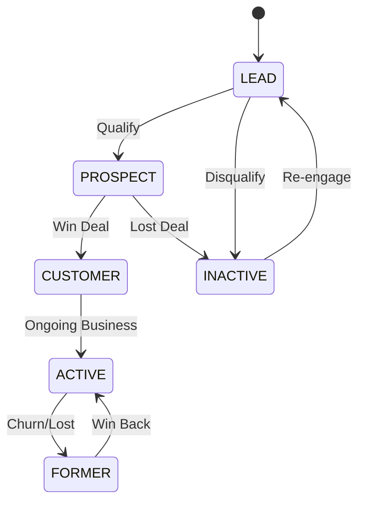
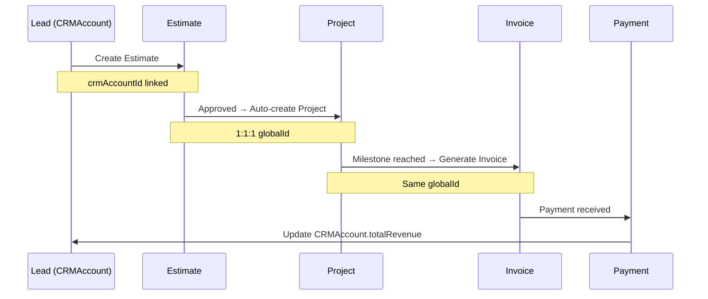

# 🏢 CRM Module Suite - Complete Flow Documentation

## 📋 Executive Summary

**Module Suite**: `crmcore.prisma`, `crmcommunication.prisma`, `crmrelationships.prisma`  
**Pattern**: Mixed (BH for communications, Tenant for most, Pattern B for critical entities)  
**Purpose**: Customer Relationship Management across entire customer lifecycle  
**Total Models**: 30 models (10 + 10 + 10)  
**Integration**: Estimate, Invoice, Project, Member, Actor  
**Version**: 1.0  
**Last Updated**: November 17, 2025

---

## 🎯 Strategic Purpose

The **CRM module suite** is the **relationship foundation layer** in the enterprise ERP. It manages all customer touchpoints from lead acquisition through ongoing account management, enabling:

### Key Business Objectives

1. **360° Customer View**: Complete history of all interactions, communications, and transactions
2. **Lead-to-Cash**: Track prospects through qualification, quoting, winning, and project delivery
3. **Multi-Channel Communication**: Unified inbox for emails, SMS, phone calls, and messages
4. **Relationship Intelligence**: Map complex org structures, decision makers, and influencers
5. **Revenue Optimization**: Identify upsell/cross-sell opportunities and prevent churn
6. **Compliance & Privacy**: GDPR, CCPA-compliant data management with consent tracking

---

## 🏗️ Module Architecture (30 Models)

### crmcore.prisma (10 models)

**Purpose**: Foundation layer with accounts, contacts, addresses, and basic interactions

| Model | Pattern | Purpose |
|-------|---------|---------|
| **CRMAccount** | Tenant + Pattern B | Company/organization (full actor tracking) |
| **CRMContact** | Tenant + Pattern B | Individual person (full actor tracking) |
| **CRMAddress** | Tenant + Pattern A | Physical/mailing addresses |
| **CRMInteraction** | BH + Pattern A | Touchpoint tracking with globalId |
| **CRMInteractionAttachment** | Tenant + Pattern A | Files attached to interactions |
| **CRMNote** | Tenant + Pattern A | Text notes on any entity |
| **CRMTag** | Tenant + Pattern A | Categorization tags |
| **CRMAccountTag** | Tenant + M:N | Account-to-tag associations |
| **CRMActivity** | Tenant + Pattern A | Tasks, events, reminders |
| **CRMHistoryEvent** | Tenant + Audit | Complete audit trail |

### crmcommunication.prisma (10 models)

**Purpose**: Multi-channel communication management

| Model | Pattern | Purpose |
|-------|---------|---------|
| **CRMEmail** | BH + Pattern A | Email tracking with open/click rates |
| **CRMEmailAttachment** | Tenant + Pattern A | Email attachments |
| **CRMSMS** | BH + Pattern A | SMS message tracking |
| **CRMPhoneCall** | BH + Pattern A | Call logging with duration |
| **CRMPhoneCallRecording** | Tenant + Pattern A | Call recordings with transcripts |
| **CRMMessageThread** | BH + Pattern A | Conversation threads |
| **CRMMessageParticipant** | Tenant + Pattern A | Thread participants |
| **CRMChannel** | Tenant + Pattern A | Communication channels config |
| **CRMNotificationSetting** | Tenant + Pattern A | Member notification preferences |
| **CRMNotificationEvent** | Tenant + Pattern A | Notification delivery tracking |

### crmrelationships.prisma (10 models)

**Purpose**: Complex relationship modeling

| Model | Pattern | Purpose |
|-------|---------|---------|
| **CRMAccountRelationship** | Tenant + Pattern A | Account-to-account relations |
| **CRMContactRole** | Tenant + Pattern A | Contact roles within accounts |
| **CRMAccountHierarchy** | Tenant + Pattern A | Multi-level org structures |
| **CRMHousehold** | Tenant + Pattern A | Family/household groupings |
| **CRMHouseholdMember** | Tenant + Pattern A | Household membership |
| **CRMDecisionMaker** | Tenant + Pattern A | Decision authority tracking |
| **CRMInfluencer** | Tenant + Pattern A | Influence mapping |
| **CRMPartner** | Tenant + Pattern A | Partner management |
| **CRMRelationshipAttachment** | Tenant + Pattern A | Relationship documentation |
| **CRMRelationshipHistoryEvent** | Tenant + Audit | Relationship audit trail |

---

## 🔄 Core Workflow 1: Lead-to-Customer Journey

### Overview
Complete lifecycle from first contact to active customer with revenue generation.

### Workflow Stages



---

### Stage 1: Lead Capture

**Trigger**: New lead enters system via:
- Web form submission
- Manual entry by sales rep
- Import from marketing automation
- Referral from existing customer
- Trade show/event sign-up

**Actions**:
1. Create **CRMAccount** (status: LEAD, rating: COLD/WARM/HOT)
2. Create **CRMContact** (if individual provided)
3. Create **CRMAddress** (if location provided)
4. Create **CRMInteraction** (type: NOTE, subject: "Lead Source: [source]")
5. Add **CRMTag** ("Lead Source: [source]")
6. Assign **ownerMemberId** (lead routing rules)
7. Create **CRMActivity** (type: TASK, subject: "Follow up on new lead", dueDate: +2 business days)
8. Trigger **CRMNotificationEvent** to owner (eventType: NEW_LEAD)

**Data Captured**:
- Account: name, industry, website, leadSource
- Contact: name, email, phone, title
- Address: location (helps with territory assignment)
- Initial notes: how they heard about us, initial needs

**Status**: `CRMAccount.status = LEAD`

---

### Stage 2: Lead Qualification

**Trigger**: Owner reviews lead and determines fit

**Actions**:
1. Add **CRMInteraction** (type: CALL or EMAIL, notes on conversation)
2. Update **CRMAccount.rating** based on interest level:
   - HOT: Ready to buy soon, high priority
   - WARM: Interested, needs nurturing
   - COLD: Low priority or poor fit
3. If qualified → Update `status = PROSPECT`
4. If disqualified → Update `status = INACTIVE`
5. Add **CRMNote** with qualification criteria assessment
6. Create **CRMActivity** for next follow-up

**Qualification Criteria** (typical):
- Budget available?
- Authority to buy?
- Need identified?
- Timeline defined?
- (BANT framework)

**Status Transition**:
- Qualified: `LEAD` → `PROSPECT`
- Disqualified: `LEAD` → `INACTIVE`

---

### Stage 3: Opportunity Development (as PROSPECT)

**Trigger**: Qualified lead enters sales process

**Actions**:
1. Create **Estimate** (linked to crmAccountId)
   ```prisma
   Estimate.crmAccountId = CRMAccount.id
   Estimate.crmContactId = CRMContact.id (primary contact)
   ```
2. Schedule **CRMActivity** (type: MEETING, "Discovery call")
3. Log all **CRMInteractions**:
   - Calls (CRMPhoneCall)
   - Emails (CRMEmail)
   - Meetings (CRMInteraction type: MEETING)
   - Site visits (CRMInteraction type: SITE_VISIT)
4. Create **CRMMessageThread** for ongoing communication
5. Identify **CRMDecisionMaker** contacts
6. Map **CRMInfluencer** relationships
7. Document **CRMContactRole** for each stakeholder

**Communication Tracking**:
- **CRMEmail**: All correspondence tracked
  - Open/click rates monitored
  - Attachments stored
- **CRMPhoneCall**: Call duration, outcome, notes
- **CRMSMS**: Quick updates/reminders

**Relationship Mapping**:
```prisma
// Identify decision maker
CRMDecisionMaker {
  contactId: primaryContact.id
  accountId: account.id
  decisionAuthority: FULL
  decisionScope: "BUDGET"
  budgetAuthority: 250000.00
}

// Map influencers
CRMInfluencer {
  contactId: technicalLead.id
  influenceArea: "TECHNICAL"
  influenceScore: 8
}
```

**Status**: `CRMAccount.status = PROSPECT`

---

### Stage 4: Proposal & Negotiation

**Trigger**: Estimate created and sent to prospect

**Actions**:
1. **Estimate** enters quote workflow:
   ```prisma
   Estimate.status = DRAFT → PENDING_APPROVAL → SENT
   Estimate.sentToClientAt = now()
   ```
2. Create **CRMInteraction** (type: EMAIL, subject: "Estimate Sent: EST-2025-00123")
3. Track email engagement:
   ```prisma
   CRMEmail.status = SENT → DELIVERED → OPENED
   CRMEmail.openedAt = timestamp
   CRMEmail.openCount++
   ```
4. Log **CRMInteraction** for each negotiation touch:
   - Type: CALL/MEETING
   - Outcome: "Price discussion", "Scope clarification"
   - Next steps documented
5. Create **CRMActivity** reminders:
   - "Follow up if no response" (dueDate: +3 days)
   - "Check-in call" (dueDate: +7 days)

**Communication Flow**:
```
Sales Rep → Sends Email (CRMEmail) → Prospect
Prospect → Opens Email (tracked)
Prospect → Replies (creates new CRMEmail in thread)
Sales Rep → Schedules Call (CRMActivity)
Sales Rep → Logs Call (CRMPhoneCall with notes)
Sales Rep → Updates Estimate (price adjustment)
Sales Rep → Resends Estimate (new CRMEmail)
```

**Status**: Still `PROSPECT` until deal won

---

### Stage 5: Deal Won → Customer

**Trigger**: Estimate approved by prospect

**Actions**:
1. **Estimate** status transition:
   ```prisma
   Estimate.approvalStatus = APPROVED
   Estimate.status = ACCEPTED
   ```
2. **CRMAccount** status transition:
   ```prisma
   CRMAccount.status = PROSPECT → CUSTOMER
   CRMAccount.totalProjects++
   CRMAccount.lifetimeValue += Estimate.totalAmount
   ```
3. Create **CRMInteraction** (type: NOTE, subject: "Deal Won! 🎉")
4. Auto-create **Project** (if configured):
   ```prisma
   Project {
     sourceEstimateId: estimate.id
     globalId: estimate.globalId // 1:1:1 linkage
     crmAccountId: estimate.crmAccountId
     crmContactId: estimate.crmContactId
     status: PLANNING
   }
   ```
5. Create **CRMActivity** (type: TASK, "Kickoff meeting", assigned to Project Manager)
6. Trigger **CRMNotificationEvent** to stakeholders:
   - Sales rep: "Deal won!"
   - Project manager: "New project assigned"
   - Finance: "Prepare contract"
7. Update **CRMTag**: Add "Active Customer" tag

**Financial Impact**:
```prisma
CRMAccount.totalRevenue += 0 // Will update as invoices paid
CRMAccount.totalProjects = 1 (first project)
CRMAccount.totalInvoices = 0 // Not billed yet
```

**Status**: `CRMAccount.status = CUSTOMER`

---

### Stage 6: Ongoing Business (ACTIVE)

**Trigger**: Multiple successful projects/transactions

**Actions**:
1. Update **CRMAccount.status = ACTIVE** (after 2nd project or consistent revenue)
2. Track all **Project** deliveries
3. Generate **Invoice** records
4. Update financial metrics:
   ```prisma
   CRMAccount.totalRevenue += Invoice.totalAmount (on payment)
   CRMAccount.totalInvoices++
   CRMAccount.lifetimeValue += Invoice.totalAmount
   ```
5. Schedule regular **CRMActivity** touchpoints:
   - Type: CALL, "Quarterly check-in"
   - Type: EMAIL, "Satisfaction survey"
6. Monitor **CRMInteraction** frequency (engagement health)

**Health Monitoring**:
- Last interaction > 90 days → Flag for outreach
- No projects in 6 months → Risk of churn
- Payment issues → Finance team notified

**Status**: `CRMAccount.status = ACTIVE`

---

### Stage 7: Churn Prevention & Win-Back

**Trigger**: Warning signs detected

**Churn Indicators**:
- No interactions in 90+ days
- No new projects in 6+ months
- Negative sentiment in recent interactions
- Payment disputes
- Competitive intel (lost to competitor)

**Actions**:
1. Create **CRMActivity** (priority: HIGH, "At-risk account - outreach")
2. Log **CRMInteraction** (check-in call)
3. If churned:
   ```prisma
   CRMAccount.status = ACTIVE → FORMER
   ```
4. Add **CRMNote** with churn reason
5. Add **CRMTag** "Churn: [Reason]"

**Win-Back Campaign**:
1. Create **CRMActivity** series:
   - Month 1: "Check-in call"
   - Month 3: "Special offer email"
   - Month 6: "Reactivation attempt"
2. Track all **CRMInteraction** attempts
3. If re-engaged:
   ```prisma
   CRMAccount.status = FORMER → ACTIVE
   ```

---

## 🔄 Core Workflow 2: 360° Account Management

### Overview
Day-to-day account management with complete interaction history.

---

### Workflow: Daily Operations

#### 1. Morning Routine (Sales Rep)

**Query**: Get my accounts needing attention today

```typescript
// Fetch today's activities
const activities = await prisma.cRMActivity.findMany({
  where: {
    tenantId: currentTenant,
    assignedToMemberId: currentMember,
    dueDate: { lte: today },
    status: "OPEN"
  },
  include: {
    account: true,
    contact: true
  },
  orderBy: { priority: 'desc' }
});

// Fetch recent interactions to review
const recentInteractions = await prisma.cRMInteraction.findMany({
  where: {
    tenantId: currentTenant,
    accountId: { in: myAccountIds },
    createdAt: { gte: yesterday }
  },
  orderBy: { createdAt: 'desc' }
});
```

**Dashboard Shows**:
- **Overdue tasks** (red)
- **Today's calls/meetings** (yellow)
- **Follow-ups needed** (orange)
- **New leads assigned** (blue)

---

#### 2. Making a Customer Call

**Trigger**: Activity reminder pops up: "Call John Doe - Quarterly Check-in"

**Flow**:
1. Click activity → Opens **CRMContact** profile
2. Profile shows:
   - Contact info (phone, email)
   - Parent **CRMAccount** details
   - Recent **CRMInteractions** (last 5)
   - Open **CRMActivities**
   - Related **Estimates/Invoices/Projects**
3. Click "Make Call" → Dial (if VoIP integrated)
4. During call, take notes in draft **CRMPhoneCall**:
   ```prisma
   CRMPhoneCall {
     callType: OUTBOUND
     contactId: john.id
     accountId: john.account.id
     status: RINGING → ANSWERED
     // Auto-tracks duration
   }
   ```
5. After call, log outcome:
   ```prisma
   CRMPhoneCall.outcome = COMPLETED
   CRMPhoneCall.notes = "Discussed Q2 expansion plans. Needs estimate for Phase 2."
   CRMPhoneCall.nextSteps = "Send estimate by Friday"
   CRMPhoneCall.endedAt = now()
   ```
6. Create follow-up **CRMActivity**:
   ```prisma
   CRMActivity {
     activityType: TASK
     subject: "Send Phase 2 estimate to John"
     dueDate: thisWee kFriday
     accountId: john.account.id
     contactId: john.id
     priority: HIGH
   }
   ```
7. Mark original activity as COMPLETED

**Result**: Complete call history logged, next steps scheduled

---

#### 3. Sending an Email

**Trigger**: Need to send proposal to multiple contacts

**Flow**:
1. Compose email in CRM:
   ```prisma
   CRMEmail {
     subject: "Proposal for Q2 Expansion Project"
     bodyHtml: "[Rich HTML content]"
     fromAddress: "sales@nov15zeus.com"
     toAddresses: ["john@client.com", "jane@client.com"]
     accountId: client.account.id
     relatedToType: "ESTIMATE"
     relatedToId: estimate.id
     status: DRAFT
   }
   ```
2. Attach estimate PDF:
   ```prisma
   CRMEmailAttachment {
     emailId: email.id
     fileName: "Estimate-EST-2025-00456.pdf"
     fileUrl: "s3://..."
   }
   ```
3. Schedule or send immediately:
   ```prisma
   CRMEmail.status = DRAFT → SCHEDULED (or) SENT
   CRMEmail.sentAt = now()
   ```
4. Email delivery tracked:
   ```prisma
   // Webhook from email provider (SendGrid, etc.)
   CRMEmail.status = SENT → DELIVERED
   CRMEmail.deliveredAt = timestamp
   ```
5. Track engagement:
   ```prisma
   // Tracking pixel in email
   CRMEmail.status = DELIVERED → OPENED
   CRMEmail.openedAt = timestamp
   CRMEmail.openCount++
   
   // Link clicked
   CRMEmail.clickedAt = timestamp
   CRMEmail.clickCount++
   ```

**Auto-Created Records**:
- **CRMInteraction** (type: EMAIL, linked to email)
- **CRMMessageThread** (if first email or reply)
- **CRMNotificationEvent** (if reply received)

---

#### 4. Logging a Meeting

**Trigger**: Just finished client meeting at their office

**Flow**:
1. Create **CRMInteraction**:
   ```prisma
   CRMInteraction {
     interactionType: MEETING
     subject: "On-site meeting - Project scope review"
     notes: "[Detailed meeting notes]"
     outcome: "Agreement to proceed with Phase 1"
     sentiment: POSITIVE
     interactionDate: now()
     duration: 90 // minutes
     accountId: client.account.id
     contactId: [All attendees]
     followUpDate: nextWeek
   }
   ```
2. Upload meeting photos:
   ```prisma
   CRMInteractionAttachment {
     interactionId: meeting.id
     fileName: "Whiteboard-notes.jpg"
   }
   ```
3. Create action items:
   ```prisma
   // For each action item
   CRMActivity {
     subject: "Send updated timeline to client"
     dueDate: tomorrow
     accountId: client.id
   }
   ```

**Timeline Updated**: Meeting appears in account timeline

---

## 🔄 Core Workflow 3: Multi-Channel Communication

### Overview
Unified inbox managing emails, SMS, calls, and messages in one place.

---

### Workflow: Unified Inbox

#### View: Inbox Dashboard

**Shows**:
1. **CRMMessageThread** list:
   - Unread count
   - Last message preview
   - Participants
   - Related account
   - Thread type (EMAIL, SMS, CHAT)
   - Status (ACTIVE, ARCHIVED)

2. **Recent Communications** (all types):
   - CRMEmail (sent/received)
   - CRMSMS (sent/received)
   - CRMPhoneCall (inbound/outbound)
   - Sorted by timestamp desc

3. **Filters**:
   - By account
   - By contact
   - By type (EMAIL|SMS|CALL)
   - By status (UNREAD|OPEN|CLOSED)

---

#### Scenario 1: Email Thread

**Trigger**: Customer sends email to sales@nov15zeus.com

**Flow**:
1. Email received via webhook (SendGrid, etc.)
2. System processes:
   ```prisma
   // Find or create thread
   thread = findOrCreateThread({
     accountId: matchedAccount.id,
     subject: email.subject,
     threadType: EMAIL
   });
   
   // Create email record
   CRMEmail {
     threadId: thread.id
     fromAddress: "customer@client.com"
     toAddresses: ["sales@nov15zeus.com"]
     subject: email.subject
     bodyHtml: email.body
     status: DELIVERED
     accountId: matchedAccount.id
     contactId: matchedContact.id
   }
   
   // Update thread stats
   thread.messageCount++
   thread.lastMessageAt = now()
   thread.lastMessagePreview = truncate(email.body, 255)
   ```
3. Determine recipient (routing rules):
   - If account has owner → Route to owner
   - Else → Route to team queue
4. Create notification:
   ```prisma
   CRMNotificationEvent {
     eventType: "NEW_EMAIL"
     recipientMemberId: owner.id
     relatedEntityType: "EMAIL"
     relatedEntityId: email.id
     notificationContent: "New email from [Account Name]"
     status: PENDING
   }
   ```
5. Send notification (email/SMS/push based on **CRMNotificationSetting**)

**Rep Response**:
1. Rep clicks notification → Opens thread
2. Sees full history:
   - Previous emails in thread
   - Related calls (CRMPhoneCall)
   - Related SMS (CRMSMS)
   - Account context (sidebar)
3. Composes reply:
   ```prisma
   CRMEmail {
     threadId: existingThread.id
     inReplyToEmailId: originalEmail.id
     fromAddress: "sales@nov15zeus.com"
     toAddresses: ["customer@client.com"]
     subject: "RE: " + originalSubject
     bodyHtml: replyContent
     status: DRAFT → SENT
   }
   ```
4. Email sent and tracked

---

#### Scenario 2: SMS Conversation

**Trigger**: Customer texts support number

**Flow**:
1. SMS received via Twilio webhook
2. System processes:
   ```prisma
   // Match phone number to contact
   contact = findContactByPhone(fromNumber);
   
   // Find or create thread
   thread = findOrCreateThread({
     accountId: contact.accountId,
     threadType: SMS
   });
   
   // Create SMS record
   CRMSMS {
     threadId: thread.id
     fromNumber: customer.mobile
     toNumber: twilioNumber
     messageBody: sms.body
     status: DELIVERED
     contactId: contact.id
     accountId: contact.accountId
   }
   ```
3. Route to owner, create notification
4. Rep replies:
   ```prisma
   CRMSMS {
     threadId: thread.id
     fromNumber: twilioNumber
     toNumber: customer.mobile
     messageBody: replyText
     status: QUEUED → SENT → DELIVERED
   }
   ```

**SMS Auto-Responses** (if configured):
- Business hours: "Thanks! We'll respond within 1 hour."
- After hours: "We're closed. We'll respond tomorrow morning."

---

#### Scenario 3: Phone Call with Recording

**Trigger**: Inbound call via VoIP system

**Flow**:
1. Call received, screen pop:
   - Caller ID matched to **CRMContact**
   - Account details shown
   - Recent interactions displayed
2. Rep answers, call auto-logged:
   ```prisma
   CRMPhoneCall {
     callType: INBOUND
     fromNumber: caller.phone
     toNumber: companyNumber
     status: RINGING → ANSWERED
     contactId: caller.id
     accountId: caller.account.id
     startedAt: now()
   }
   ```
3. If recording enabled:
   ```prisma
   CRMPhoneCallRecording {
     phoneCallId: call.id
     recordingUrl: voipSystem.recordingUrl
     consentRecorded: true // Legal requirement
     storageProvider: "TWILIO"
   }
   ```
4. During call, rep takes notes (live)
5. Call ends:
   ```prisma
   CRMPhoneCall {
     status: ANSWERED → ENDED
     endedAt: now()
     duration: calculated // seconds
     outcome: COMPLETED
     notes: repNotes
     nextSteps: "Send follow-up email"
   }
   ```
6. Post-call:
   - Transcription queued (if enabled):
     ```prisma
     CRMPhoneCallRecording {
       transcriptionStatus: PENDING → COMPLETED
       transcriptionText: "[Full transcript]"
     }
     ```
   - Auto-create follow-up **CRMActivity** (if nextSteps set)

**Call Analytics**:
- Average call duration by rep
- Outcomes distribution
- Call volume by time of day
- Sentiment analysis (if AI enabled)

---

## 🔄 Core Workflow 4: Relationship Mapping

### Overview
Map complex organizational structures and influence networks.

---

### Workflow: Enterprise Account Mapping

#### Scenario: Large Construction Company

**Structure**:
```
ABC Construction Inc. (Parent)
├── ABC Northeast Division (Subsidiary)
│   ├── Project Manager: John Doe (Decision Maker - BUDGET)
│   ├── Chief Estimator: Jane Smith (Decision Maker - TECHNICAL)
│   └── Superintendent: Bob Wilson (Influencer - OPERATIONS)
├── ABC Southeast Division (Subsidiary)
│   └── [Similar structure]
└── ABC Equipment Rentals (Subsidiary)
```

---

#### Step 1: Create Account Hierarchy

```prisma
// Parent account
parentAccount = CRMAccount {
  accountName: "ABC Construction Inc."
  accountType: COMPANY
  status: CUSTOMER
}

// Create subsidiary
subsidiaryNE = CRMAccount {
  accountName: "ABC Northeast Division"
  accountType: COMPANY
  status: ACTIVE
}

// Link hierarchy
CRMAccountHierarchy {
  accountId: subsidiaryNE.id
  parentAccountId: parentAccount.id
  hierarchyLevel: 1
  hierarchyPath: "1"
}
```

**Visual**: Org chart in UI shows parent-child structure

---

#### Step 2: Map Contacts with Roles

```prisma
// Project Manager
john = CRMContact {
  firstName: "John"
  lastName: "Doe"
  title: "Project Manager"
  primaryAccountId: subsidiaryNE.id
}

// Define role
CRMContactRole {
  contactId: john.id
  accountId: subsidiaryNE.id
  roleType: DECISION_MAKER
  isPrimary: true
  department: "Operations"
}

// Mark as decision maker
CRMDecisionMaker {
  contactId: john.id
  accountId: subsidiaryNE.id
  decisionAuthority: FULL
  decisionScope: "BUDGET"
  budgetAuthority: 500000.00 // Can approve up to $500K
  influenceLevel: HIGH
}
```

---

#### Step 3: Map Influencers

```prisma
// Superintendent
bob = CRMContact {
  firstName: "Bob"
  lastName: "Wilson"
  title: "Superintendent"
  primaryAccountId: subsidiaryNE.id
}

// Mark as influencer
CRMInfluencer {
  contactId: bob.id
  accountId: subsidiaryNE.id
  influencerType: INTERNAL
  influenceArea: "OPERATIONS"
  influenceScore: 7 // 1-10 scale
  networkSize: 15 // Has 15 direct reports
  engagementLevel: HIGH
}
```

**Use Case**: Bob doesn't sign contracts but his opinion heavily influences John's decision

---

#### Step 4: Rollup Metrics

**Auto-calculated** in **CRMAccountHierarchy**:
```prisma
// Parent account sees aggregated metrics
parentAccount.hierarchy {
  rollupRevenue: 5_250_000.00 // Sum of all subsidiaries
  rollupEmployeeCount: 450
  rollupProjectCount: 32
}
```

**Reports**:
- Revenue by division
- Project count by subsidiary
- Win rate by region

---

### Workflow: Partner Management

#### Scenario: Referral Partner

**Flow**:
1. Create **CRMAccount** for partner company
2. Create **CRMPartner** record:
   ```prisma
   CRMPartner {
     accountId: partnerAccount.id
     partnerType: REFERRAL
     partnerTier: GOLD
     partnerStatus: ACTIVE
     commissionRate: 0.10 // 10%
     contractStartDate: 2025-01-01
     contractEndDate: 2026-12-31
   }
   ```
3. When partner sends referral:
   ```prisma
   // Create new lead
   newLead = CRMAccount {
     accountName: "Referred Company"
     status: LEAD
     leadSource: "Partner: [Partner Name]"
   }
   
   // Track referral
   CRMAccountRelationship {
     fromAccountId: partnerAccount.id
     toAccountId: newLead.id
     relationshipType: PARTNER
   }
   
   // Update partner stats
   partner.totalReferrals++
   ```
4. When deal closes:
   ```prisma
   partner.totalRevenue += dealValue
   partner.lastDealDate = today
   ```
5. Calculate commission (in separate Billing module):
   ```prisma
   commission = dealValue * partner.commissionRate
   // Create payment record
   ```

**Partner Portal** (optional):
- Partner logs in to see their referrals
- Track commission statements
- Submit new referrals

---

### Workflow: Household Management (B2C Use Case)

#### Scenario: Family Renovating Home

**Flow**:
1. Create **CRMHousehold**:
   ```prisma
   CRMHousehold {
     householdName: "Smith Family"
     householdType: FAMILY
     primaryAddressId: homeAddress.id
   }
   ```
2. Add household members:
   ```prisma
   // Head of household
   CRMHouseholdMember {
     householdId: smithFamily.id
     contactId: johnSmith.id
     role: HEAD
     isPrimary: true
   }
   
   // Spouse
   CRMHouseholdMember {
     householdId: smithFamily.id
     contactId: janeSmith.id
     role: SPOUSE
   }
   ```
3. Track household-level metrics:
   ```prisma
   smithFamily.totalPurchases = 125000.00 // Total spent
   smithFamily.memberCount = 4 // 2 parents, 2 kids
   ```

**Use Cases**:
- Send single invoice to household
- Track family referrals
- Household-level loyalty rewards
- Shared communication preferences

---

## 🔄 Core Workflow 5: Revenue Document Integration

### Overview
How CRM integrates with Estimate, Invoice, and Project modules.

---

### Workflow: From Lead to Invoice Payment

#### Full Cycle:



---

#### Step 1: Create Estimate from CRM

**Trigger**: CRMAccount is qualified as PROSPECT

**Flow**:
1. Sales rep clicks "Create Estimate" on account
2. Estimate pre-populated:
   ```prisma
   Estimate {
     crmAccountId: account.id (REQUIRED)
     crmContactId: primaryContact.id (optional)
     billToAddressId: billingAddress.id
     jobsiteAddressId: jobsiteAddress.id
     currencyCode: "USD"
     status: DRAFT
   }
   ```
3. Rep builds estimate (line items, costs, etc.)
4. Estimate sent:
   ```prisma
   Estimate.status = SENT
   Estimate.sentToClientAt = now()
   
   // Auto-create CRMEmail
   CRMEmail {
     accountId: estimate.crmAccountId
     contactId: estimate.crmContactId
     relatedToType: "ESTIMATE"
     relatedToId: estimate.id
     subject: "Estimate: " + estimate.estimateNumber
   }
   ```

---

#### Step 2: Estimate Approved → Update CRM

**Trigger**: Customer approves estimate

**Flow**:
```prisma
// Estimate updated
Estimate.approvalStatus = APPROVED
Estimate.status = ACCEPTED

// CRM Account updated
CRMAccount {
  status: PROSPECT → CUSTOMER
  totalProjects++ // Will increment when project created
  lifetimeValue += Estimate.totalAmount (potential)
}

// Log interaction
CRMInteraction {
  interactionType: NOTE
  subject: "Estimate Approved: " + estimate.estimateNumber
  accountId: estimate.crmAccountId
  relatedToType: "ESTIMATE"
  relatedToId: estimate.id
  sentiment: POSITIVE
}
```

---

#### Step 3: Project Created → Link to CRM

**Trigger**: Estimate approval auto-creates Project

**Flow**:
```prisma
Project {
  sourceEstimateId: estimate.id
  globalId: estimate.globalId // 1:1:1 linkage
  
  // CRM linkage (inherited from Estimate)
  crmAccountId: estimate.crmAccountId
  crmContactId: estimate.crmContactId
  jobsiteAddressId: estimate.jobsiteAddressId
  
  status: PLANNING
}

// CRM updated
CRMAccount.totalProjects++

// Log interaction
CRMInteraction {
  interactionType: NOTE
  subject: "Project Started: " + project.projectNumber
  accountId: project.crmAccountId
  relatedToType: "PROJECT"
  relatedToId: project.id
}
```

---

#### Step 4: Invoice Generated → Link to CRM

**Trigger**: Project milestone reached or progress billing triggered

**Flow**:
```prisma
Invoice {
  relatedProjectId: project.id
  sourceEstimateId: estimate.id (optional)
  globalId: project.globalId // 1:1:1 linkage
  
  // CRM linkage (inherited from Project)
  crmAccountId: project.crmAccountId
  crmContactId: project.crmContactId
  billToAddressId: project.billToAddressId
  
  status: DRAFT
}

// When invoice sent
Invoice.status = SENT
Invoice.sentToClientAt = now()

// Create CRMEmail
CRMEmail {
  accountId: invoice.crmAccountId
  contactId: invoice.crmContactId
  relatedToType: "INVOICE"
  relatedToId: invoice.id
  subject: "Invoice: " + invoice.invoiceNumber
  // PDF attached via CRMEmailAttachment
}

// CRM updated
CRMAccount.totalInvoices++

// Log interaction
CRMInteraction {
  interactionType: EMAIL
  subject: "Invoice Sent: " + invoice.invoiceNumber
  accountId: invoice.crmAccountId
  relatedToType: "INVOICE"
  relatedToId: invoice.id
}
```

---

#### Step 5: Payment Received → Update CRM

**Trigger**: Invoice payment applied (via Payment module)

**Flow**:
```prisma
// Invoice updated
Invoice.paymentStatus = UNPAID → PARTIALLY_PAID → PAID
Invoice.amountPaid += payment.amount

// CRM Account updated
CRMAccount {
  totalRevenue += payment.amount
  lifetimeValue += payment.amount
}

// Log interaction (optional, for full transparency)
CRMInteraction {
  interactionType: NOTE
  subject: "Payment Received: " + formatMoney(payment.amount)
  accountId: invoice.crmAccountId
  relatedToType: "INVOICE"
  relatedToId: invoice.id
  sentiment: POSITIVE
}

// If fully paid, trigger thank you email
if (Invoice.paymentStatus == PAID) {
  CRMEmail {
    accountId: invoice.crmAccountId
    subject: "Thank you for your payment!"
    bodyHtml: thankYouTemplate
  }
}
```

---

### CRM Dashboard: Account 360° View

**When viewing CRMAccount, user sees**:

1. **Account Header**:
   - Name, status, rating
   - Owner, territory
   - Lifetime value, total revenue
   - Total projects, total invoices

2. **Contact List**:
   - All **CRMContact** records linked to account
   - Roles (**CRMContactRole**)
   - Decision makers (**CRMDecisionMaker**)
   - Influencers (**CRMInfluencer**)

3. **Activity Timeline** (reverse chronological):
   - All **CRMInteraction** records
   - **CRMEmail**, **CRMSMS**, **CRMPhoneCall**
   - Estimate status changes
   - Invoice sent/paid events
   - Project milestones

4. **Open Activities**:
   - **CRMActivity** (status: OPEN)
   - Sorted by due date

5. **Revenue Documents**:
   - **Estimates** (with status)
   - **Projects** (with status, % complete)
   - **Invoices** (with payment status)

6. **Communication Stats**:
   - Email open rate
   - SMS response time
   - Call frequency

7. **Relationships**:
   - Parent/subsidiary (**CRMAccountHierarchy**)
   - Partners (**CRMPartner**)
   - Related accounts (**CRMAccountRelationship**)

---

## 📊 Status Transition Rules

### CRMAccount.status

**Valid Transitions**:
```
LEAD → PROSPECT (qualified)
LEAD → INACTIVE (disqualified)

PROSPECT → CUSTOMER (deal won)
PROSPECT → INACTIVE (deal lost)

CUSTOMER → ACTIVE (ongoing business)
CUSTOMER → FORMER (churned)

ACTIVE → FORMER (churned)
FORMER → ACTIVE (win-back)

INACTIVE → LEAD (re-engage)
```

**Business Rules**:
- Cannot delete account with `status = CUSTOMER or ACTIVE` (must archive first)
- Cannot delete account with linked revenue docs (Estimate/Invoice/Project with `deletedAt = null`)
- Accounts with `totalRevenue > 0` can never be permanently deleted (compliance)

---

### CRMEmail.status

**Lifecycle**:
```
DRAFT → SCHEDULED → SENT → DELIVERED → OPENED → CLICKED
                  ↓
               BOUNCED / FAILED
```

**Tracking**:
- `sentAt`: When email left server
- `deliveredAt`: When email reached inbox (webhook from provider)
- `openedAt`: When tracking pixel loaded
- `clickedAt`: When link clicked
- `bouncedAt`: If email bounced

---

### CRMPhoneCall.status

**Lifecycle**:
```
INITIATED → RINGING → ANSWERED → ENDED
          ↓          ↓
       MISSED     BUSY
```

---

## 🤖 Automation Rules

### Auto-Activity Creation

**Rule 1**: New lead assigned
```
Trigger: CRMAccount.status = LEAD AND ownerMemberId changed
Action: Create CRMActivity {
  subject: "Follow up on new lead"
  dueDate: +2 business days
  priority: HIGH
}
```

**Rule 2**: Estimate sent with no response
```
Trigger: Estimate.sentToClientAt AND (now() - sentToClientAt) > 3 days AND status = SENT
Action: Create CRMActivity {
  subject: "Follow up on estimate: " + estimateNumber
  dueDate: today
}
```

**Rule 3**: No interaction in 90 days
```
Trigger: CRMAccount.status = ACTIVE AND lastInteractionDate < (now() - 90 days)
Action: Create CRMActivity {
  subject: "At-risk account - check-in call"
  priority: HIGH
}
```

---

### Auto-Email Campaigns

**Welcome Email** (new customer):
```
Trigger: CRMAccount.status changed from PROSPECT to CUSTOMER
Action: Send CRMEmail {
  subject: "Welcome to [Company]!"
  bodyHtml: welcomeTemplate
  accountId: account.id
}
```

**Birthday Email**:
```
Trigger: CRMContact.birthdate.month == today.month AND birthdate.day == today.day
Action: Send CRMEmail {
  subject: "Happy Birthday, [FirstName]!"
  contactId: contact.id
}
```

**Payment Thank You**:
```
Trigger: Invoice.paymentStatus = PAID
Action: Send CRMEmail {
  subject: "Thank you for your payment!"
  accountId: invoice.crmAccountId
}
```

---

### Auto-Notifications

**New Lead Assigned**:
```
Trigger: CRMAccount.ownerMemberId changed AND status = LEAD
Recipient: New owner
Type: Based on CRMNotificationSetting
Content: "New lead assigned: [AccountName]"
```

**Email Opened**:
```
Trigger: CRMEmail.status = OPENED
Recipient: Email sender (createdByActorId)
Type: IN_APP (typically)
Content: "[ContactName] opened your email"
```

**Task Overdue**:
```
Trigger: CRMActivity.dueDate < today AND status = OPEN
Recipient: Assigned member
Type: EMAIL + PUSH
Content: "Overdue task: [Subject]"
```

---

## 📈 Reporting & Analytics

### Key Metrics

**Sales Performance**:
- Conversion rate: LEAD → PROSPECT → CUSTOMER
- Average deal size
- Sales cycle length (days from LEAD to CUSTOMER)
- Win rate (PROSPECT to CUSTOMER)

**Account Health**:
- Days since last interaction
- Email engagement rate (opens, clicks)
- Response time
- Churn risk score

**Communication Volume**:
- Emails sent/received by rep
- Call volume and duration
- SMS response time
- Average touches per deal

**Revenue**:
- Lifetime value per account
- Revenue by account type
- Revenue by industry
- Top 20 accounts by revenue

---

### Example Queries

**Query 1**: Accounts needing attention (no interaction in 60+ days)
```typescript
const atRiskAccounts = await prisma.cRMAccount.findMany({
  where: {
    tenantId,
    status: { in: ['ACTIVE', 'CUSTOMER'] },
    interactions: {
      none: {
        createdAt: { gte: sixtyDaysAgo }
      }
    }
  },
  include: {
    interactions: {
      take: 1,
      orderBy: { createdAt: 'desc' }
    }
  }
});
```

**Query 2**: Email engagement by rep
```typescript
const emailStats = await prisma.cRMEmail.groupBy({
  by: ['createdByActorId'],
  where: {
    tenantId,
    createdAt: { gte: startOfMonth }
  },
  _count: { id: true },
  _sum: {
    openCount: true,
    clickCount: true
  }
});
```

**Query 3**: Revenue pipeline by stage
```typescript
const pipeline = await prisma.cRMAccount.groupBy({
  by: ['status'],
  where: {
    tenantId,
    status: { in: ['LEAD', 'PROSPECT', 'CUSTOMER'] }
  },
  _count: { id: true },
  _sum: {
    lifetimeValue: true
  }
});
```

---

## 🔒 Data Privacy & Compliance

### GDPR Compliance

**Consent Tracking**:
```prisma
CRMContact {
  gdprConsent: true
  marketingConsent: false
  dataPrivacyStatus: "CONSENTED" // CONSENTED|WITHDRAWN|PENDING
}
```

**Right to be Forgotten**:
```typescript
// Soft delete contact + related data
await prisma.cRMContact.update({
  where: { id: contactId },
  data: {
    deletedAt: now(),
    // Anonymize PII
    firstName: "REDACTED",
    lastName: "REDACTED",
    email: null,
    phone: null,
    mobile: null
  }
});

// Cascade to interactions, emails, etc.
await prisma.cRMInteraction.updateMany({
  where: { contactId },
  data: { deletedAt: now() }
});
```

**Data Export** (GDPR data portability):
```typescript
// Generate JSON export of all contact data
const contactData = await prisma.cRMContact.findUnique({
  where: { id: contactId },
  include: {
    addresses: true,
    interactions: true,
    emails: true,
    phoneCalls: true,
    activities: true
  }
});

// Return as downloadable JSON
```

---

### Do Not Contact Rules

**Email Suppression**:
```typescript
// Before sending email
const contact = await prisma.cRMContact.findUnique({
  where: { id: contactId }
});

if (contact.doNotEmail || !contact.marketingConsent) {
  throw new Error("Contact opted out of emails");
}
```

**Call Blocking**:
```typescript
if (contact.doNotCall) {
  throw new Error("Contact on do-not-call list");
}
```

---

## 🎯 Best Practices

### 1. Data Quality

**Always capture minimum viable data**:
- Account: name, industry, status
- Contact: firstName, lastName, email (at minimum)
- Interaction: type, date, outcome

**Avoid**:
- Creating duplicate accounts (search first)
- Incomplete records (missing required fields)
- Stale data (last updated > 12 months)

---

### 2. Activity Management

**Do**:
- Set realistic due dates
- Add clear next steps
- Mark completed activities as COMPLETED (don't delete)
- Link activities to accounts/contacts

**Don't**:
- Create activities without assignees
- Set vague subjects ("Follow up")
- Ignore overdue activities

---

### 3. Communication Tracking

**Do**:
- Log every customer interaction (calls, emails, meetings)
- Add detailed notes with outcomes
- Set follow-up activities
- Track sentiment (POSITIVE/NEUTRAL/NEGATIVE)

**Don't**:
- Rely on memory (log immediately)
- Use external email (use CRM email for tracking)
- Skip logging "quick calls" (all interactions matter)

---

### 4. Relationship Mapping

**Do**:
- Map all decision makers and influencers
- Document org hierarchy for enterprise accounts
- Track decision authority and budget limits
- Update as relationships change

**Don't**:
- Assume one contact is sufficient
- Ignore administrative gatekeepers
- Forget to update when people change roles

---

## 📊 Summary

**CRM Module Suite** provides:
1. **Complete Customer Lifecycle**: Lead → Customer → Active → Former (with win-back)
2. **360° View**: All interactions, communications, and revenue documents in one place
3. **Multi-Channel**: Unified inbox for email, SMS, calls, and messages
4. **Relationship Intelligence**: Decision makers, influencers, hierarchies, and partners
5. **Revenue Integration**: Seamless linkage to Estimate, Invoice, and Project modules
6. **Compliance**: GDPR-ready with consent tracking and data portability
7. **Automation**: Auto-activities, email campaigns, and smart notifications

**Total Models**: 30 (crmcore: 10, crmcommunication: 10, crmrelationships: 10)

**Pattern Summary**:
- **Pattern B** (Full Actor): CRMAccount, CRMContact (critical entities)
- **BH Pattern** (globalId): CRMInteraction, CRMEmail, CRMSMS, CRMPhoneCall, CRMMessageThread
- **Pattern A** (IDs Only): All other supporting entities

**Ready for Implementation**: ✅

---

**Next Steps**:
1. Review CRM_ARCHITECTURE_DIAGRAM.md for complete model definitions
2. Generate Prisma migrations
3. Build tRPC API layers
4. Create UI components for CRM dashboard
5. Implement automation rules
6. Set up email/SMS provider integrations (SendGrid, Twilio)
7. Configure notification channels

---

**Version**: 1.0  
**Last Updated**: November 17, 2025  
**Status**: ✅ COMPLETE & READY FOR IMPLEMENTATION
