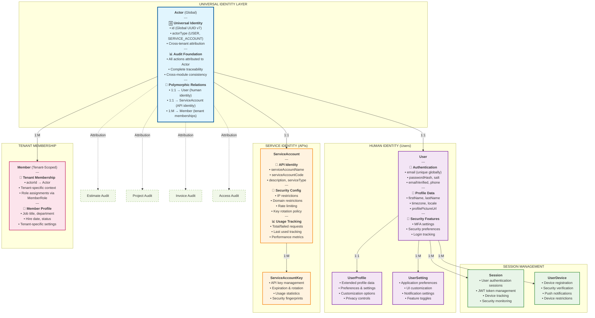
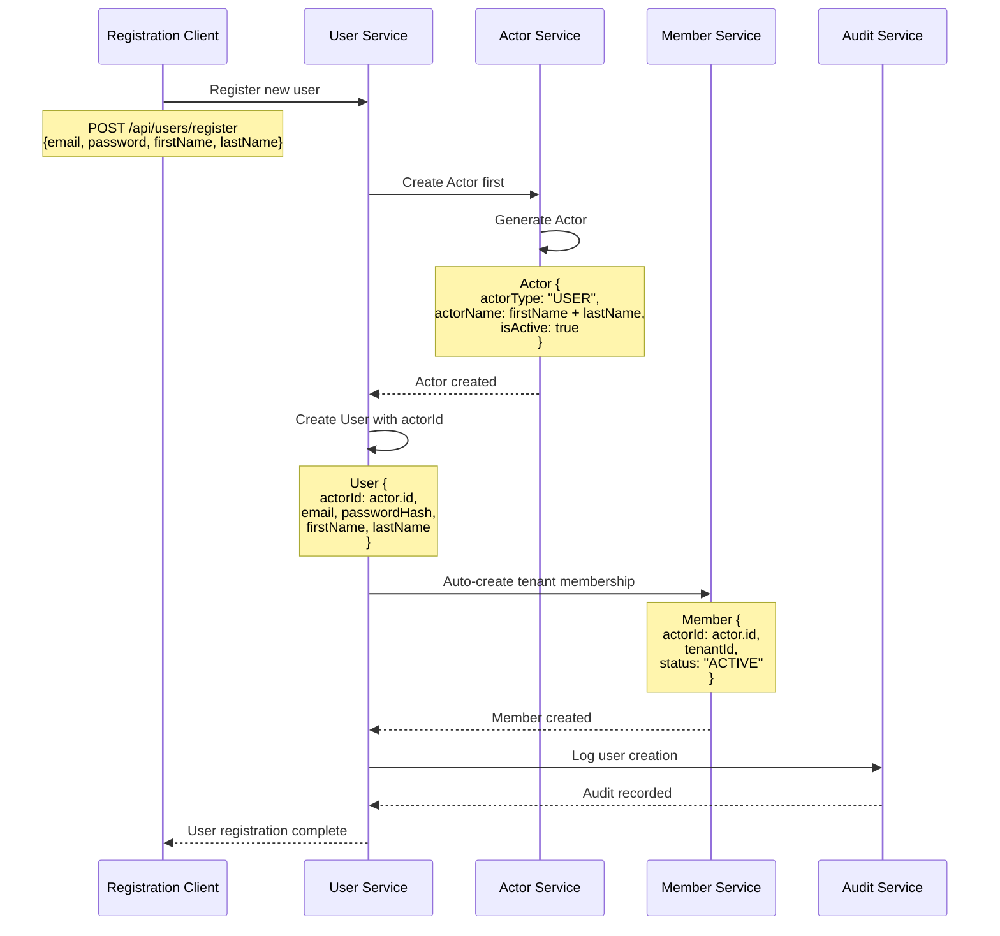
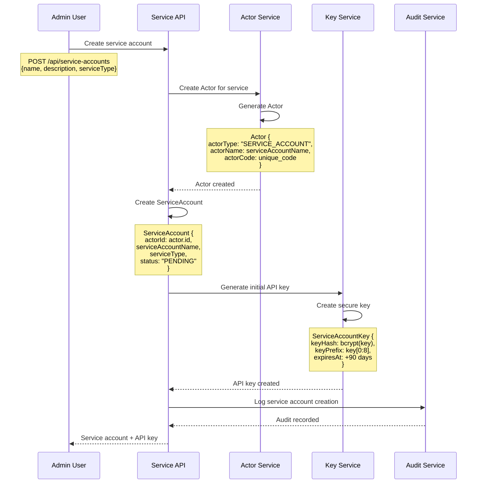
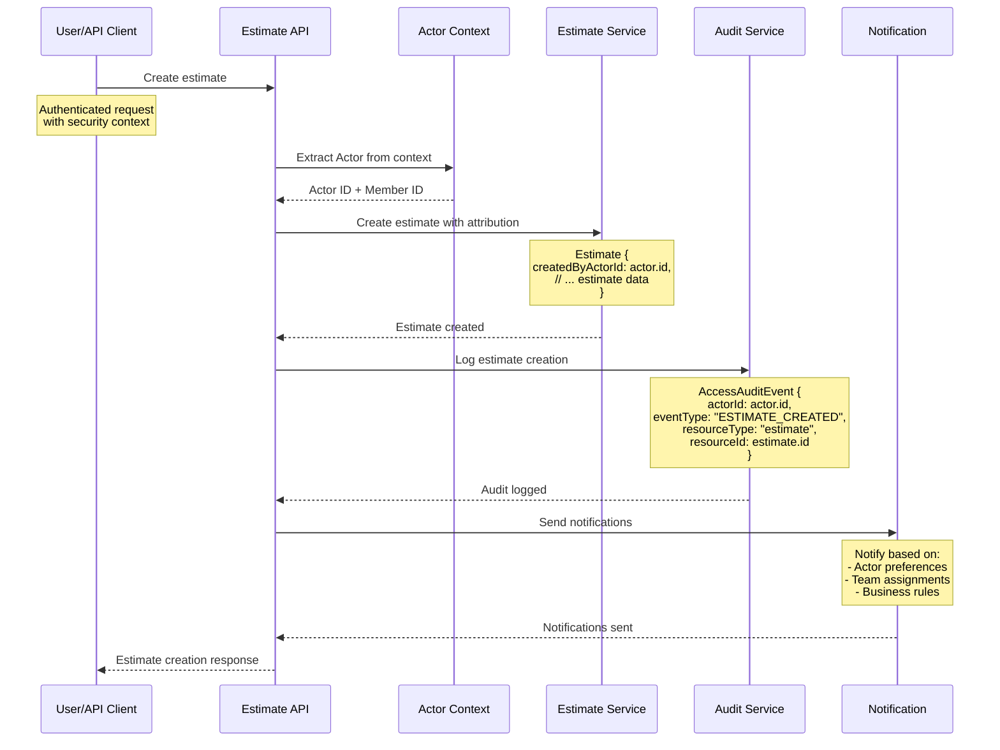
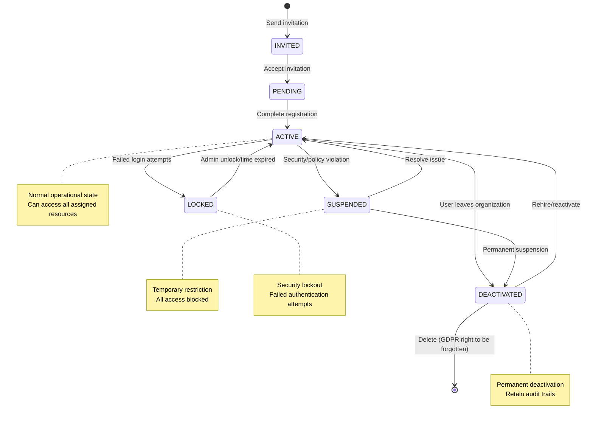
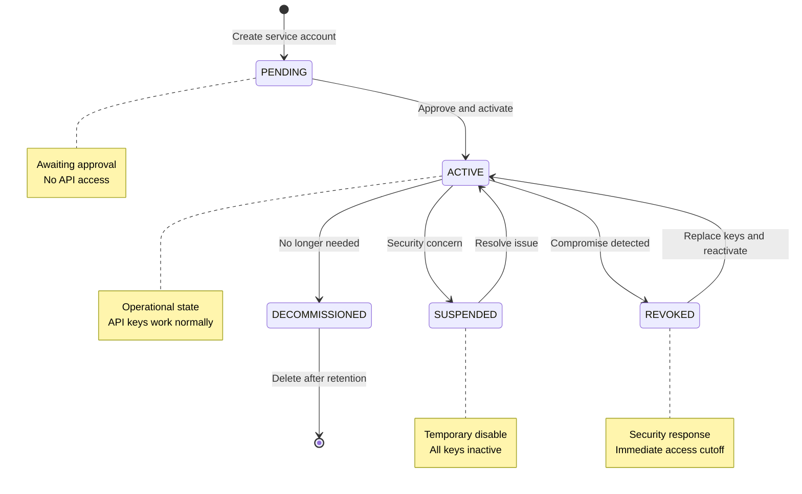

# 🎭 Identity Module v9.0 - Universal Actor System

**Version:** 9.0
**Phase:** Phase 1 - Internal Members + Service Accounts
**Date:** November 18, 2025
**Pattern:** Actor Pattern - Universal Identity Attribution
**Integration:** RBAC v9.0 + RLS v9.0 + Multi-Tenant Architecture

---

## 🎯 Strategic Purpose

The **Identity Module v9.0** implements the **Actor Pattern** as the universal identity foundation for the entire BeeSmart Pro ERP platform. Every action, every audit trail, every business transaction can be attributed to an **Actor** - whether human user or automated service.

### Core Identity Principles

1. **Universal Attribution** - Every action traceable to an Actor (human or service)
2. **Cross-Tenant Tracking** - Global Actor identity with tenant-specific memberships
3. **Polymorphic Design** - Actor → User OR ServiceAccount (1:1 relationship)
4. **Audit Foundation** - Complete audit trails via Actor attribution
5. **Security Integration** - Seamless RBAC v9.0 + RLS v9.0 integration
6. **Future-Proof Design** - Ready for external users, AI agents, webhooks

---

## 🏗️ Architecture Overview - Actor Pattern



---

## 📊 Core Models Architecture

### 🎭 Actor Model (Universal Identity Foundation)

```prisma
model Actor {
  // 🆔 Global Identity (Cross-Tenant)
  id String @id @default(uuid(7)) @db.Uuid

  // 📄 Actor Classification
  actorType     String    @db.VarChar(20)     // USER, SERVICE_ACCOUNT (future: AI_AGENT, WEBHOOK)
  actorName     String    @db.VarChar(255)    // Display name (from User or ServiceAccount)
  actorCode     String?   @unique @db.VarChar(100) // Optional unique code
  description   String?   @db.Text            // Actor description

  // 🔒 Actor Status & Security
  isActive      Boolean   @default(true)      // Can perform actions
  isVerified    Boolean   @default(false)     // Identity verified
  isSuspended   Boolean   @default(false)     // Temporarily disabled

  // 📊 Usage Statistics
  totalActions        BigInt    @default(0)   // Total actions performed
  lastActionAt        DateTime? @db.Timestamptz(6) // Last activity timestamp
  lastActionTenantId  String?   @db.Uuid      // Last tenant context

  // 🔐 Security Metadata
  securityScore       Decimal?  @db.Decimal(3, 2) // 0.00 - 1.00 security rating
  riskIndicators      String[]  @db.Text      // Security risk flags
  complianceFlags     String[]  @db.Text      // Compliance markers

  // 📅 Lifecycle
  status        String    @default("ACTIVE")   // ACTIVE, SUSPENDED, DEACTIVATED, DELETED
  version       Int       @default(1)
  createdAt     DateTime  @default(now()) @db.Timestamptz(6)
  updatedAt     DateTime  @updatedAt @db.Timestamptz(6)
  deletedAt     DateTime? @db.Timestamptz(6)

  // 🧠 Governance & Extensibility
  auditCorrelationId String? @db.Uuid
  dataClassification String  @default("INTERNAL") @db.VarChar(50)
  metadata           Json?   @db.JsonB         // Actor-specific metadata
  tags               String[] @db.Text         // Classification tags

  // 🔗 Polymorphic Relations (1:1)
  user           User?           // Human identity
  serviceAccount ServiceAccount? // API/system identity

  // 🔗 Multi-Tenant Relations (1:M)
  members        Member[]        // Tenant memberships

  // 🔗 Audit Attribution Relations (Pattern B entities reference Actor)
  // Note: These are reverse relations - actual fields are in the related models
  estimatesCreated     Estimate[]     @relation("EstimateCreatedByActor")
  estimatesUpdated     Estimate[]     @relation("EstimateUpdatedByActor")
  estimatesDeleted     Estimate[]     @relation("EstimateDeletedByActor")

  projectsCreated      Project[]      @relation("ProjectCreatedByActor")
  projectsUpdated      Project[]      @relation("ProjectUpdatedByActor")
  projectsDeleted      Project[]      @relation("ProjectDeletedByActor")

  invoicesCreated      Invoice[]      @relation("InvoiceCreatedByActor")
  invoicesUpdated      Invoice[]      @relation("InvoiceUpdatedByActor")
  invoicesDeleted      Invoice[]      @relation("InvoiceDeletedByActor")

  accessAuditEvents    AccessAuditEvent[]

  // 🗂️ Indexes & Constraints
  @@index([actorType])
  @@index([isActive])
  @@index([lastActionAt])
  @@index([status])
  @@index([securityScore])
  @@index([createdAt])
  @@index([deletedAt])
  @@index([metadata], type: Gin)
  @@index([tags], type: Gin)
  @@index([riskIndicators], type: Gin)

  @@map("actors")
}
```

### 👤 User Model (Human Identity)

```prisma
model User {
  // 🆔 Identity & Actor Link
  id      String @id @default(uuid(7)) @db.Uuid
  actorId String @unique @db.Uuid      // Links to Actor (1:1)

  // 📧 Authentication Credentials
  email           String   @unique @db.VarChar(255)    // Primary identifier
  emailVerified   Boolean  @default(false)
  passwordHash    String   @db.VarChar(255)            // bcrypt hash
  passwordSalt    String   @db.VarChar(255)            // Salt for additional security

  // 📞 Contact Information
  phone           String?  @db.VarChar(20)
  phoneVerified   Boolean  @default(false)

  // 👤 Basic Profile
  firstName       String   @db.VarChar(100)
  lastName        String   @db.VarChar(100)
  displayName     String   @db.VarChar(255)            // Computed: firstName + lastName
  profilePictureUrl String? @db.Text                   // Avatar URL

  // 🌍 Localization
  timezone        String   @default("UTC") @db.VarChar(50)
  locale          String   @default("en-US") @db.VarChar(10)
  dateFormat      String   @default("MM/DD/YYYY") @db.VarChar(20)
  timeFormat      String   @default("12h") @db.VarChar(10)

  // 🔐 Security Settings
  mfaEnabled      Boolean  @default(false)
  mfaSecret       String?  @db.VarChar(255)            // TOTP secret (encrypted)
  backupCodes     String[] @db.Text                    // Recovery codes (hashed)

  // 📱 Device & Session Management
  maxActiveSessions Int    @default(5)                 // Concurrent session limit
  requireDeviceAuth Boolean @default(false)            // Require device verification

  // 🔔 Notification Preferences
  emailNotifications   Boolean @default(true)
  smsNotifications     Boolean @default(false)
  pushNotifications    Boolean @default(true)

  // 📅 Authentication Events
  lastLoginAt          DateTime? @db.Timestamptz(6)
  lastLoginIp          String?   @db.VarChar(45)
  lastPasswordChangeAt DateTime? @db.Timestamptz(6)
  failedLoginAttempts  Int       @default(0)
  lockedUntil          DateTime? @db.Timestamptz(6)

  // 📊 Account Health
  isEmailBouncing      Boolean @default(false)
  isPhoneBouncing      Boolean @default(false)
  securityScore        Decimal? @db.Decimal(3, 2)     // 0.00 - 1.00

  // 📅 Lifecycle
  status        String    @default("ACTIVE")           // ACTIVE, SUSPENDED, LOCKED, DEACTIVATED
  version       Int       @default(1)
  createdAt     DateTime  @default(now()) @db.Timestamptz(6)
  updatedAt     DateTime  @updatedAt @db.Timestamptz(6)
  deletedAt     DateTime? @db.Timestamptz(6)

  // 👤 Actor Attribution (Pattern A - IDs only for supporting entities)
  createdByActorId String? @db.Uuid
  updatedByActorId String? @db.Uuid
  deletedByActorId String? @db.Uuid

  // 🧠 Governance
  auditCorrelationId String? @db.Uuid
  dataClassification String  @default("CONFIDENTIAL") @db.VarChar(50)
  metadata           Json?   @db.JsonB

  // 🔗 Relations
  actor         Actor           @relation(fields: [actorId], references: [id], onDelete: Cascade)
  profile       UserProfile?
  settings      UserSetting[]
  sessions      Session[]
  devices       UserDevice[]
  invitations   UserInvitation[]
  apiKeys       UserApiKey[]

  // 🗂️ Indexes & Constraints
  @@index([email])
  @@index([phone])
  @@index([status])
  @@index([lastLoginAt])
  @@index([isEmailBouncing])
  @@index([actorId])
  @@index([createdAt])
  @@index([deletedAt])
  @@index([metadata], type: Gin)

  @@map("users")
}
```

### 👥 UserProfile Model (Extended Profile Data)

```prisma
model UserProfile {
  // 🆔 Identity
  id     String @id @default(uuid(7)) @db.Uuid
  userId String @unique @db.Uuid

  // 💼 Professional Information
  jobTitle          String? @db.VarChar(255)
  department        String? @db.VarChar(255)
  company           String? @db.VarChar(255)
  workLocation      String? @db.VarChar(255)

  // 📞 Extended Contact
  workPhone         String? @db.VarChar(20)
  mobilePhone       String? @db.VarChar(20)
  emergencyContact  String? @db.VarChar(255)
  emergencyPhone    String? @db.VarChar(20)

  // 🏠 Address Information
  streetAddress     String? @db.VarChar(500)
  city              String? @db.VarChar(100)
  state             String? @db.VarChar(100)
  postalCode        String? @db.VarChar(20)
  country           String? @db.VarChar(100)

  // 👤 Personal Details
  bio               String? @db.Text
  birthDate         DateTime? @db.Date
  hireDate          DateTime? @db.Date

  // 🎯 Preferences
  workingHoursStart String? @db.VarChar(10)   // "09:00"
  workingHoursEnd   String? @db.VarChar(10)   // "17:00"
  workingDays       String[] @db.Text         // ["MON", "TUE", "WED", "THU", "FRI"]

  // 🔒 Privacy Settings
  profileVisibility String  @default("PRIVATE") @db.VarChar(20) // PUBLIC, TEAM, PRIVATE
  showEmail         Boolean @default(false)
  showPhone         Boolean @default(false)
  showBirthDate     Boolean @default(false)

  // 📅 Lifecycle
  status    String    @default("ACTIVE")
  version   Int       @default(1)
  createdAt DateTime  @default(now()) @db.Timestamptz(6)
  updatedAt DateTime  @updatedAt @db.Timestamptz(6)
  deletedAt DateTime? @db.Timestamptz(6)

  // 👤 Actor Attribution (Pattern A - IDs only)
  createdByActorId String? @db.Uuid
  updatedByActorId String? @db.Uuid

  // 🧠 Governance
  metadata Json? @db.JsonB

  // 🔗 Relations
  user User @relation(fields: [userId], references: [id], onDelete: Cascade)

  // 🗂️ Indexes & Constraints
  @@index([userId])
  @@index([company])
  @@index([department])
  @@index([hireDate])
  @@index([profileVisibility])
  @@index([metadata], type: Gin)

  @@map("user_profiles")
}
```

### ⚙️ UserSetting Model (Application Preferences)

```prisma
model UserSetting {
  // 🆔 Identity
  id     String @id @default(uuid(7)) @db.Uuid
  userId String @db.Uuid

  // ⚙️ Setting Definition
  settingKey     String  @db.VarChar(100)       // e.g., "dashboard.defaultView"
  settingValue   String? @db.Text               // JSON string or simple value
  settingType    String  @db.VarChar(20)        // STRING, NUMBER, BOOLEAN, JSON, ARRAY

  // 📊 Setting Metadata
  category       String  @db.VarChar(50)        // UI, NOTIFICATIONS, SECURITY, etc.
  description    String? @db.Text               // Human-readable description
  isSystemSetting Boolean @default(false)       // System vs user-defined
  isEncrypted    Boolean @default(false)        // Sensitive setting

  // 📅 Lifecycle
  status    String    @default("ACTIVE")
  version   Int       @default(1)
  createdAt DateTime  @default(now()) @db.Timestamptz(6)
  updatedAt DateTime  @updatedAt @db.Timestamptz(6)
  deletedAt DateTime? @db.Timestamptz(6)

  // 👤 Actor Attribution (Pattern A - IDs only)
  createdByActorId String? @db.Uuid
  updatedByActorId String? @db.Uuid

  // 🧠 Governance
  metadata Json? @db.JsonB

  // 🔗 Relations
  user User @relation(fields: [userId], references: [id], onDelete: Cascade)

  // 🗂️ Indexes & Constraints
  @@unique([userId, settingKey])               // One setting per key per user
  @@index([userId])
  @@index([category])
  @@index([settingKey])
  @@index([isSystemSetting])
  @@index([metadata], type: Gin)

  @@map("user_settings")
}
```

### 🔐 Session Model (Authentication Sessions)

```prisma
model Session {
  // 🆔 Identity
  id     String @id @default(uuid(7)) @db.Uuid
  userId String @db.Uuid

  // 🎫 Session Details
  sessionToken   String   @unique @db.VarChar(255)   // JWT or session ID
  refreshToken   String?  @unique @db.VarChar(255)   // Refresh token

  // ⏰ Session Timing
  createdAt      DateTime @default(now()) @db.Timestamptz(6)
  updatedAt      DateTime @updatedAt @db.Timestamptz(6)
  expiresAt      DateTime @db.Timestamptz(6)
  lastActivityAt DateTime @default(now()) @db.Timestamptz(6)

  // 📱 Device & Location Context
  deviceId       String?  @db.Uuid                   // Links to UserDevice
  ipAddress      String   @db.VarChar(45)
  userAgent      String?  @db.Text
  deviceType     String?  @db.VarChar(50)            // WEB, MOBILE, API, etc.

  // 🌍 Location Data
  country        String?  @db.VarChar(100)
  city           String?  @db.VarChar(100)
  timezone       String?  @db.VarChar(50)

  // 🔒 Security Context
  mfaVerified    Boolean  @default(false)            // MFA completed this session
  riskScore      Decimal? @db.Decimal(3, 2)         // Session risk (0.00-1.00)
  securityFlags  String[] @db.Text                  // Security indicators

  // 📊 Session Activity
  requestCount   BigInt   @default(0)               // Requests in this session
  lastTenantId   String?  @db.Uuid                  // Last tenant context

  // 📅 Session Status
  status         String   @default("ACTIVE")         // ACTIVE, EXPIRED, REVOKED, SUSPICIOUS
  revokedAt      DateTime? @db.Timestamptz(6)
  revokedReason  String?   @db.Text

  // 👤 Actor Attribution (Pattern A - IDs only)
  createdByActorId String? @db.Uuid
  revokedByActorId String? @db.Uuid

  // 🧠 Governance
  metadata Json? @db.JsonB

  // 🔗 Relations
  user   User       @relation(fields: [userId], references: [id], onDelete: Cascade)
  device UserDevice? @relation(fields: [deviceId], references: [id], onDelete: SetNull)

  // 🗂️ Indexes & Constraints
  @@index([userId])
  @@index([sessionToken])
  @@index([status])
  @@index([expiresAt])
  @@index([lastActivityAt])
  @@index([deviceId])
  @@index([ipAddress])
  @@index([riskScore])
  @@index([lastTenantId])
  @@index([metadata], type: Gin)

  @@map("sessions")
}
```

---

## 🔄 Actor Pattern Integration Flows

### Actor Creation Flow



### Service Account Creation Flow



### Cross-Module Attribution Flow



---

## 🔄 Identity Lifecycle Management

### User Lifecycle States



### Service Account Lifecycle States



---

## 🔄 Security Integration Patterns

### Actor-Based Audit Trail

```typescript
// Universal audit attribution via Actor pattern
export class AuditService {
  async logBusinessEvent(
    context: {
      actorId: string;
      tenantId?: string;
      memberId?: string;
    },
    event: {
      eventType: string;
      resourceType: string;
      resourceId: string;
      action: string;
      details?: any;
    }
  ): Promise<void> {
    // Every business event attributed to an Actor
    await this.prisma.accessAuditEvent.create({
      data: {
        // Universal attribution
        actorId: context.actorId,
        tenantId: context.tenantId,
        memberId: context.memberId,

        // Event details
        eventType: event.eventType,
        resourceType: event.resourceType,
        resourceId: event.resourceId,
        actionType: event.action,

        // Context
        eventTimestamp: new Date(),
        contextData: event.details,

        // Audit classification
        accessDecision: "ALLOWED", // Business event, not access check
        auditCorrelationId: generateCorrelationId(),
      },
    });

    // Update Actor activity tracking
    await this.prisma.actor.update({
      where: { id: context.actorId },
      data: {
        totalActions: { increment: 1 },
        lastActionAt: new Date(),
        lastActionTenantId: context.tenantId,
      },
    });
  }
}
```

### Actor Security Context

```typescript
// Security context with Actor integration
export interface ActorSecurityContext {
  // Core identity
  actorId: string;
  actorType: "USER" | "SERVICE_ACCOUNT";
  actorName: string;

  // User context (if actorType = USER)
  userId?: string;
  userEmail?: string;

  // Service context (if actorType = SERVICE_ACCOUNT)
  serviceAccountId?: string;
  serviceAccountCode?: string;
  apiKeyId?: string;

  // Tenant membership context
  tenantId?: string;
  memberId?: string;
  primaryRole?: string;
  roleHierarchy?: number;

  // Security attributes
  isVerified: boolean;
  securityScore?: number;
  riskIndicators?: string[];

  // Session context
  sessionId?: string;
  deviceId?: string;
  ipAddress?: string;
}

export class ActorContextService {
  async buildSecurityContext(
    actorId: string,
    tenantId?: string
  ): Promise<ActorSecurityContext> {
    // Get Actor with polymorphic relations
    const actor = await this.prisma.actor.findUnique({
      where: { id: actorId },
      include: {
        user: true,
        serviceAccount: true,
        members: {
          where: tenantId ? { tenantId } : {},
          include: {
            memberRoles: {
              where: { isActive: true },
              include: { role: true },
            },
          },
        },
      },
    });

    if (!actor) {
      throw new Error("Actor not found");
    }

    // Build context based on Actor type
    const context: ActorSecurityContext = {
      actorId: actor.id,
      actorType: actor.actorType as "USER" | "SERVICE_ACCOUNT",
      actorName: actor.actorName,
      isVerified: actor.isVerified,
      securityScore: actor.securityScore?.toNumber(),
      riskIndicators: actor.riskIndicators,
    };

    // Add User-specific context
    if (actor.user) {
      context.userId = actor.user.id;
      context.userEmail = actor.user.email;
    }

    // Add ServiceAccount-specific context
    if (actor.serviceAccount) {
      context.serviceAccountId = actor.serviceAccount.id;
      context.serviceAccountCode = actor.serviceAccount.serviceAccountCode;
    }

    // Add tenant membership context
    if (tenantId && actor.members.length > 0) {
      const member = actor.members[0];
      context.tenantId = tenantId;
      context.memberId = member.id;

      // Get primary role
      const primaryRole =
        member.memberRoles.find((mr) => mr.isPrimary) || member.memberRoles[0];
      if (primaryRole) {
        context.primaryRole = primaryRole.role.roleCode;
        context.roleHierarchy = primaryRole.role.hierarchy;
      }
    }

    return context;
  }
}
```

---

## 🎯 Phase 1 Implementation Status

### ✅ Completed Features

1. **Universal Actor Pattern** - Global identity foundation with polymorphic relations
2. **User Management** - Complete authentication, profiles, preferences, sessions
3. **Service Account Support** - API authentication with key management and rotation
4. **Cross-Module Attribution** - All business entities can be attributed to Actors
5. **Security Integration** - Full RBAC v9.0 + RLS v9.0 integration via Actor context
6. **Multi-Tenant Membership** - Actor → Member relationship for tenant-scoped access
7. **Complete Audit Foundation** - Universal audit attribution via Actor pattern
8. **Lifecycle Management** - State management for both Users and ServiceAccounts

### 🔄 Phase 2 Roadmap (Future)

1. **External Users** - Client portal users with limited access patterns
2. **AI Agent Actors** - Support for AI/ML systems as Actors
3. **Webhook Actors** - Automated systems triggering business events
4. **Federated Identity** - SAML/OIDC integration for enterprise SSO
5. **Advanced Device Management** - Device trust scores and restrictions
6. **Biometric Authentication** - Fingerprint/face recognition support

---

## 🏆 Competitive Advantages

### vs Traditional Identity Systems

✅ **Universal Attribution** - Every action traceable to an Actor across all modules
✅ **Polymorphic Design** - Single pattern handles Users AND ServiceAccounts
✅ **Cross-Tenant Tracking** - Global Actor identity with tenant-specific contexts
✅ **Audit Foundation** - Built-in compliance-grade audit trails

### vs Enterprise IAM Solutions

✅ **Business Entity Integration** - Native integration with ERP business processes
✅ **Construction Industry Focus** - Tailored for field operations and project workflows
✅ **Performance Optimized** - Sub-millisecond identity resolution
✅ **Developer Experience** - Simple, consistent API across all modules

---

**Prepared by**: Senior Enterprise Architect
**Date**: November 18, 2025
**Version**: 9.0
**Status**: Production-Ready Universal Identity System
**Integration**: Complete RBAC v9.0 + RLS v9.0 compatibility
