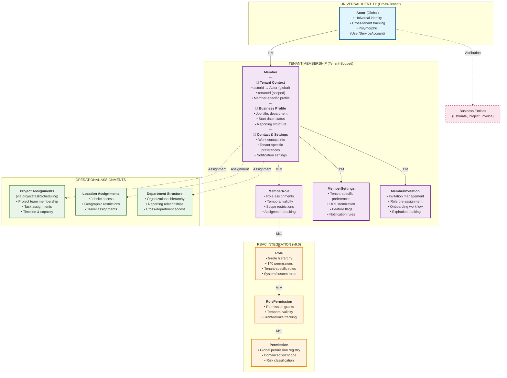
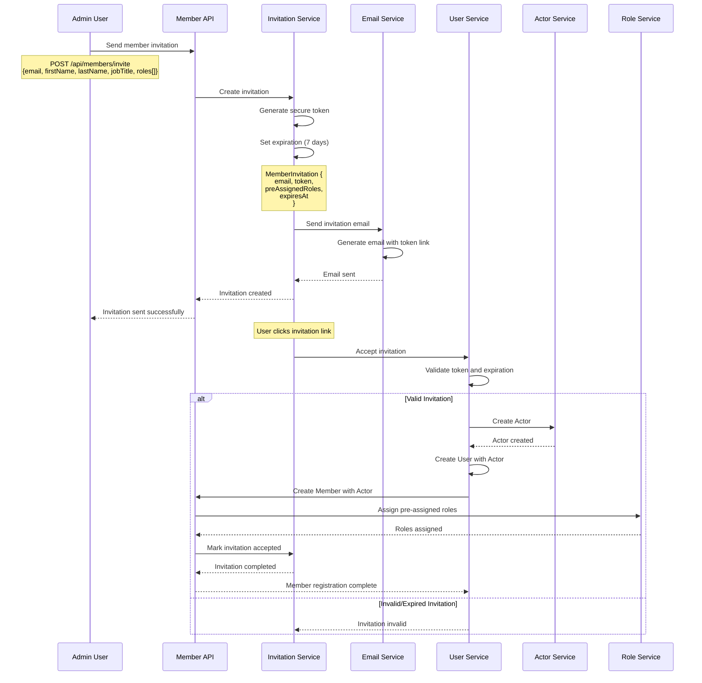
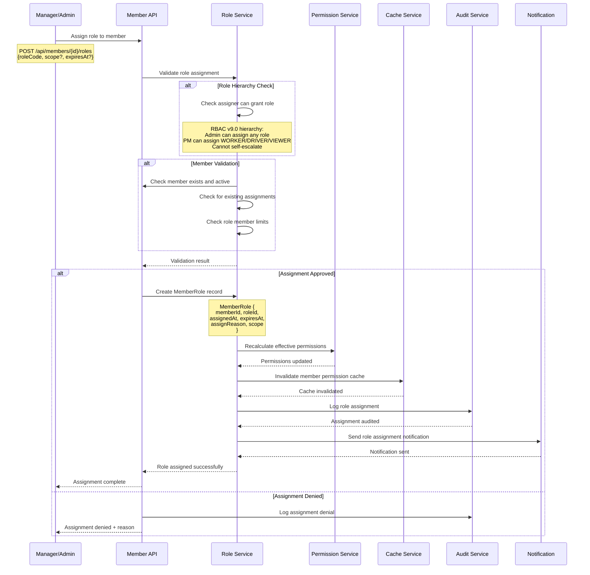

# 🏢 Membership Module v9.0 - Tenant Relationship Management

**Version:** 9.0
**Phase:** Phase 1 - Internal Members Only
**Date:** November 18, 2025
**Integration:** Actor Pattern + RBAC v9.0 + RLS v9.0
**Purpose:** Tenant-scoped membership and role management

---

## 🎯 Strategic Purpose

The **Membership Module v9.0** bridges the **universal Actor identity system** with **tenant-specific business contexts**. It manages how Actors (Users and ServiceAccounts) participate in tenant organizations, their roles, permissions, and operational assignments.

### Core Membership Principles

1. **Actor-Centric Design** - All memberships linked to universal Actor identity
2. **Tenant Isolation** - Complete separation of member data per tenant
3. **Role-Based Organization** - RBAC v9.0 integration for permission management
4. **Flexible Assignment** - Support for project, department, and location scoping
5. **Lifecycle Management** - Complete member journey from invitation to offboarding
6. **Audit Compliance** - Full tracking of membership changes and role assignments

---

## 🏗️ Architecture Overview - Membership System



---

## 📊 Core Models Architecture

### 👥 Member Model (Tenant-Scoped Identity)

```prisma
model Member {
  // 🆔 Identity & Tenant Isolation
  id       String @id @default(uuid(7)) @db.Uuid
  tenantId String @db.Uuid

  // 🎭 Actor Linkage (Universal Identity)
  actorId String @db.Uuid                        // Links to global Actor

  // 💼 Member Business Profile
  memberCode      String?  @db.VarChar(50)       // Internal employee/member ID
  jobTitle        String?  @db.VarChar(255)      // Position title
  department      String?  @db.VarChar(255)      // Department/division
  team            String?  @db.VarChar(255)      // Team assignment
  costCenter      String?  @db.VarChar(100)      // Cost center code

  // 📅 Employment Details
  startDate       DateTime? @db.Date             // Start/hire date
  endDate         DateTime? @db.Date             // End date (if departed)
  probationEndDate DateTime? @db.Date            // Probation period end

  // 👤 Reporting Structure
  managerId       String?  @db.Uuid             // Reports to (Member)
  managerActorId  String?  @db.Uuid             // Manager's Actor (for cross-tenant)

  // 📱 Work Contact Information
  workEmail       String?  @db.VarChar(255)     // Work email (different from User.email)
  workPhone       String?  @db.VarChar(20)      // Work phone number
  extension       String?  @db.VarChar(10)      // Phone extension
  workLocation    String?  @db.VarChar(255)     // Primary work location

  // ⏰ Work Schedule
  workingHoursStart String? @db.VarChar(10)     // "08:00"
  workingHoursEnd   String? @db.VarChar(10)     // "17:00"
  workingDays       String[] @db.Text           // ["MON", "TUE", "WED", "THU", "FRI"]
  timezone          String?  @db.VarChar(50)    // Member's working timezone

  // 💰 Compensation Info (Basic)
  payrollId       String?  @db.VarChar(100)     // Payroll system ID
  employeeType    String?  @db.VarChar(50)      // FULL_TIME, PART_TIME, CONTRACT, INTERN
  billableRate    Decimal? @db.Decimal(10, 2)   // Hourly billing rate (if applicable)

  // 🏷️ Member Classifications
  memberType      String   @default("EMPLOYEE") @db.VarChar(50) // EMPLOYEE, CONTRACTOR, CONSULTANT, TEMP
  securityLevel   String   @default("STANDARD") @db.VarChar(50) // STANDARD, ELEVATED, RESTRICTED
  accessLevel     String   @default("NORMAL") @db.VarChar(50)   // NORMAL, LIMITED, EXTENDED

  // 🔔 Notification Preferences (Tenant-Specific)
  emailNotifications       Boolean @default(true)
  smsNotifications         Boolean @default(false)
  pushNotifications        Boolean @default(true)
  digestFrequency          String  @default("DAILY") @db.VarChar(20) // REAL_TIME, HOURLY, DAILY, WEEKLY

  // 📊 Member Statistics
  totalProjectsAssigned    Int     @default(0)
  totalTasksCompleted      Int     @default(0)
  totalBillableHours       Decimal @default(0) @db.Decimal(10, 2)
  averageTaskRating        Decimal? @db.Decimal(3, 2)           // 1.00 - 5.00

  // 🔒 Access Control
  canCreateProjects        Boolean @default(false)              // Quick permission flags
  canApproveTimesheets     Boolean @default(false)
  canViewAllProjects       Boolean @default(false)
  maxProjectAssignments    Int?                                 // Capacity limits

  // 📅 Activity Tracking
  lastLoginAt              DateTime? @db.Timestamptz(6)
  lastProjectActivityAt    DateTime? @db.Timestamptz(6)
  lastTimesheetSubmitAt    DateTime? @db.Timestamptz(6)

  // 📅 Lifecycle
  status        String    @default("ACTIVE")                    // INVITED, ACTIVE, SUSPENDED, INACTIVE, DEPARTED
  version       Int       @default(1)
  createdAt     DateTime  @default(now()) @db.Timestamptz(6)
  updatedAt     DateTime  @updatedAt @db.Timestamptz(6)
  deletedAt     DateTime? @db.Timestamptz(6)

  // 👤 Actor Attribution (Pattern A - IDs only for supporting entities)
  createdByActorId String? @db.Uuid
  updatedByActorId String? @db.Uuid
  deletedByActorId String? @db.Uuid

  // 🧠 Governance
  auditCorrelationId String? @db.Uuid
  dataClassification String  @default("CONFIDENTIAL") @db.VarChar(50)
  metadata           Json?   @db.JsonB
  retentionPolicy    String? @db.VarChar(50)

  // 🔗 Relations
  tenant           Tenant            @relation(fields: [tenantId], references: [id], onDelete: Cascade)
  actor            Actor             @relation(fields: [actorId], references: [id], onDelete: Cascade)
  manager          Member?           @relation("MemberHierarchy", fields: [tenantId, managerId], references: [tenantId, id], onDelete: SetNull)
  directReports    Member[]          @relation("MemberHierarchy")

  // Member-specific entities
  memberRoles      MemberRole[]
  settings         MemberSettings[]
  invitations      MemberInvitation[]
  documents        MemberDocument[]

  // Cross-module relations (examples - these would be defined in their respective modules)
  projectAssignments   ProjectTeamMember[]     // Projects assigned to
  taskAssignments      ProjectTaskAssignment[] // Tasks assigned to
  timesheetEntries     TimesheetEntry[]        // Time tracking
  auditEvents          AccessAuditEvent[]      // Audit trail

  // 🗂️ Indexes & Constraints
  @@unique([tenantId, id])
  @@unique([tenantId, actorId])                   // One membership per Actor per tenant
  @@unique([tenantId, memberCode])                // Unique member code per tenant (if provided)
  @@index([tenantId, status])
  @@index([tenantId, memberType])
  @@index([tenantId, department])
  @@index([tenantId, managerId])
  @@index([tenantId, startDate])
  @@index([tenantId, jobTitle])
  @@index([actorId])                             // Cross-tenant Actor lookups
  @@index([workEmail])
  @@index([securityLevel])
  @@index([lastLoginAt])
  @@index([createdAt])
  @@index([deletedAt])
  @@index([metadata], type: Gin)

  @@map("members")
}
```

### ⚙️ MemberSettings Model (Tenant-Specific Preferences)

```prisma
model MemberSettings {
  // 🆔 Identity & Tenant
  id       String @id @default(uuid(7)) @db.Uuid
  tenantId String @db.Uuid
  memberId String @db.Uuid

  // ⚙️ Setting Definition
  settingKey        String  @db.VarChar(100)    // e.g., "dashboard.defaultProject"
  settingValue      String? @db.Text            // JSON string or simple value
  settingType       String  @db.VarChar(20)     // STRING, NUMBER, BOOLEAN, JSON, ARRAY

  // 📊 Setting Metadata
  category          String  @db.VarChar(50)     // DASHBOARD, NOTIFICATIONS, PROJECTS, TASKS, etc.
  description       String? @db.Text            // Human-readable description
  isSystemSetting   Boolean @default(false)     // System vs user-defined
  isEncrypted       Boolean @default(false)     // Sensitive setting

  // 🎯 Setting Scope
  scope             String  @default("MEMBER") @db.VarChar(20) // MEMBER, PROJECT, DEPARTMENT, TENANT
  scopeId           String? @db.Uuid            // Specific scope reference

  // 📅 Lifecycle
  status    String    @default("ACTIVE")
  version   Int       @default(1)
  createdAt DateTime  @default(now()) @db.Timestamptz(6)
  updatedAt DateTime  @updatedAt @db.Timestamptz(6)
  deletedAt DateTime? @db.Timestamptz(6)

  // 👤 Actor Attribution (Pattern A - IDs only)
  createdByActorId String? @db.Uuid
  updatedByActorId String? @db.Uuid

  // 🧠 Governance
  metadata Json? @db.JsonB

  // 🔗 Relations
  tenant Tenant @relation(fields: [tenantId], references: [id], onDelete: Cascade)
  member Member @relation(fields: [tenantId, memberId], references: [tenantId, id], onDelete: Cascade)

  // 🗂️ Indexes & Constraints
  @@unique([tenantId, id])
  @@unique([tenantId, memberId, settingKey, scope, scopeId]) // One setting per key/scope combination
  @@index([tenantId, memberId])
  @@index([tenantId, category])
  @@index([tenantId, settingKey])
  @@index([tenantId, scope])
  @@index([isSystemSetting])
  @@index([metadata], type: Gin)

  @@map("member_settings")
}
```

### 📨 MemberInvitation Model (Invitation Management)

```prisma
model MemberInvitation {
  // 🆔 Identity & Tenant
  id       String @id @default(uuid(7)) @db.Uuid
  tenantId String @db.Uuid

  // 📧 Invitation Details
  email             String  @db.VarChar(255)    // Invitee email
  firstName         String? @db.VarChar(100)    // Pre-filled profile
  lastName          String? @db.VarChar(100)
  jobTitle          String? @db.VarChar(255)
  department        String? @db.VarChar(255)

  // 🎫 Invitation Token
  invitationToken   String  @unique @db.VarChar(255) // Secure invitation token
  invitationCode    String? @db.VarChar(20)     // Human-readable code (optional)

  // 🔗 Pre-Assignment (Optional)
  preAssignedRoles  String[] @db.Text           // Role codes to assign on acceptance
  preAssignedProjects String[] @db.Uuid        // Project IDs for immediate assignment

  // 📅 Invitation Lifecycle
  invitedAt         DateTime @default(now()) @db.Timestamptz(6)
  expiresAt         DateTime @db.Timestamptz(6)
  acceptedAt        DateTime? @db.Timestamptz(6)
  declinedAt        DateTime? @db.Timestamptz(6)
  revokedAt         DateTime? @db.Timestamptz(6)

  // 📊 Invitation Metadata
  invitationMessage String? @db.Text            // Custom message
  invitationReason  String? @db.Text            // Why invited
  revokeReason      String? @db.Text            // Why revoked

  // 📱 Communication Tracking
  emailSentCount    Int     @default(0)         // How many emails sent
  lastEmailSentAt   DateTime? @db.Timestamptz(6)
  reminderSentCount Int     @default(0)         // Reminder emails
  lastReminderSentAt DateTime? @db.Timestamptz(6)

  // 🎯 Resulting Membership
  resultingMemberId String? @db.Uuid           // Created Member (on acceptance)
  resultingActorId  String? @db.Uuid           // Created Actor (on acceptance)

  // 📅 Lifecycle
  status        String    @default("SENT")      // SENT, DELIVERED, OPENED, ACCEPTED, DECLINED, EXPIRED, REVOKED
  version       Int       @default(1)
  createdAt     DateTime  @default(now()) @db.Timestamptz(6)
  updatedAt     DateTime  @updatedAt @db.Timestamptz(6)
  deletedAt     DateTime? @db.Timestamptz(6)

  // 👤 Actor Attribution (Pattern A - IDs only)
  createdByActorId String? @db.Uuid           // Who sent the invitation
  updatedByActorId String? @db.Uuid
  revokedByActorId String? @db.Uuid           // Who revoked

  // 🧠 Governance
  auditCorrelationId String? @db.Uuid
  metadata           Json?   @db.JsonB

  // 🔗 Relations
  tenant          Tenant  @relation(fields: [tenantId], references: [id], onDelete: Cascade)
  resultingMember Member? @relation(fields: [tenantId, resultingMemberId], references: [tenantId, id], onDelete: SetNull)

  // 🗂️ Indexes & Constraints
  @@unique([tenantId, id])
  @@unique([tenantId, email, status])          // Prevent duplicate active invitations
  @@index([tenantId, status])
  @@index([tenantId, expiresAt])
  @@index([tenantId, invitedAt])
  @@index([email])
  @@index([invitationToken])
  @@index([resultingMemberId])
  @@index([createdByActorId])
  @@index([metadata], type: Gin)

  @@map("member_invitations")
}
```

### 📄 MemberDocument Model (Member-Specific Documentation)

```prisma
model MemberDocument {
  // 🆔 Identity & Tenant
  id       String @id @default(uuid(7)) @db.Uuid
  tenantId String @db.Uuid
  memberId String @db.Uuid

  // 📄 Document Details
  documentType      String  @db.VarChar(100)   // CONTRACT, ID_COPY, CERTIFICATION, PHOTO, etc.
  documentName      String  @db.VarChar(255)   // Human-readable name
  fileName          String  @db.VarChar(255)   // Original file name
  fileSize          BigInt                     // File size in bytes
  mimeType          String  @db.VarChar(100)   // File MIME type

  // 📁 Storage Information
  storagePath       String  @db.Text           // Cloud storage path
  storageProvider   String  @db.VarChar(50)    // S3, GCS, AZURE, LOCAL
  storageRegion     String? @db.VarChar(50)    // Storage region
  checksumSHA256    String  @db.VarChar(64)    // File integrity check

  // 📅 Document Lifecycle
  uploadedAt        DateTime @default(now()) @db.Timestamptz(6)
  expiresAt         DateTime? @db.Timestamptz(6) // Document expiration (e.g., certifications)
  lastViewedAt      DateTime? @db.Timestamptz(6)
  viewCount         Int      @default(0)

  // 🔒 Access Control
  isConfidential    Boolean  @default(true)    // Sensitive document
  accessLevel       String   @default("MEMBER") @db.VarChar(20) // MEMBER, MANAGER, HR, ADMIN
  allowDownload     Boolean  @default(false)   // Can be downloaded

  // 📝 Document Metadata
  description       String?  @db.Text          // Document description
  tags              String[] @db.Text          // Classification tags
  notes             String?  @db.Text          // Additional notes

  // 📅 Lifecycle
  status        String    @default("ACTIVE")   // ACTIVE, ARCHIVED, EXPIRED, DELETED
  version       Int       @default(1)
  createdAt     DateTime  @default(now()) @db.Timestamptz(6)
  updatedAt     DateTime  @updatedAt @db.Timestamptz(6)
  deletedAt     DateTime? @db.Timestamptz(6)

  // 👤 Actor Attribution (Pattern A - IDs only)
  createdByActorId String? @db.Uuid
  updatedByActorId String? @db.Uuid
  deletedByActorId String? @db.Uuid

  // 🧠 Governance
  auditCorrelationId String? @db.Uuid
  dataClassification String  @default("CONFIDENTIAL") @db.VarChar(50)
  retentionUntilDate DateTime? @db.Timestamptz(6)
  metadata           Json?   @db.JsonB

  // 🔗 Relations
  tenant Tenant @relation(fields: [tenantId], references: [id], onDelete: Cascade)
  member Member @relation(fields: [tenantId, memberId], references: [tenantId, id], onDelete: Cascade)

  // 🗂️ Indexes & Constraints
  @@unique([tenantId, id])
  @@index([tenantId, memberId])
  @@index([tenantId, documentType])
  @@index([tenantId, status])
  @@index([tenantId, expiresAt])
  @@index([tenantId, uploadedAt])
  @@index([accessLevel])
  @@index([isConfidential])
  @@index([checksumSHA256])
  @@index([tags], type: Gin)
  @@index([metadata], type: Gin)

  @@map("member_documents")
}
```

---

## 🔄 Membership Lifecycle Flows

### Member Invitation Flow



### Role Assignment Flow



### Member Offboarding Flow

```mermaid
sequenceDiagram
    participant HR as HR Admin
    participant MemberAPI as Member API
    participant RoleService as Role Service
    participant ProjectService as Project Service
    parameter AccessService as Access Service
    participant AuditService as Audit Service
    participant RetentionService as Retention Service

    HR->>MemberAPI: Initiate member offboarding
    Note over HR: POST /api/members/{id}/offboard<br/>{endDate, reason, retainData}

    MemberAPI->>MemberAPI: Update member status to DEPARTING
    MemberAPI->>MemberAPI: Set endDate

    MemberAPI->>RoleService: Revoke all active roles
    Note over RoleService: MemberRole updates:<br/>- revokedAt = now<br/>- isActive = false<br/>- revokeReason = "OFFBOARDING"
    RoleService-->>MemberAPI: Roles revoked

    MemberAPI->>ProjectService: Remove from active projects
    ProjectService->>ProjectService: Update project assignments
    ProjectService->>ProjectService: Reassign tasks to other members
    ProjectService-->>MemberAPI: Project assignments updated

    MemberAPI->>AccessService: Revoke all active sessions
    AccessService->>AccessService: Mark all sessions as REVOKED
    AccessService->>AccessService: Invalidate API keys (if service account)
    AccessService-->>MemberAPI: Access revoked

    MemberAPI->>AuditService: Log offboarding event
    Note over AuditService: Complete audit trail:<br/>- Member status change<br/>- Role revocations<br/>- Project removals<br/>- Access revocation
    AuditService-->>MemberAPI: Offboarding audited

    MemberAPI->>RetentionService: Apply retention policy
    RetentionService->>RetentionService: Determine data retention rules
    Note over RetentionService: Based on:<br/>- Legal requirements<br/>- Tenant policy<br/>- Role requirements

    alt Retain Data
        RetentionService->>MemberAPI: Set member status to DEPARTED
        RetentionService->>RetentionService: Schedule data review
    else Delete Data (GDPR Right to be Forgotten)
        RetentionService->>MemberAPI: Set member status to DELETED
        RetentionService->>RetentionService: Schedule data purge
        RetentionService->>AuditService: Preserve audit trails only
    end

    RetentionService-->>MemberAPI: Retention policy applied
    MemberAPI-->>HR: Offboarding complete
```

---

## 🔄 Integration Patterns

### Actor-Member Bridge Pattern

```typescript
// Universal Actor lookup with tenant membership context
export class ActorMemberService {
  async getActorWithMemberContext(
    actorId: string,
    tenantId?: string
  ): Promise<ActorMemberContext> {
    const actor = await this.prisma.actor.findUnique({
      where: { id: actorId },
      include: {
        user: {
          select: {
            id: true,
            email: true,
            firstName: true,
            lastName: true,
            displayName: true,
            status: true,
          },
        },
        serviceAccount: {
          select: {
            id: true,
            serviceAccountName: true,
            serviceAccountCode: true,
            serviceType: true,
            status: true,
          },
        },
        members: {
          where: tenantId ? { tenantId } : {},
          include: {
            tenant: {
              select: {
                id: true,
                tenantName: true,
                status: true,
              },
            },
            memberRoles: {
              where: { isActive: true },
              include: {
                role: {
                  select: {
                    id: true,
                    roleCode: true,
                    roleName: true,
                    hierarchy: true,
                  },
                },
              },
            },
          },
        },
      },
    });

    if (!actor) {
      throw new Error("Actor not found");
    }

    return {
      actor: {
        id: actor.id,
        actorType: actor.actorType,
        actorName: actor.actorName,
        isActive: actor.isActive,
        isVerified: actor.isVerified,
      },
      user: actor.user,
      serviceAccount: actor.serviceAccount,
      memberships: actor.members.map((member) => ({
        memberId: member.id,
        tenant: member.tenant,
        jobTitle: member.jobTitle,
        department: member.department,
        status: member.status,
        roles: member.memberRoles.map((mr) => ({
          roleCode: mr.role.roleCode,
          roleName: mr.role.roleName,
          hierarchy: mr.role.hierarchy,
          assignedAt: mr.assignedAt,
          expiresAt: mr.expiresAt,
          isPrimary: mr.isPrimary,
        })),
        primaryRole: member.memberRoles.find((mr) => mr.isPrimary)?.role
          .roleCode,
        highestRole: member.memberRoles.reduce((highest, current) =>
          current.role.hierarchy < highest.role.hierarchy ? current : highest
        )?.role.roleCode,
      })),
      currentMembership: tenantId
        ? actor.members.find((m) => m.tenantId === tenantId)
        : null,
    };
  }
}
```

### Membership Permission Resolution

```typescript
// Enhanced permission resolution with membership context
export class MemberPermissionService {
  async getEffectivePermissions(
    tenantId: string,
    memberId: string
  ): Promise<MemberEffectivePermissions> {
    // Get member with all role assignments
    const member = await this.prisma.member.findUnique({
      where: {
        tenantId_id: { tenantId, id: memberId },
      },
      include: {
        actor: true,
        memberRoles: {
          where: {
            isActive: true,
            OR: [{ expiresAt: null }, { expiresAt: { gt: new Date() } }],
          },
          include: {
            role: {
              include: {
                permissions: {
                  where: { isActive: true },
                  include: {
                    permission: true,
                  },
                },
              },
            },
          },
        },
      },
    });

    if (!member) {
      throw new Error("Member not found");
    }

    // Collect all permissions from all active roles
    const allPermissions = new Set<string>();
    const roleHierarchy = new Map<string, number>();

    member.memberRoles.forEach((memberRole) => {
      const role = memberRole.role;
      roleHierarchy.set(role.roleCode, role.hierarchy);

      role.permissions.forEach((rolePermission) => {
        allPermissions.add(rolePermission.permission.permissionCode);
      });
    });

    // Determine highest role (lowest hierarchy number)
    const primaryRole = Array.from(roleHierarchy.entries()).reduce(
      (highest, current) => (current[1] < highest[1] ? current : highest)
    )[0];

    // Check for dynamic PM permissions (TenantSettings integration)
    let dynamicPermissions: string[] = [];
    if (primaryRole === ROLE_CODES.PROJECT_MANAGER) {
      dynamicPermissions = await this.getPMDynamicPermissions(tenantId);
    }

    // Combine base + dynamic permissions
    const finalPermissions =
      Array.from(allPermissions).concat(dynamicPermissions);

    return {
      memberId: member.id,
      actorId: member.actorId,
      tenantId: member.tenantId,
      memberStatus: member.status,
      primaryRole,
      allRoles: member.memberRoles.map((mr) => mr.role.roleCode),
      roleHierarchy: roleHierarchy.get(primaryRole) || 999,
      permissions: finalPermissions,
      dynamicPermissions,
      effectiveUntil: this.calculateEarliestRoleExpiry(member.memberRoles),
      lastCalculatedAt: new Date(),
    };
  }
}
```

---

## 🎯 Phase 1 Implementation Status

### ✅ Completed Features

1. **Actor-Centric Membership** - Universal Actor identity with tenant-scoped membership
2. **Complete Member Lifecycle** - Invitation → Onboarding → Active → Offboarding → Retention
3. **Role Assignment Integration** - Full RBAC v9.0 integration with MemberRole management
4. **Flexible Configuration** - Member settings, preferences, and tenant-specific customization
5. **Document Management** - Member-specific document storage with access control
6. **Organizational Structure** - Reporting hierarchy and department organization
7. **Audit Compliance** - Complete audit trails for all membership activities
8. **Security Integration** - Full RLS v9.0 integration for tenant isolation

### 🔄 Phase 2 Roadmap (Future)

1. **External Member Support** - Client portal users with limited access
2. **Advanced Organizational Charts** - Visual org structure with role mapping
3. **Skills & Competency Management** - Member skill tracking and certification management
4. **Performance Integration** - Link to performance review and goal management systems
5. **Advanced Scoping** - Project-specific, location-specific, and time-based role assignments
6. **Team Management** - Advanced team formation and collaboration tools

---

## 🏆 Competitive Advantages

### vs Traditional HR Systems

✅ **Universal Identity Integration** - Actor pattern provides complete attribution across all business processes
✅ **Real-time Permission Management** - RBAC v9.0 integration with sub-millisecond performance
✅ **Construction Industry Focus** - Field operations, project assignments, and jobsite management
✅ **Multi-Tenant Architecture** - Native support for multi-location construction companies

### vs Enterprise Identity Solutions

✅ **Business Process Integration** - Native integration with projects, tasks, timesheets, and billing
✅ **Flexible Role Scoping** - Project/department/location-based role assignments
✅ **Complete Audit Trail** - SOX/GDPR compliant audit logs for all membership activities
✅ **Performance Optimized** - Database-level security with RLS v9.0 automatic enforcement

---

**Prepared by**: Senior Enterprise Architect
**Date**: November 18, 2025
**Version**: 9.0
**Status**: Production-Ready Membership Management System
**Integration**: Complete Actor Pattern + RBAC v9.0 + RLS v9.0 compatibility
