## 6. MODULE PROJECTSCORE 🔗

### Tables (11)

**Module**: `projectsCore.prisma`
**Scope**: HYBRID
**Description**: Core project management with client visibility. Projects can be shared with clients via Customer Portal or public links for progress tracking.

### HYBRID TABLES (2): Globalmente Indexables

- **Project** 🏆 ⭐: Core project record with **MANDATORY globalId**. Created from approved estimate with same globalId for 1:1:1 traceability. Tracks status, dates, budget, team.
- **ProjectPublicLink** ⭐: Token-based client access to project progress.
  **Includes globalId for cross-module correlation. Not a foreign key. Mirrors parent globalId for PublicLinkEngine analytics, portal permissions, and unified audit traceability.** Allowed actions: view progress, view documents, view photos. Used when client doesn't have portal access.

### TENANT TABLES (9): ALL RLS-SCOPED

- **ProjectPhase**: Project phases (Planning, Execution, Closeout). Inherited from EstimateSection.
- **ProjectMilestone**: Key milestones and deliverables. Client-visible checkpoints.
- **ProjectTeamMember**: Team assignments to project (internal members + external subcontractors).
- **ProjectLocation**: Job site locations and addresses. GPS coordinates for mobile access.
- **ProjectBudget**: Budget tracking and variance analysis. Cost vs. estimate comparison.
- **ProjectBudgetLineItem**: Detailed budget line items. Links to EstimateLineItem and tracks actuals.
- **ProjectDocument**: Documents associated with project (contracts, permits, plans).
- **ProjectAttachment**: File attachments to project (photos, videos, scans).
- **ProjectHistoryEvent**: Audit trail of all project changes.

### External Access Flow:

```
Internal User → Creates Project (inherits globalId from Estimate) → Shares with Client
                      ↓
        ProjectPublicLink (mirrors globalId) → Progress Portal → Client views
                      ↓
        Client tracks progress → Updates viewed → Project team notified
```

---

## 7. MODULE PROJECTTASKSCHEDULING

### Tables (10)

**Module**: `projectTaskScheduling.prisma`
**Scope**: TENANT
**Description**: Internal project task and schedule management. Manages el WBS, las dependencias y la ruta crítica para la ejecución.

### 🎯 CRITICAL RATIONALE (Why TENANT)

- **Plan Operacional Confidencial:** El cronograma detallado (`ProjectSchedule`), las dependencias (`ProjectTaskDependency`) y la **ruta crítica** (`ProjectCriticalPath`) son planes operativos estratégicos.
- **Base para el Control:** El _baseline_ (`ProjectBaseline`) es esencial para medir la desviación del proyecto y es un dato de control interno sensible.
- **Vínculo Transaccional:** Cada asignación (`ProjectTaskAssignment`) debe estar ligada a un `Member` (23) y a un proyecto (50), manteniendo el aislamiento.

### TENANT TABLES (10): ALL TENANT-SCOPED

- **ProjectTask** 🏆: Project tasks and activities (WBS).
- **ProjectTaskAssignment**: Task assignments to team members.
- **ProjectTaskDependency**: Task dependencies (predecessors, successors).
- **ProjectSchedule**: Project schedules.
- **ProjectScheduleItem**: Schedule items and milestones.
- **ProjectCriticalPath**: Critical path analysis.
- **ProjectBaseline**: Schedule baselines for variance analysis.
- **ProjectChecklistItem**: Task checklists.
- **ProjectTaskComment**: Comments on tasks.
- **ProjectTaskAttachment**: Task-level attachments.

### Process Flow: PROJECTTASKSCHEDULING (Planificación Operativa)

```mermaid
graph TD
    subgraph Planning[Estructura y Tareas (TENANT)]
        A[Project (50)] --> B[ProjectSchedule];
        B --> C[ProjectTask & ChecklistItem];
    end

    subgraph Logic[Asignación y Ruta Crítica (TENANT)]
        C --> D[ProjectTaskDependency];
        C --> E[ProjectTaskAssignment];
        D --> F[ProjectCriticalPath];
    end

    subgraph Control[Control]
        F --> G[ProjectBaseline];
        C --> H[TimeAttendance (41)];
    end

    A & B & C & D & E & F & G & H -- tenantId (RLS) --> I[Aislamiento Completo];

    style Planning fill:#dff,stroke:#333;
    style Logic fill:#ccf,stroke:#333;
    style Control fill:#f9f,stroke:#333;
```

---

## 8. MODULE PROJECTRISK

### Tables (10)

**Module**: `projectRisk.prisma`
**Scope**: TENANT
**Description**: Internal project risk and issue management. Also manages the critical field data capture through Daily Logs (field reports).

### 🎯 CRITICAL RATIONALE (Why TENANT)

- **Riesgo y Responsabilidad:** Los registros de riesgos (`ProjectRisk`) y las decisiones de mitigación son información interna que afecta la responsabilidad y la estrategia del proyecto.
- **Registro de Campo como Fuente de Verdad:** El **`ProjectDailyLog`** es una tabla de datos de origen crítica. Contiene los detalles exactos de mano de obra, equipo y materiales utilizados, lo cual es la base para el costeo y los registros de tiempo.
- **Integración Financiera:** Los datos de labor y materiales de los _Daily Logs_ alimentan directamente los módulos **`TIMEATTENDANCE` (41)** y **`JOBCOSTING` (47)**, confirmando la necesidad de aislamiento RLS.

### TENANT TABLES (10): ALL TENANT-SCOPED

- **ProjectRisk** 🏆: Project risks and mitigation.
- **ProjectIssue**: Project issues and problems.
- **ProjectDecision**: Project decisions and rationale.
- **ProjectDailyLog**: Daily log entries (field reports).
- **ProjectDailyLogLabor**: Labor tracking in daily logs.
- **ProjectDailyLogEquipment**: Equipment usage in daily logs.
- **ProjectDailyLogMaterial**: Material usage in daily logs.
- **ProjectDailyLogPhoto**: Photos in daily logs.
- **ProjectProgress**: Progress tracking and reporting.
- **ProjectNote**: General project notes.

### Process Flow: PROJECTRISK (Riesgos y Reporte Diario)

```mermaid
graph TD
    subgraph Management[Riesgos y Decisiones (TENANT)]
        A[Project (50)] --> B[ProjectRisk & Issue];
        B --> C[ProjectDecision];
    end

    subgraph FieldData[Reporte Diario (TENANT)]
        A --> D[ProjectDailyLog];
        D --> E[DailyLogLabor / Equipment / Material / Photo];
    end

    subgraph Output[Flujo de Datos]
        E --> F[TimeAttendance (41)];
        E --> G[JobCosting (47)];
    end

    A & B & C & D & E & F & G -- tenantId (RLS) --> H[Datos de Riesgo y Campo Segregados];

    style Management fill:#dff,stroke:#333;
    style FieldData fill:#ccf,stroke:#333;
    style Output fill:#f9f,stroke:#333;
```

---

## 🏗️ PROJECT MODULE SUITE - Interactive Mermaid Architecture

```mermaid
graph TB
    subgraph "🏗️ PROJECT MODULE SUITE ARCHITECTURE"
        direction TB

        subgraph "🔀 6. PROJECTSCORE (HYBRID) - Core Project Management"
            direction TB

            subgraph "🌐 HYBRID LAYER"
                Project["🏆 PROJECT ⭐<br/>MANDATORY globalId (1:1:1 Link)<br/>• Core project record<br/>• Created from approved Estimate<br/>• Same globalId = 1:1:1 traceability<br/>• Status, dates, budget, team tracking"]
                ProjectPublicLink["🌐 PROJECTPUBLICLINK ⭐<br/>Token-Based Client Access<br/>• Mirrors globalId (NOT foreign key)<br/>• Cross-module correlation tracking<br/>• Actions: view_progress, docs, photos<br/>• Used when no Customer Portal access"]
            end

            subgraph "🔒 TENANT LAYER"
                direction LR

                subgraph "📋 STRUCTURE"
                    ProjectPhase["📝 ProjectPhase<br/>Planning → Execution → Close<br/>⬅️ Inherited EstimateSection"]
                    ProjectMilestone["🎯 ProjectMilestone<br/>Key deliverables & gates<br/>Client-visible markers"]
                    ProjectTeamMember["👥 ProjectTeamMember<br/>Team + subcontractors"]
                    ProjectLocation["📍 ProjectLocation<br/>GPS coordinates + job sites"]
                end

                subgraph "💰 BUDGET"
                    ProjectBudget["💵 ProjectBudget<br/>Budget tracking & variance"]
                    ProjectBudgetLineItem["📊 ProjectBudgetLineItem<br/>Links EstimateLineItem<br/>Tracks actuals vs budget"]
                end

                subgraph "📄 DOCS"
                    ProjectDocument["📑 ProjectDocument<br/>Contracts, permits, plans"]
                    ProjectAttachment["📎 ProjectAttachment<br/>Photos, videos, scans"]
                    ProjectHistoryEvent["📜 ProjectHistoryEvent<br/>Complete audit trail"]
                end
            end
        end

        subgraph "🔒 7. PROJECTTASKSCHEDULING (TENANT) - WBS & Critical Path"
            direction TB

            subgraph "📋 WBS STRUCTURE"
                ProjectTask["🏆 PROJECTTASK<br/>Work Breakdown Structure<br/>• Project tasks and activities<br/>• WBS hierarchy and numbering<br/>• Links EstimateLineItem inheritance<br/>• Progress tracking per task"]
                ProjectTaskDependency["🔄 ProjectTaskDependency<br/>Predecessors/successors<br/>(FS, SS, FF, SF)"]
                ProjectTaskAssignment["👤 ProjectTaskAssignment<br/>Resource assignment to tasks<br/>🔗 Links Member (tenantId isolation)"]
            end

            subgraph "⏰ SCHEDULE MGMT"
                ProjectSchedule["📊 ProjectSchedule<br/>Master project schedules"]
                ProjectScheduleItem["📋 ProjectScheduleItem<br/>Schedule line items & dates"]
                ProjectCriticalPath["🎯 ProjectCriticalPath<br/>Strategic operational plan<br/>🔒 Confidential planning"]
                ProjectBaseline["📈 ProjectBaseline<br/>Variance analysis baseline<br/>🔒 Essential control data"]
            end

            subgraph "✅ QUALITY"
                ProjectChecklistItem["✅ ProjectChecklistItem<br/>Task checklists & quality gates"]
                ProjectTaskComment["💬 ProjectTaskComment<br/>Task-level collaboration"]
                ProjectTaskAttachment["📎 ProjectTaskAttachment<br/>Task-specific documentation"]
            end
        end

        subgraph "🔒 8. PROJECTRISK (TENANT) - Risk Management & Field Data"
            direction TB

            subgraph "⚠️ RISK MGMT"
                ProjectRisk["🏆 PROJECTRISK<br/>Risk Register & Mitigation<br/>• Risk identification & impact analysis<br/>• Mitigation planning & tracking<br/>• Internal strategy & liability mgmt"]
                ProjectIssue["🔧 ProjectIssue<br/>Problem & resolution tracking"]
                ProjectDecision["⚖️ ProjectDecision<br/>Decision log with rationale<br/>Strategic decision tracking"]
            end

            subgraph "📋 FIELD DATA"
                ProjectDailyLog["🏆 PROJECTDAILYLOG<br/>Field Reports - Critical<br/>• 🎯 Source of truth field data<br/>• Labor, equipment, materials<br/>• Base for costing & time<br/>• Direct feed to financials"]
                ProjectDailyLogLabor["👷 ProjectDailyLogLabor<br/>Labor tracking in logs"]
                ProjectDailyLogEquipment["🚜 ProjectDailyLogEquipment<br/>Equipment usage tracking"]
                ProjectDailyLogMaterial["🧱 ProjectDailyLogMaterial<br/>Material consumption"]
                ProjectDailyLogPhoto["📷 ProjectDailyLogPhoto<br/>Visual documentation"]
            end

            subgraph "📈 PROGRESS"
                ProjectProgress["📊 ProjectProgress<br/>Progress tracking & reporting"]
                ProjectNote["📝 ProjectNote<br/>General notes & communication"]
            end
        end

        subgraph "🔄 EXTERNAL SYSTEMS"
            TimeAttendance["⏰ TimeAttendance (41)<br/>Labor tracking integration"]
            JobCosting["💵 JobCosting (47)<br/>Cost tracking from field data"]
            ExternalClient["🌍 EXTERNAL CLIENT<br/>📱 Progress Portal<br/>(Public Access)"]
        end

        subgraph "🌐 1:1:1 TRACEABILITY"
            Estimate["📄 Estimate (approved)<br/>🌐 globalId"]
            Invoice["💰 Invoice.globalId<br/>(SAME UUID)<br/>1:1:1 Traceability"]
        end
    end

    %% Cross-Module Integration Flow
    Estimate -.->|"globalId inheritance"| Project
    Project -.->|"Progress billing"| Invoice
    ProjectTask -.->|"percentComplete"| Invoice
    ProjectMilestone -.->|"billingTrigger"| Invoice
    ProjectDailyLog -.->|"T&M data"| Invoice

    %% External Access Flow
    ProjectPublicLink -.->|"🔗 Token access"| ExternalClient

    %% Financial Integration
    ProjectDailyLog -.->|"Direct feed"| TimeAttendance
    ProjectDailyLog -.->|"Direct feed"| JobCosting

    %% Internal Relations - Core
    Project --> ProjectPhase
    Project --> ProjectMilestone
    Project --> ProjectTeamMember
    Project --> ProjectLocation
    Project --> ProjectBudget
    ProjectBudget --> ProjectBudgetLineItem
    Project --> ProjectDocument
    Project --> ProjectAttachment
    Project --> ProjectHistoryEvent

    %% Internal Relations - Tasks
    Project --> ProjectTask
    ProjectTask --> ProjectTaskDependency
    ProjectTask --> ProjectTaskAssignment
    ProjectTask --> ProjectChecklistItem
    ProjectTask --> ProjectTaskComment
    ProjectTask --> ProjectTaskAttachment

    %% Internal Relations - Schedule
    Project --> ProjectSchedule
    ProjectSchedule --> ProjectScheduleItem
    ProjectTask --> ProjectCriticalPath
    ProjectSchedule --> ProjectBaseline

    %% Internal Relations - Risk
    Project --> ProjectRisk
    Project --> ProjectIssue
    Project --> ProjectDecision
    Project --> ProjectDailyLog
    ProjectDailyLog --> ProjectDailyLogLabor
    ProjectDailyLog --> ProjectDailyLogEquipment
    ProjectDailyLog --> ProjectDailyLogMaterial
    ProjectDailyLog --> ProjectDailyLogPhoto
    Project --> ProjectProgress
    Project --> ProjectNote

    %% Styling
    classDef hybridCore fill:#e1f5fe,stroke:#0277bd,stroke-width:3px,color:#000
    classDef tenantCore fill:#f3e5f5,stroke:#7b1fa2,stroke-width:3px,color:#000
    classDef externalAccess fill:#e8f5e8,stroke:#2e7d32,stroke-width:2px,color:#000
    classDef integration fill:#fff3e0,stroke:#ef6c00,stroke-width:2px,color:#000
    classDef traceability fill:#fce4ec,stroke:#c2185b,stroke-width:2px,color:#000

    class Project,ProjectPublicLink hybridCore
    class ProjectTask,ProjectRisk,ProjectDailyLog tenantCore
    class ExternalClient externalAccess
    class TimeAttendance,JobCosting integration
    class Estimate,Invoice traceability
```



### 🎯 Key Architectural Principles

| Principle                             | Description                                        |
| ------------------------------------- | -------------------------------------------------- |
| 🔀 **HYBRID SCOPE** (projectsCore)    | External client visibility via secure public links |
| 🔒 **TENANT SCOPE** (scheduling/risk) | Internal operational data with RLS protection      |
| 🌐 **1:1:1 TRACEABILITY**             | globalId links Estimate → Project → Invoice        |
| 📊 **CRITICAL PATH**                  | Strategic operational planning (confidential)      |
| 📋 **DAILY LOGS**                     | Source of truth for time/cost tracking             |
| 💰 **FINANCIAL INTEGRATION**          | Direct feed to TimeAttendance & JobCosting         |
| 👥 **CLIENT ACCESS**                  | Progress visibility without portal registration    |
| 🔄 **WORKFLOW AUTOMATION**            | Milestone triggers → Invoice generation            |

---

**📊 TOTAL: 31 Tables | 1 HYBRID Module + 2 TENANT Modules | Complete Project Lifecycle Management**

---

```ascii
╔═══════════════════════════════════════════════════════════════════════════════════════════════════╗
║                              🏗️ PROJECT MODULE SUITE ARCHITECTURE                                 ║
║                             3 Modules • 31 Tables • 1:1:1 Traceability                            ║
╚═══════════════════════════════════════════════════════════════════════════════════════════════════╝

╔═══════════════════════════════════════════════════════════════════════════════════════════════════╗
║                                🔀 6. PROJECTSCORE (HYBRID)                                        ║
║                              Core Project Management • 11 Tables                                  ║
╚═══════════════════════════════════════════════════════════════════════════════════════════════════╝

    ┌─── 🌐 HYBRID LAYER ────────────────────────────┐    ┌─── 🔒 TENANT LAYER ─────────────────────┐
    │    Global Indexing + External Access           │    │         RLS Protected Data              │
    ├────────────────────────────────────────────────┤    ├─────────────────────────────────────────┤
    │                                                │    │                                         │
    │  ╔══════════════════════════════════════════╗  │    │  ┌─ 📋 PROJECT STRUCTURE ──────────┐  │
    │  ║          🏆 PROJECT ⭐                  ║  │    │  │                                   │  │
    │  ║     MANDATORY globalId (1:1:1 Link)     ║  │    │  │  📝 ProjectPhase                 │  │
    │  ║                                          ║  │    │  │    Planning → Execution → Close  │  │
    │  ║  • Core project record                  ║  │    │  │    ⬅️ Inherited EstimateSection   │  │
    │  ║  • Created from approved Estimate       ║  │    │  │                                   │  │
    │  ║  • Same globalId = 1:1:1 traceability  ║  │    │  │  🎯 ProjectMilestone             │  │
    │  ║  • Status, dates, budget, team tracking ║  │    │  │    Key deliverables & gates      │  │
    │  ╚══════════════════════════════════════════╝  │    │  │    Client-visible markers        │  │
    │                                                │    │  │                                   │  │
    │  ╔══════════════════════════════════════════╗  │    │  │  👥 ProjectTeamMember            │  │
    │  ║      🌐 PROJECTPUBLICLINK ⭐            ║  │    │  │    Team + subcontractors          │  │
    │  ║       Token-Based Client Access          ║  │    │  │                                   │  │
    │  ║                                          ║  │    │  │  📍 ProjectLocation               │  │
    │  ║  • Mirrors globalId (NOT foreign key)   ║  │    │  │    GPS coordinates + job sites   │  │
    │  ║  • Cross-module correlation tracking    ║  │    │  └───────────────────────────────────┘  │
    │  ║  • Actions: view_progress, docs, photos ║  │    │                                         │
    │  ║  • Used when no Customer Portal access  ║  │    │  ┌─ 💰 BUDGET MANAGEMENT ───────────┐  │
    │  ╚══════════════════════════════════════════╝  │    │  │                                   │  │
    │                                                │    │  │  💵 ProjectBudget                │  │
    │         ┌─────────────────────┐                │    │  │    Budget tracking & variance    │  │
    │      ┌──┤   🌍 EXTERNAL       │                │    │  │                                   │  │
    │      │  │     CLIENT          │ ──── 🔗        │    │  │  📊 ProjectBudgetLineItem        │  │
    │      │  │     ACCESS          │                │    │  │    Links EstimateLineItem        │  │
    │      │  └─────────────────────┘                │    │  │    Tracks actuals vs budget      │  │
    │      │                                         │    │  └───────────────────────────────────┘  │
    │      ▼                                         │    │                                         │
    │  ┌─────────────────────────┐                  │    │  ┌─ 📄 DOCUMENTATION LAYER ────────┐  │
    │  │   📱 Progress Portal    │                  │    │  │                                   │  │
    │  │    (Public Access)      │                  │    │  │  📑 ProjectDocument              │  │
    │  └─────────────────────────┘                  │    │  │    Contracts, permits, plans     │  │
    │                                                │    │  │                                   │  │
    └────────────────────────────────────────────────┘    │  │  📎 ProjectAttachment            │  │
                                                           │  │    Photos, videos, scans         │  │
                                                           │  │                                   │  │
                                                           │  │  📜 ProjectHistoryEvent          │  │
                                                           │  │    Complete audit trail          │  │
                                                           │  └───────────────────────────────────┘  │
                                                           └─────────────────────────────────────────┘

╔═══════════════════════════════════════════════════════════════════════════════════════════════════╗
║                              🔒 7. PROJECTTASKSCHEDULING (TENANT)                                 ║
║                       Work Breakdown Structure & Critical Path • 10 Tables                       ║
╚═══════════════════════════════════════════════════════════════════════════════════════════════════╝

    ┌─── 📋 WBS STRUCTURE ───────────────────────────┐    ┌─── ⏰ SCHEDULE MANAGEMENT ──────────────┐
    │       Tasks & Dependencies                     │    │        Critical Path Analysis           │
    ├────────────────────────────────────────────────┤    ├─────────────────────────────────────────┤
    │                                                │    │                                         │
    │  ╔══════════════════════════════════════════╗  │    │  ┌─ 📅 SCHEDULE CONTROL ────────────┐  │
    │  ║          🏆 PROJECTTASK                  ║  │    │  │                                   │  │
    │  ║       Work Breakdown Structure           ║  │    │  │  📊 ProjectSchedule              │  │
    │  ║                                          ║  │    │  │    Master project schedules      │  │
    │  ║  • Project tasks and activities         ║  │    │  │                                   │  │
    │  ║  • WBS hierarchy and numbering          ║  │    │  │  📋 ProjectScheduleItem           │  │
    │  ║  • Links EstimateLineItem inheritance   ║  │    │  │    Schedule line items & dates   │  │
    │  ║  • Progress tracking per task           ║  │    │  │                                   │  │
    │  ╚══════════════════════════════════════════╝  │    │  │  🎯 ProjectCriticalPath          │  │
    │                                                │    │  │    Strategic operational plan    │  │
    │  ┌─ 🔗 TASK DEPENDENCIES & ASSIGNMENTS ────┐  │    │  │    🔒 Confidential planning       │  │
    │  │                                          │  │    │  │                                   │  │
    │  │  🔄 ProjectTaskDependency               │  │    │  │  📈 ProjectBaseline              │  │
    │  │    Predecessors/successors              │  │    │  │    Variance analysis baseline    │  │
    │  │    (FS, SS, FF, SF)                    │  │    │  │    🔒 Essential control data      │  │
    │  │                                          │  │    │  └───────────────────────────────────┘  │
    │  │  👤 ProjectTaskAssignment               │  │    │                                         │
    │  │    Resource assignment to tasks         │  │    │                                         │
    │  │    🔗 Links Member (tenantId isolation) │  │    │                                         │
    │  └──────────────────────────────────────────┘  │    │                                         │
    └────────────────────────────────────────────────┘    └─────────────────────────────────────────┘

    ┌─── ✅ QUALITY & COLLABORATION ─────────────────┐    ┌─── 🔄 EXTERNAL INTEGRATION ─────────────┐
    │        Task Management Tools                   │    │        System Connectivity              │
    ├────────────────────────────────────────────────┤    ├─────────────────────────────────────────┤
    │                                                │    │                                         │
    │  ✅ ProjectChecklistItem                      │    │  ⏰ TimeAttendance (41)                │
    │    Task checklists & quality gates            │    │    Labor tracking integration          │
    │                                                │    │                                         │
    │  💬 ProjectTaskComment                        │    │            🔒 tenantId (RLS)            │
    │    Task-level collaboration                    │    │         Complete Data Isolation        │
    │                                                │    │                                         │
    │  📎 ProjectTaskAttachment                     │    │                                         │
    │    Task-specific documentation                 │    │                                         │
    │                                                │    │                                         │
    └────────────────────────────────────────────────┘    └─────────────────────────────────────────┘

╔═══════════════════════════════════════════════════════════════════════════════════════════════════╗
║                                 🔒 8. PROJECTRISK (TENANT)                                        ║
║                         Risk Management & Field Data Capture • 10 Tables                         ║
╚═══════════════════════════════════════════════════════════════════════════════════════════════════╝

    ┌─── ⚠️ RISK & DECISION MANAGEMENT ──────────────┐    ┌─── 📋 FIELD DATA CAPTURE ───────────────┐
    │       Strategic Planning & Mitigation          │    │        Source of Truth Operations       │
    ├────────────────────────────────────────────────┤    ├─────────────────────────────────────────┤
    │                                                │    │                                         │
    │  ╔══════════════════════════════════════════╗  │    │  ╔═══════════════════════════════════╗  │
    │  ║          🏆 PROJECTRISK                  ║  │    │  ║     🏆 PROJECTDAILYLOG           ║  │
    │  ║      Risk Register & Mitigation          ║  │    │  ║    Field Reports - Critical       ║  │
    │  ║                                          ║  │    │  ║                                   ║  │
    │  ║  • Risk identification & impact analysis ║  │    │  ║  • 🎯 Source of truth field data  ║  │
    │  ║  • Mitigation planning & tracking       ║  │    │  ║  • Labor, equipment, materials    ║  │
    │  ║  • Internal strategy & liability mgmt   ║  │    │  ║  • Base for costing & time        ║  │
    │  ╚══════════════════════════════════════════╝  │    │  ║  • Direct feed to financials      ║  │
    │                                                │    │  ╚═══════════════════════════════════╝  │
    │  ┌─ 🚨 ISSUE & DECISION TRACKING ──────────┐  │    │                                         │
    │  │                                          │  │    │  ┌─ 📊 DETAILED DAILY TRACKING ────┐  │
    │  │  🔧 ProjectIssue                        │  │    │  │                                   │  │
    │  │    Problem & resolution tracking        │  │    │  │  👷 ProjectDailyLogLabor         │  │
    │  │                                          │  │    │  │    Labor tracking in logs        │  │
    │  │  ⚖️ ProjectDecision                      │  │    │  │                                   │  │
    │  │    Decision log with rationale          │  │    │  │  🚜 ProjectDailyLogEquipment     │  │
    │  │    Strategic decision tracking          │  │    │  │    Equipment usage tracking      │  │
    │  └──────────────────────────────────────────┘  │    │  │                                   │  │
    │                                                │    │  │  🧱 ProjectDailyLogMaterial      │  │
    │  ┌─ 📈 PROGRESS & DOCUMENTATION ───────────┐  │    │  │    Material consumption          │  │
    │  │                                          │  │    │  │                                   │  │
    │  │  📊 ProjectProgress                     │  │    │  │  📷 ProjectDailyLogPhoto         │  │
    │  │    Progress tracking & reporting        │  │    │  │    Visual documentation          │  │
    │  │                                          │  │    │  └───────────────────────────────────┘  │
    │  │  📝 ProjectNote                         │  │    │                                         │
    │  │    General notes & communication       │  │    │                                         │
    │  └──────────────────────────────────────────┘  │    │                                         │
    └────────────────────────────────────────────────┘    └─────────────────────────────────────────┘

                                                           ┌─── 💰 FINANCIAL INTEGRATION ────────────┐
                                                           │        Direct Data Flow                 │
                                                           ├─────────────────────────────────────────┤
                                                           │                                         │
                                                           │  ⏰ TimeAttendance (41)                │
                                                           │    Direct feed from daily logs         │
                                                           │                                         │
                                                           │  💵 JobCosting (47)                    │
                                                           │    Cost tracking from field data       │
                                                           │                                         │
                                                           │            🔒 tenantId (RLS)            │
                                                           │       Risk & Field Data Segregated     │
                                                           └─────────────────────────────────────────┘

╔═══════════════════════════════════════════════════════════════════════════════════════════════════╗
║                               🔄 CROSS-MODULE INTEGRATION FLOW                                    ║
╚═══════════════════════════════════════════════════════════════════════════════════════════════════╝

  ┌─── 📋 ESTIMATE → PROJECT ───┐     ┌─── 🏗️ PROJECT → INVOICE ─────────────────────────────────┐
  │        Creation Flow         │     │                 Billing Integration                     │
  ├──────────────────────────────┤     ├─────────────────────────────────────────────────────────┤
  │                              │     │                                                         │
  │  📄 Estimate (approved)      │     │  📊 ProjectTask.percentComplete                        │
  │      │                       │     │           │                                             │
  │      └── 🌐 globalId ────────┼─────┼──► 🏗️ Project.globalId (SAME) ───────────────────────┼─┐
  │                              │     │           │                                             │ │
  │  📁 EstimateSection          │     │           ▼                                             │ │
  │      └── ProjectPhase        │     │  📄 InvoiceLineItem.progressPercentage                │ │
  │                              │     │                                                         │ │
  │  📋 EstimateLineItem         │     │  🎯 ProjectMilestone.reached                           │ │
  │      └── ProjectTask         │     │           │                                             │ │
  │                              │     │           ▼                                             │ │
  └──────────────────────────────┘     │  💰 InvoiceMilestone.billingTrigger                   │ │
                                       │                                                         │ │
                                       │  📋 ProjectDailyLog (T&M data)                         │ │
                                       │           │                                             │ │
                                       │           ▼                                             │ │
                                       │  💵 InvoiceLineItem (T&M billing)                     │ │
                                       └─────────────────────────────────────────────────────────┘ │
                                                                                                   │
                         ┌─────────────────────────────────────────────────────────────────────────┘
                         │
                         ▼
                ┌─────────────────────────┐
                │   💰 Invoice.globalId   │
                │      (SAME UUID)        │
                │    1:1:1 Traceability   │
                └─────────────────────────┘

╔═══════════════════════════════════════════════════════════════════════════════════════════════════╗
║                              🎯 KEY ARCHITECTURAL PRINCIPLES                                      ║
╚═══════════════════════════════════════════════════════════════════════════════════════════════════╝

    🔀 HYBRID SCOPE (projectsCore)      →  External client visibility via secure public links
    🔒 TENANT SCOPE (scheduling/risk)   →  Internal operational data with RLS protection
    🌐 1:1:1 TRACEABILITY              →  globalId links Estimate → Project → Invoice
    📊 CRITICAL PATH                   →  Strategic operational planning (confidential)
    📋 DAILY LOGS                      →  Source of truth for time/cost tracking
    💰 FINANCIAL INTEGRATION           →  Direct feed to TimeAttendance & JobCosting
    👥 CLIENT ACCESS                   →  Progress visibility without portal registration
    🔄 WORKFLOW AUTOMATION             →  Milestone triggers → Invoice generation

    ═══════════════════════════════════════════════════════════════════════════════════════════════
    📊 TOTAL: 31 Tables | 1 HYBRID Module + 2 TENANT Modules | Complete Project Lifecycle Mgmt
    ═══════════════════════════════════════════════════════════════════════════════════════════════
```

This comprehensive ASCII diagram shows:

1. **Three Module Architecture**: projectsCore (HYBRID), projectTaskScheduling (TENANT), projectRisk (TENANT)
2. **1:1:1 Traceability**: globalId pattern linking Estimate → Project → Invoice
3. **External Access Layer**: ProjectPublicLink for client visibility
4. **Internal Operations**: WBS, critical path, risk management, daily logs
5. **Financial Integration**: Direct feeds to TimeAttendance and JobCosting
6. **Security Model**: HYBRID for external access, TENANT for internal operations
7. **Complete Workflow**: From estimate approval to invoice generation

The diagram emphasizes the strategic nature of the project suite as the operational execution layer that transforms estimates into managed deliveries while maintaining complete traceability and client visibility.
