# 📊 PROJECT Module Suite - Complete Architecture Diagram

**Version:** 2.0  
**Last Updated:** November 17, 2025  
**Modules**: projectsCore.prisma, projectTaskScheduling.prisma, projectRisk.prisma  
**Aligned with**: Estimate v8.0, Invoice v8.0

---

## 🏗️ Strategic Architecture Overview

```mermaid
graph TB
    %% Define Project Core Entity (Hybrid Pattern - globalId enabled)
    subgraph "PROJECT CORE (Pattern: BH - Base Hybrid)"
        Project["`**PROJECT**
        ---
        🆔 **Identity & Governance**
        • id (UUID v7)
        • tenantId + globalId ⭐
        • projectNumber (1:1 w/ estimateNumber)
        • @@unique([tenantId, globalId]) ⚡
        • @@index([globalId]) - Cross-tenant
        ---
        📄 **Business Identity**
        • projectNumber (immutable)
        • projectName, projectCode
        • scope, description
        ---
        👥 **CRM Linkage**
        • [Future] crmAccountId → CRMAccount (REQUIRED)
        • [Future] crmContactId → CRMContact (optional)
        • [Future] jobsiteAddressId → CRMAddress
        ---
        📊 **Status (Triple Dimension)**
        • status (ProjectStatus)
        • budgetStatus (ProjectBudgetStatus)
        • scheduleStatus (ProjectScheduleStatus)
        ---
        💰 **Financial Totals**
        • totalBudgetedCost
        • totalActualCost, committedCost
        • costVariance, grossProfit
        • contractValue, billedToDate
        ---
        📅 **Timeline**
        • planned/baseline/actual dates
        • forecastEndDate
        • percentComplete
        ---
        👤 **Actor Attribution (Pattern B)**
        • createdByActorId, updatedByActorId
        • Full Actor cross-relations (critical entity)
        ---
        🔗 **Cross-Module Linkage**
        • sourceEstimateId (1:1:1 via globalId)
        • contractId → Contract
        • approvalRequestId → ApprovalRequest
        `"]
    end

    %% Project Structure Components
    subgraph "PROJECT STRUCTURE (Pattern A - IDs Only Audit)"
        ProjectPhase["`**ProjectPhase**
        • inherited from EstimateSection
        • phaseName, description
        • plannedDates, actualDates
        • budgetedAmount, actualCost
        • percentComplete
        `"]
        
        ProjectMilestone["`**ProjectMilestone**
        • milestoneName, targetDate
        • billingTrigger, paymentAmount
        • completionCriteria
        • approvalRequired
        `"]
        
        ProjectTeamMember["`**ProjectTeamMember**
        • memberId, role
        • responsibilities
        • assignmentDates
        • billableRate
        `"]
        
        ProjectLocation["`**ProjectLocation**
        • locationName, type
        • gpsCoordinates
        • address, contactInfo
        • primaryJobsite flag
        `"]
    end

    %% Budget & Cost Components
    subgraph "BUDGET & COST (Pattern A)"
        ProjectBudget["`**ProjectBudget**
        • budgetVersion, approvalDate
        • totalBudget, contingency
        • escalationProvision
        `"]
        
        ProjectBudgetLineItem["`**ProjectBudgetLineItem**
        • costCodeId, description
        • budgetedAmount
        • actualCost, committedCost
        • variance, forecastAtCompletion
        `"]
        
        ProjectDocument["`**ProjectDocument**
        • documentType, fileName
        • versionNumber
        • uploadDate, expiryDate
        • accessControl
        `"]
        
        ProjectHistoryEvent["`**ProjectHistoryEvent**
        • eventType, timestamp
        • actorId, description
        • changesTracked (JSON)
        • auditCompliance
        `"]
    end

    %% Task & Scheduling Components
    subgraph "WORK BREAKDOWN STRUCTURE (Pattern A)"
        ProjectTask["`**ProjectTask**
        • INHERITED from EstimateLineItem ⚡
        • quantity, unitPrice → budgetHours, budgetCost
        • laborHours, materialCost, equipmentCost
        • wbsCode, taskName, description
        • percentComplete, actualCost
        • dependencies, criticalPath
        `"]
        
        ProjectTaskAssignment["`**ProjectTaskAssignment**
        • taskId, memberId
        • assignedHours, role
        • startDate, endDate
        • actualHours worked
        `"]
        
        ProjectTaskDependency["`**ProjectTaskDependency**
        • predecessorTaskId
        • dependencyType (FS/SS/FF/SF)
        • lagTime, leadTime
        • criticalPath impact
        `"]
        
        ProjectSchedule["`**ProjectSchedule**
        • scheduleBaseline
        • currentSchedule
        • forecastSchedule
        • varianceAnalysis
        `"]
    end

    %% Advanced Scheduling
    subgraph "ADVANCED SCHEDULING (Pattern A)"
        ProjectScheduleItem["`**ProjectScheduleItem**
        • taskId, resourceId
        • scheduledStart/End
        • actualStart/End
        • float, totalSlack
        `"]
        
        ProjectCriticalPath["`**ProjectCriticalPath**
        • criticalPathSequence
        • totalDuration
        • criticalTasks[]
        • impactAnalysis
        `"]
        
        ProjectBaseline["`**ProjectBaseline**
        • baselineDate, baselineBy
        • originalSchedule, originalBudget
        • changeLog, varianceTracking
        `"]
        
        ProjectChecklistItem["`**ProjectChecklistItem**
        • taskId, checklistName
        • completionCriteria
        • completedDate, completedBy
        • mandatory, qualityGate
        `"]
    end

    %% Risk & Issue Management
    subgraph "RISK & ISSUE MANAGEMENT (Pattern A)"
        ProjectRisk["`**ProjectRisk**
        • riskDescription, category
        • probability, impact, score
        • mitigationPlan, owner
        • status (active/mitigated/realized)
        `"]
        
        ProjectIssue["`**ProjectIssue**
        • issueDescription, severity
        • reportedBy, assignedTo
        • resolutionPlan, dueDate
        • status (open/in-progress/resolved)
        `"]
        
        ProjectDecision["`**ProjectDecision**
        • decisionDescription
        • alternatives considered
        • rationale, approvedBy
        • implementationDate
        `"]
        
        ProjectNote["`**ProjectNote**
        • noteType (general/assumption/exclusion)
        • noteText, priority
        • linkedEntities
        • visibility (internal/client)
        `"]
    end

    %% Daily Operations
    subgraph "DAILY OPERATIONS (Pattern A)"
        ProjectDailyLog["`**ProjectDailyLog**
        • logDate, shift
        • weatherConditions
        • overallProgress, issues
        • safetyIncidents
        `"]
        
        ProjectDailyLogLabor["`**ProjectDailyLog Labor**
        • workerId, hours
        • taskId, costCode
        • regularTime, overtime
        • productivity notes
        `"]
        
        ProjectDailyLogEquipment["`**ProjectDailyLog Equipment**
        • equipmentId, hours
        • taskId, costCode
        • fuelUsage, maintenance
        • downtime tracking
        `"]
        
        ProjectDailyLogMaterial["`**ProjectDailyLog Material**
        • materialId, quantity
        • taskId, costCode
        • deliveryTracking
        • wasteTracking
        `"]
    end

    %% Supporting Entities
    subgraph "SUPPORTING ENTITIES (Pattern A)"
        ProjectProgress["`**ProjectProgress**
        • progressDate
        • percentComplete by phase/task
        • earnedValue, plannedValue
        • SPI, CPI metrics
        `"]
        
        ProjectTaskComment["`**ProjectTaskComment**
        • commentText, timestamp
        • authorId, mentions
        • threadTracking
        • attachments
        `"]
        
        ProjectTaskAttachment["`**ProjectTaskAttachment**
        • fileName, fileType
        • uploadedBy, uploadDate
        • linkedTasks, versions
        • accessControl
        `"]
        
        ProjectDailyLogPhoto["`**ProjectDailyLog Photo**
        • photoDate, timestamp
        • taskId, locationId
        • description, tags
        • gpsCoordinates
        `"]
    end

    %% Cross-Module Relationships
    subgraph "CROSS-MODULE RELATIONS (1:1:1 Traceability)"
        EstimateGlobal["`**ESTIMATE**
        globalId: 01HZQ...
        estimateNumber: EST-2025-001
        ✅ Source for Project creation
        `"]
        
        InvoiceGlobal["`**INVOICE**
        globalId: 01HZQ...
        invoiceNumber: EST-2025-001
        ✅ Progress billing integration
        `"]
        
        ChangeOrderExternal["`**CHANGE ORDER**
        (changeorder.prisma)
        • ProjectTask.percentComplete → Billing
        • ProjectMilestone.reached → InvoiceMilestone
        • ProjectDailyLog → T&M billing
        `"]
        
        TimesheetExternal["`**TIMESHEET**
        (timeattendance.prisma)
        • TimesheetEntry.projectTaskId → ProjectTask
        • Cost accumulation → actualLaborCost
        • Billable hours → InvoiceLineItem
        `"]
    end

    %% Relationships
    Project -->|"1:M"| ProjectPhase
    Project -->|"1:M"| ProjectMilestone
    Project -->|"1:M"| ProjectTeamMember
    Project -->|"1:M"| ProjectLocation
    Project -->|"1:M"| ProjectBudget
    Project -->|"1:M"| ProjectDocument
    Project -->|"1:M"| ProjectHistoryEvent
    
    ProjectPhase -->|"1:M"| ProjectTask
    Project -->|"1:M"| ProjectTask
    
    ProjectBudget -->|"1:M"| ProjectBudgetLineItem
    
    ProjectTask -->|"1:M"| ProjectTaskAssignment
    ProjectTask -->|"1:M"| ProjectTaskDependency
    ProjectTask -->|"1:M"| ProjectChecklistItem
    ProjectTask -->|"1:M"| ProjectTaskComment
    ProjectTask -->|"1:M"| ProjectTaskAttachment
    
    Project -->|"1:M"| ProjectSchedule
    ProjectSchedule -->|"1:M"| ProjectScheduleItem
    Project -->|"1:M"| ProjectCriticalPath
    Project -->|"1:M"| ProjectBaseline
    
    Project -->|"1:M"| ProjectRisk
    Project -->|"1:M"| ProjectIssue
    Project -->|"1:M"| ProjectDecision
    Project -->|"1:M"| ProjectNote
    
    Project -->|"1:M"| ProjectDailyLog
    ProjectDailyLog -->|"1:M"| ProjectDailyLogLabor
    ProjectDailyLog -->|"1:M"| ProjectDailyLogEquipment
    ProjectDailyLog -->|"1:M"| ProjectDailyLogMaterial
    ProjectDailyLog -->|"1:M"| ProjectDailyLogPhoto
    
    Project -->|"1:M"| ProjectProgress
    
    %% 1:1:1 Traceability Chain (globalId synchronization)
    EstimateGlobal -.->|"globalId"| Project
    Project -.->|"globalId"| InvoiceGlobal
    Project -->|"sourceEstimateId"| EstimateGlobal
    
    %% External Module Integration
    Project -.->|"Change Management"| ChangeOrderExternal
    ProjectTask -.->|"Time Tracking"| TimesheetExternal
    
    %% Styling
    classDef hybridEntity fill:#e1f5fe,stroke:#01579b,stroke-width:3px,color:#000
    classDef tenantEntity fill:#f3e5f5,stroke:#4a148c,stroke-width:2px,color:#000
    classDef externalModule fill:#fff3e0,stroke:#e65100,stroke-width:2px,color:#000

    class Project hybridEntity
    class ProjectPhase,ProjectMilestone,ProjectTeamMember,ProjectLocation,ProjectBudget,ProjectBudgetLineItem,ProjectDocument,ProjectHistoryEvent tenantEntity
    class ProjectTask,ProjectTaskAssignment,ProjectTaskDependency,ProjectSchedule,ProjectScheduleItem,ProjectCriticalPath,ProjectBaseline,ProjectChecklistItem tenantEntity
    class ProjectRisk,ProjectIssue,ProjectDecision,ProjectNote,ProjectDailyLog,ProjectDailyLogLabor,ProjectDailyLogEquipment,ProjectDailyLogMaterial tenantEntity
    class ProjectProgress,ProjectTaskComment,ProjectTaskAttachment,ProjectDailyLogPhoto tenantEntity
    class ChangeOrderExternal,TimesheetExternal externalModule
```



---

## 📊 Detailed Implementation Architecture

### Core Entity Structure (Pattern BH - Base Hybrid)

```
┌─────────────────────────────────────────────────────────────────────────────┐
│                            PROJECT (Parent Model)                            │
│                           Pattern: BH (Base Hybrid)                          │
│                     Project Execution Management Layer                       │
└─────────────────────────────────────────────────────────────────────────────┘
                                      │
                ┌─────────────────────┼─────────────────────┐
                │                     │                     │
                ▼                     ▼                     ▼
        ┌───────────────┐     ┌───────────────┐   ┌──────────────┐
        │   IDENTITY    │     │   LIFECYCLE   │   │ GOVERNANCE   │
        ├───────────────┤     ├───────────────┤   ├──────────────┤
        │ id (UUID v7)  │     │ status        │   │ auditCorr... │
        │ tenantId      │     │ budgetStatus  │   │ dataClass... │
        │ globalId ⭐   │     │ scheduleStatus│   │ retention... │
        │               │     │ version       │   │ metadata     │
        │               │     │ createdAt     │   │ recordSrc    │
        │               │     │ updatedAt     │   │ timezone     │
        │               │     │ deletedAt     │   │              │
        └───────────────┘     └───────────────┘   └──────────────┘

┌─────────────────────────────────────────────────────────────────────────────┐
│                         ACTOR ATTRIBUTION (Enabled)                          │
├─────────────────────────────────────────────────────────────────────────────┤
│ createdByActorId → Actor  |  updatedByActorId → Actor  |  deletedByActorId  │
│                                                                             │
│ Full cross-relations for critical entity                                   │
│ createdByActor Actor? @relation("ProjectCreatedByActor", ...)              │
│ updatedByActor Actor? @relation("ProjectUpdatedByActor", ...)              │
│ deletedByActor Actor? @relation("ProjectDeletedByActor", ...)              │
└─────────────────────────────────────────────────────────────────────────────┘
```

### Business Dimensions (80+ Fields)

```
┌─────────────────────────────────────────────────────────────────────────────┐
│                           BUSINESS DIMENSIONS                                │
└─────────────────────────────────────────────────────────────────────────────┘
        │
        ├─► 📄 BUSINESS IDENTITY
        │   ├── projectNumber (EST-2025-00123 - inherited from Estimate)
        │   ├── projectName
        │   ├── projectCode (internal)
        │   ├── title
        │   ├── description
        │   └── scope (scope of work)
        │
        ├─► 👥 CRM LINKAGE (Future Enhancement)
        │   ├── [Future] crmAccountId → CRMAccount (REQUIRED)
        │   ├── [Future] crmContactId → CRMContact (optional)
        │   └── [Future] jobsiteAddressId → CRMAddress (optional)
        │
        ├─► 🔗 SOURCE LINKAGE (1:1:1 Traceability)
        │   ├── globalId (same as Estimate & Invoice)
        │   ├── sourceEstimateId → Estimate (via globalId)
        │   └── contractId → Contract (optional)
        │
        ├─► 👤 OWNERSHIP & TEAM
        │   ├── projectManagerMemberId → Member
        │   ├── superintendentMemberId → Member
        │   └── teamMemberCount
        │
        ├─► 📊 STATUS (Triple Dimension)
        │   ├── status (ProjectStatus) - Primary workflow
        │   ├── budgetStatus (ProjectBudgetStatus) - Financial health
        │   └── scheduleStatus (ProjectScheduleStatus) - Timeline health
        │
        ├─► 📅 TIMELINE (Planned/Baseline/Actual/Forecast)
        │   ├── plannedStartDate, plannedEndDate, plannedDuration
        │   ├── baselineStartDate, baselineEndDate, baselineDuration
        │   ├── actualStartDate, actualEndDate, actualDuration
        │   └── forecastEndDate, forecastDuration
        │
        ├─► 💰 FINANCIAL TOTALS (Budget/Actual/Committed)
        │   ├── budgetedLaborCost, budgetedMaterialCost
        │   ├── budgetedEquipmentCost, budgetedSubcontractCost
        │   ├── totalBudgetedCost
        │   ├── actualLaborCost, actualMaterialCost
        │   ├── actualEquipmentCost, actualSubcontractCost
        │   ├── totalActualCost
        │   ├── committedCost (POs not yet invoiced)
        │   ├── costVariance, costVariancePercentage
        │   ├── contractValue
        │   ├── billedToDate, unbilledAmount
        │   └── grossProfit, grossMarginPercentage
        │
        ├─► 📊 PROGRESS TRACKING
        │   ├── percentComplete (overall)
        │   ├── percentBilled
        │   ├── percentPaid
        │   ├── totalTaskCount
        │   ├── completedTaskCount
        │   ├── inProgressTaskCount
        │   ├── notStartedTaskCount
        │   ├── totalMilestoneCount
        │   └── completedMilestoneCount
        │
        ├─► 📅 EVENT TIMESTAMPS
        │   ├── kickoffDate
        │   ├── submittedForApprovalAt
        │   ├── approvedAt
        │   ├── startedAt
        │   ├── completedAt
        │   └── closedAt
        │
        ├─► ⚙️ BEHAVIOR FLAGS
        │   ├── isTemplate
        │   ├── isArchived
        │   ├── isBillable
        │   ├── allowTimeTracking
        │   ├── allowExpenses
        │   ├── requireApproval
        │   └── isInternal
        │
        └─► 🔗 EXTERNAL MODULE REFS
            ├── approvalRequestId → ApprovalRequest
            └── numberSequenceAllocationId
```

---

## 🔄 1:1:1 IMMUTABLE TRACEABILITY

```
    globalId: "01HZQ..."     globalId: "01HZQ..."     globalId: "01HZQ..."
         │                        │                        │
         ▼                        ▼                        ▼
    ┌─────────┐              ┌─────────┐              ┌─────────┐
    │ESTIMATE │─────────────►│ PROJECT │─────────────►│ INVOICE │
    └─────────┘              └─────────┘              └─────────┘
         │                        │                        │
    EST-2025-001            EST-2025-001            EST-2025-001
    (estimateNumber)        (projectNumber)         (invoiceNumber)
         │                        │                        │
         │                        │                        ▼
         │                        │                   ┌─────────┐
         │                        │                   │ PAYMENT │
         │                        │                   └─────────┘
         │                        │                        │
         └────────────────────────┴────────────────────────┘
                                  │
                    COMPLETE AUDIT TRAIL FROM QUOTE TO CASH
                         Cannot be broken - Regulatory grade
```

---

## 📊 STATUS FLOW DIAGRAMS

### Primary Workflow (status)

```
    PLANNING
      │
      ▼
    PENDING_APPROVAL ──────► (rejected) ──► Back to PLANNING
      │
      ▼
    APPROVED
      │
      ▼
    ACTIVE ──────────► Work in progress
      │                    │
      ├──► ON_HOLD ────────┤ (temporary pause)
      │                    │
      ├──► DELAYED ────────┤ (schedule issues)
      │                    │
      └──► AT_RISK ────────┘ (critical issues)
                           │
                           ▼
                      COMPLETED ──► Work done, awaiting closeout
                           │
                           ▼
                        CLOSED ──► Project fully closed
                        
    Parallel paths:
      ├──► CANCELLED (project terminated)
      └──► DELETED (soft delete)
```

### Budget Status (budgetStatus)

```
    ON_BUDGET (actualCost <= 90% of budget)
      │
      ▼
    UNDER_BUDGET (actualCost < 80% of budget)
      │
    OR
      │
      ▼
    APPROACHING_BUDGET (90% <= actualCost <= 100%)
      │
      ▼
    OVERBUDGET (actualCost > 100% of budget)
      │
      ▼
    CRITICAL (actualCost > 110% of budget)
      └──► Immediate escalation required
```

### Schedule Status (scheduleStatus)

```
    ON_SCHEDULE (no delays)
      │
      ▼
    AHEAD_OF_SCHEDULE (ahead of baseline)
      │
    OR
      │
      ▼
    MINOR_DELAY (1-7 days delayed)
      │
      ▼
    DELAYED (>7 days delayed)
      │
      ▼
    CRITICAL (>30 days delayed)
      └──► Recovery plan required
```

---

## 🔄 DATA FLOW DIAGRAMS

### Estimate → Project Auto-Generation

```
    1. ESTIMATE APPROVED
       ├── Estimate.status = APPROVED
       ├── Estimate.autoCreateProjectOnApproval = true
       └── Trigger: Auto-create Project
       
    2. CREATE PROJECT HEADER
       ├── Copy globalId from Estimate
       ├── Set projectNumber = estimateNumber
       ├── Copy crmAccountId, crmContactId
       ├── Set status = PLANNING
       ├── Copy budgets, dates
       └── Link sourceEstimateId
       
    3. CREATE STRUCTURE
       FOR EACH EstimateSection:
       ├── Create ProjectPhase
       │   ├── Copy phaseName, description
       │   ├── Set sourceEstimateSectionId
       │   ├── Copy budgetedAmount
       │   └── Set dates from estimate
       
       FOR EACH EstimateLineItem:
       ├── Create ProjectTask
       │   ├── Copy taskName, description
       │   ├── Set sourceEstimateLineItemId
       │   ├── Copy budgetedCost, budgetedHours
       │   ├── Link to corresponding ProjectPhase
       │   └── Set WBS code
       
    4. COPY SUPPORTING DATA
       ├── EstimateAssumption → ProjectNote (type: ASSUMPTION)
       ├── EstimateExclusion → ProjectNote (type: EXCLUSION)
       ├── EstimateAttachment → ProjectDocument
       └── EstimateTerm → Project metadata
       
    5. CREATE BASELINE
       ├── Create ProjectBaseline
       ├── Snapshot of original schedule
       └── Snapshot of original budget
       
    6. INITIALIZE TRACKING
       ├── Calculate totalBudgetedCost
       ├── Set planned dates
       ├── Create initial ProjectSchedule
       └── Notify team members
```

### Task Execution & Cost Tracking

```
    1. START TASK
       ├── ProjectTask.status = IN_PROGRESS
       ├── Set actualStartDate = now
       ├── Create ProjectTaskAssignment (resources)
       └── Notify assignees
       
    2. TIME TRACKING
       ├── Worker logs time (TimesheetEntry)
       │   ├── Link to projectId + taskId
       │   └── Specify costCode
       ├── On timesheet approval:
       │   ├── Update ProjectTask.actualHours
       │   ├── Calculate labor cost (hours × rate)
       │   └── Update ProjectTask.actualCost
       └── Update Project.totalActualCost
       
    3. MATERIAL COSTS
       ├── PurchaseOrder created for materials
       │   ├── Link to projectId + taskId
       │   └── Update committedCost
       ├── Goods received:
       │   ├── InventoryTransaction
       │   └── Update actual inventory
       └── Invoice received:
           ├── Update ProjectTask.actualCost
           ├── Reduce committedCost
           └── Update Project.totalActualCost
       
    4. VARIANCE ANALYSIS
       ├── Calculate: variance = budget - (actual + committed)
       ├── Calculate: variance% = (variance / budget) × 100
       ├── Update budgetStatus:
       │   ├── ON_BUDGET if variance% > -10%
       │   ├── APPROACHING_BUDGET if -10% to 0%
       │   ├── OVERBUDGET if variance% < 0%
       │   └── CRITICAL if variance% < -10%
       └── Trigger alerts if thresholds exceeded
       
    5. PROGRESS UPDATE
       ├── Supervisor sets ProjectTask.percentComplete
       ├── Calculate Project.percentComplete:
       │   └── Weighted avg by task budget
       ├── Calculate earned value:
       │   └── EV = budget × percentComplete
       ├── Calculate SPI = EV / PV
       └── Update scheduleStatus based on SPI
```

### Milestone-Triggered Billing

```
    1. MILESTONE COMPLETION
       ├── ProjectMilestone.status = COMPLETED
       ├── Set actualDate = now
       ├── Verify completion criteria met
       ├── Get approval (if required)
       └── isBillingMilestone = true?
       
    2. IF BILLING MILESTONE:
       ├── Create Invoice
       │   ├── billingType = MILESTONE
       │   ├── milestoneId = ProjectMilestone.id
       │   ├── totalAmount = milestone.billingAmount
       │   └── Link via globalId
       ├── Create InvoiceMilestone record
       └── Update Project.billedToDate
       
    3. INVOICE DELIVERY
       ├── Create InvoicePublicLink (no-login)
       ├── Send email to client
       └── Track clientViewedAt
       
    4. PAYMENT RECEIVED
       ├── Create Payment
       ├── InvoicePaymentApplication
       ├── Update Invoice.amountPaid
       ├── Update Project.percentPaid
       └── Trigger next milestone (if applicable)
```

---

## 🔗 CROSS-MODULE INTEGRATION MAP

```
┌────────────────────────────────────────────────────────────────────┐
│                        PROJECT (Central Hub)                        │
└────────────────────────────────────────────────────────────────────┘
                              │
        ┌─────────────────────┼─────────────────────┐
        │                     │                     │
        ▼                     ▼                     ▼
   ┌─────────┐         ┌──────────┐          ┌──────────┐
   │ESTIMATE │         │ INVOICE  │          │ CHANGE   │
   │         │         │          │          │ ORDER    │
   └─────────┘         └──────────┘          └──────────┘
        │                     │                     │
    (source)            (billing)            (scope changes)
        │                     │                     │
        ▼                     ▼                     ▼
  EstimateSection ──► InvoiceProgress  ChangeOrderImpact
  EstimateLineItem ─► InvoiceLineItem  ChangeOrderLineItem
  
        │                     │                     │
        ▼                     ▼                     ▼
   ┌─────────┐         ┌──────────┐          ┌──────────┐
   │ TIME    │         │ PAYROLL  │          │INVENTORY │
   │TRACKING │         │          │          │          │
   └─────────┘         └──────────┘          └──────────┘
        │                     │                     │
  TimesheetEntry ──► PayrollEarning   InventoryTransaction
  (projectId/taskId)   (cost tracking)  (material usage)
  
        │                     │                     │
        ▼                     ▼                     ▼
   ┌─────────┐         ┌──────────┐          ┌──────────┐
   │   HR    │         │PROCUREMENT│          │   JOB    │
   │         │         │          │          │ COSTING  │
   └─────────┘         └──────────┘          └──────────┘
        │                     │                     │
  Employee ────────► PurchaseOrder ─────► JobCostLedger
  (team members)      (materials)        (cost analysis)
  
        │                     │                     │
        ▼                     ▼                     ▼
   ┌─────────┐         ┌──────────┐          ┌──────────┐
   │APPROVALS│         │DOCUMENTS │          │ SAFETY   │
   │         │         │          │          │          │
   └─────────┘         └──────────┘          └──────────┘
        │                     │                     │
  ApprovalRequest ──► Document ──────────► SafetyIncident
  (change approvals)  (project docs)    (incident tracking)
```

---

## 📊 INDEX STRATEGY (40+ indexes)

### Primary Constraints (3)
```prisma
@@unique([tenantId, id])
@@unique([tenantId, globalId])
@@unique([tenantId, projectNumber])
```

### Global Linkage (1)
```prisma
@@index([globalId]) // Cross-tenant 1:1:1 traceability
```

### Triple Status Filters (3)
```prisma
@@index([tenantId, status])
@@index([tenantId, budgetStatus])
@@index([tenantId, scheduleStatus])
```

### Common Filters (6)
```prisma
@@index([tenantId, crmAccountId]) // Customer lookup
@@index([tenantId, projectManagerMemberId])
@@index([tenantId, superintendentMemberId])
@@index([tenantId, sourceEstimateId])
@@index([tenantId, contractId])
@@index([tenantId, deletedAt])
```

### Temporal Queries (4 BRIN)
```prisma
@@index([plannedStartDate], type: Brin)
@@index([plannedEndDate], type: Brin)
@@index([actualStartDate], type: Brin)
@@index([createdAt], type: Brin)
```

### Financial Queries (4)
```prisma
@@index([tenantId, totalBudgetedCost])
@@index([tenantId, totalActualCost])
@@index([tenantId, costVariance])
@@index([tenantId, grossMarginPercentage])
```

### Progress & Completion (3)
```prisma
@@index([tenantId, percentComplete])
@@index([tenantId, completedAt])
@@index([tenantId, closedAt])
```

### Analytics & Governance (2)
```prisma
@@index([tenantId, auditCorrelationId])
@@index([tenantId, dataClassification])
```

### CRM Lookups (2)
```prisma
@@index([tenantId, crmContactId])
@@index([tenantId, jobsiteAddressId])
```

### External Modules (2)
```prisma
@@index([tenantId, approvalRequestId])
@@index([tenantId, numberSequenceAllocationId])
```

### Behavior Flags (5)
```prisma
@@index([tenantId, isTemplate])
@@index([tenantId, isArchived])
@@index([tenantId, isBillable])
@@index([tenantId, isInternal])
@@index([tenantId, allowTimeTracking])
```

### Event Timestamps (3)
```prisma
@@index([tenantId, startedAt])
@@index([tenantId, kickoffDate])
@@index([tenantId, approvedAt])
```

### Governance & Extensibility (2)
```prisma
@@index([tenantId, timezone])
@@index([metadata], type: Gin)
```

**Total**: 41 strategic indexes

---

## 🎯 KEY INNOVATIONS

### ⭐ 1:1:1 Immutable Traceability
```
globalId shared across Estimate → Project → Invoice
Regulatory-grade audit trail
Cannot be broken
```

### ⭐ Triple Status Dimension
```
status:          Workflow state (PLANNING → ACTIVE → COMPLETED)
budgetStatus:    Financial health (ON_BUDGET → OVERBUDGET)
scheduleStatus:  Timeline health (ON_SCHEDULE → DELAYED)
```

### ⭐ Earned Value Management (EVM)
```
SPI = Earned Value / Planned Value (schedule performance)
CPI = Earned Value / Actual Cost (cost performance)
EAC = Budget / CPI (estimate at completion)
VAC = Budget - EAC (variance at completion)
```

### ⭐ WBS with Dependencies
```
ProjectTask with:
- Hierarchical structure (parent/child)
- WBS codes (1.2.3)
- Dependencies (FS, SS, FF, SF)
- Critical path tracking
- Lag/lead time support
```

### ⭐ Construction-Specific
```
- Daily logs (labor, equipment, materials, photos)
- Weather tracking integration
- Safety incident linkage
- Progress photos with GPS
- Superintendent assignment
```

### ⭐ Real-Time Cost Control
```
Budget vs Actual vs Committed
Variance analysis at task/phase/project level
Automated alerts on budget overruns
Forecast at completion (EAC)
```

---

## 🏆 COMPETITIVE ADVANTAGES

### vs Procore
✅ Full ERP integration (not just PM)  
✅ 1:1:1 traceability (immutable globalId)  
✅ Triple status dimension (granular health)  
✅ Committed cost tracking (PO integration)  

### vs BuilderTrend
✅ Enterprise job costing (cost code tracking)  
✅ Earned value management (EVM)  
✅ Critical path analysis (CPM)  
✅ Actor relations (full accountability)  

### vs Monday.com/Asana
✅ Construction-specific (daily logs, safety)  
✅ Financial integration (budget vs actual)  
✅ Billing integration (progress/milestone)  
✅ Compliance-ready (audit trails, retention)  

---

**Prepared by**: Senior Enterprise Architect  
**Date**: November 17, 2025  
**Version**: 2.0  
**Status**: Enterprise-Grade Production-Ready
